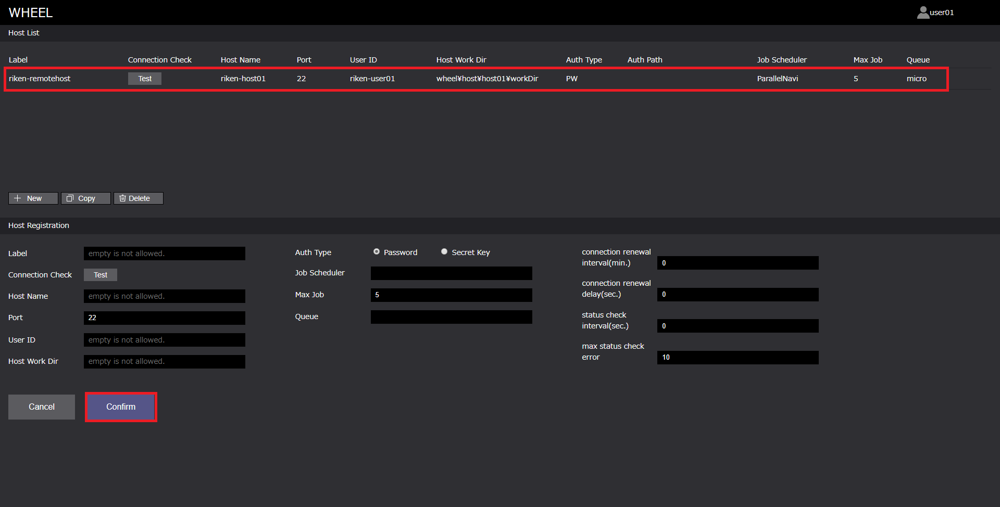
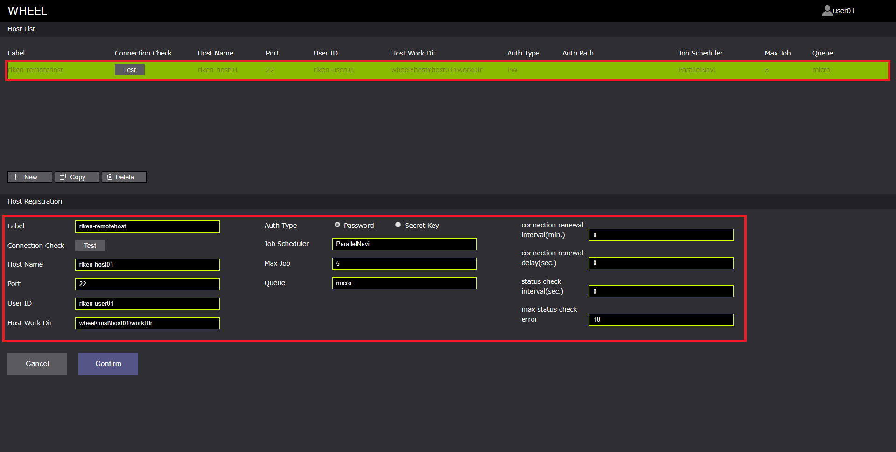
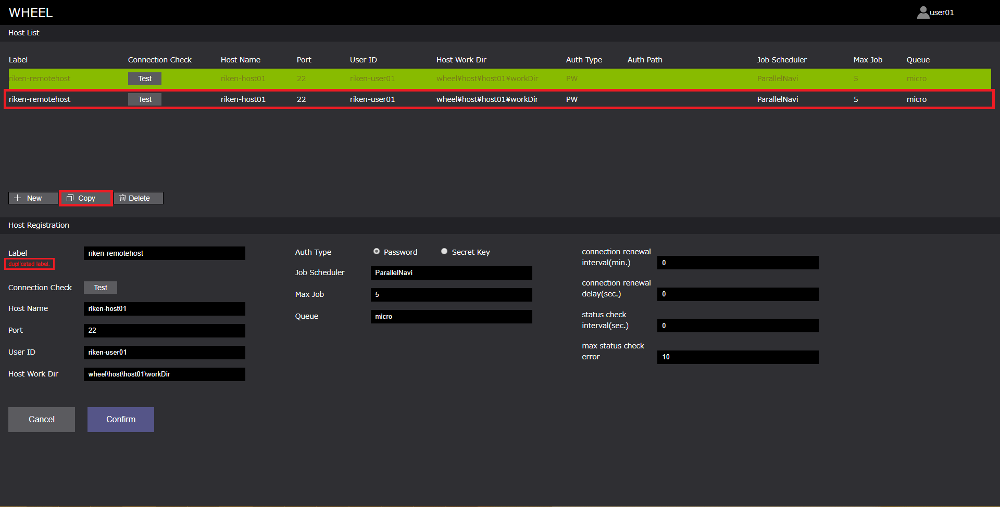
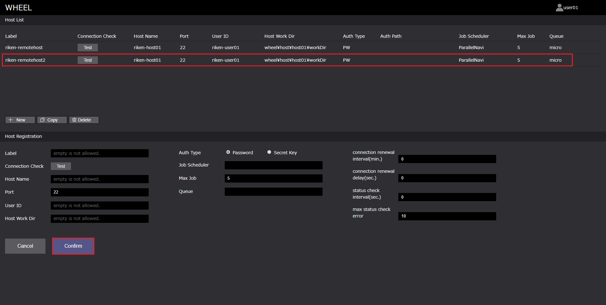

# ホストの登録
京コンピュータ等の外部計算環境にて計算を実行する場合、計算マシン（以下、ホスト）にSSH接続し、ホスト上でコマンドを実行します。  
WHEELでは、ワークフロー画面（Taskコンポーネント）にて設定するホストの情報及びホストに登録されているユーザ情報をホスト登録画面にて設定します。  

## ホスト登録画面への移動
ホスト登録画面には、下記の2パターンの方法によって遷移します。

* ホーム画面右上ドロワー内の[ remotehost ]
* ワークフロー画面右上ドロワー内の[ remotehost ]  

1. ホーム画面右上ドロワー  
  

1. ワークフロー画面右上ドロワー  
  

## ホスト登録画面
ホスト登録画面の構成は以下のようになっています。  
  

1. タイトル　：ホーム画面遷移ボタン
1. ユーザー名：ログインユーザ名
1. Host List エリア：登録済みホストリスト
    1. ホストリスト：登録済みホスト情報
    1. New ボタン：新規ホスト登録ボタン
    1. Copyボタン：登録済みホストの複製（登録済みホスト情報の引用用）
    1. Deleteボタン：登録済みホストの削除
1. Host Registration エリア：ホスト登録用情報入力エリア
    1. ホスト情報入力エリア：新規ホスト情報、登録済みホスト情報の編集エリア
    1. Cancel ボタン：入力情報のリフレッシュ
    1. Confirm ボタン：入力情報の登録

また、Host List, Host Registrationエリアの各プロパティは以下です。  

| プロパティ名 | プロパティ | 備考 |
|----|----|----|
| Label | ホスト識別ラベル | 重複不可 |
| Connection Check | ホスト接続確認ボタン | ー | 
| Host Name | ホストIPアドレス、または、ホスト名 | ー | 
| Port | ホストポート番号 | SSH接続用、デフォルト値 22 | 
| User ID | ホスト登録済みユーザ名 | ー | 
| Host Work Dir | ホストマシンでの作業ディレクトリ | ー | 
| Auth Type | ホストマシンの認証手段 | ラジオボタンより選択 | 
| Auth Path | Auth Type -> Key 選択時のKeyFile保存先パス | ー | 
| JobScheduler | WHEELに登録されているJob Scheduler名 | app/db/jobSceduler.jsonに定義されているJobScheduler名 *1| 
| Max Job | ジョブ投入制限数 | デフォルト値 5、本プロパティに設定した値を投入本数の上限として、WHEELからのジョブ投入を抑制| 
| Queue | Queue名 | カンマ区切りで複数入力可（ex. A, B, C）| 

### *1 JobSchedulerへの設定方法
WHEELを用いて計算機へジョブをする場合、Taskコンポーネントを使用します。（Taskコンポーネントに関する詳細は後述）  
Taskコンポーネントは、child_process又はsshを用いて指定されたスクリプトを直接実行する以外に、ジョブスケジューラにジョブとして投入する方法があります。  
本機能に関する設定は次の5つがあります。
1. Taskコンポーネントの[ useJobScheduler ]プロパティを有効にしている場合、Taskはジョブスケジューラ経由で実行されます。
1. Taskコンポーネントの[ queue ]プロパティには、投入先のキュー名を指定することができます。   
null(デフォルト値)が指定されていた場合は、ジョブスケジューラ側で指定されているデフォルトキューに対してジョブが投入されます。
1. ホスト登録画面[ JobScheduler ]には、当該ホストから投入可能なジョブスケジューラの名称を設定します。 
1. ホスト登録画面[ Max Job ]には、本プロパティに設定された値以下の投入本数を上限として、WHEELからのジョブ投入を抑制します。
1. ホスト登録画面[ Queue ]で登録したQueue情報は、Taskコンポーネントの[ queue ]プロパティでセレクトボックスとして表示されます。  

ジョブスケジューラの定義は"app/db/jobSceduler.json"にて行います。 スケジューラの名称をkeyとし、以下の各keyを持つテーブルを値として各ジョブスケジューラを設定します。

| key | value |
|----|----|
| submit | ジョブ投入に用いるコマンド名 |
| queueOpt | 投入先キューを指定するためのsubmitコマンドのオプション |
| stat | ジョブの状態表示に用いるコマンド名 |
| del | ジョブの削除に用いるコマンド名 |
| reJobID | submitコマンドの出力からジョブIDを抽出するための正規表現 |
| reFinishdState | statコマンドの出力を正常終了と判定するための正規表現 |
| reFailedState | statコマンドの出力を異常終了と判定するための正規表現 |

reJobIDは1つ以上のキャプチャを含む正規表現でなければなりません。また、1つ目のキャプチャ文字列がjobIDを示す文字列として扱われます。  
reFinishedStateとreFailedStateは、前者が先に評価され前者がマッチした場合は後者の判定は行なわずに正常終了と判定します。また、両者にマッチしない場合はジョブは実行待ちもしくは実行中と判定します。  
※いずれの正規表現もプログラム内でコンパイルして利用するため、正規表現リテラル(//)は使うことができません。  

> 富士通 parallel naviでの設定は次のようになります。  
```
{  
　"ParallelNavi": {  
　　"submit": "pjsub",   
　　"queueOpt": "-L rscgrp=",  
　　"stat": "pjstat -H day=3 --choose st,ec",  
　　"del": "pjdel",  
　　"reJobID": "pjsub Job (\\\\d+) submitted.",  
　　"reFinishdState": "^ST *EC\\\\nEXT *0",  
　　"reFailedState": "^ST *EC\\\\n(CCL|ERR|EXT)"  
　}  
}  
```

## ホストの登録
ホストの登録方法は、2パターンあります。
1. 新規に登録する
1. 既存のホスト情報を引用し、登録する  

まずは、「1. 新規に登録する」方法を説明します。  
### 1. 新規に登録する  

手順は以下になります。
1. Host List エリア「New」ボタンをクリックする
1. Host Registration エリアの必要項目を入力する
1. Host Registration エリア「Confirm」ボタンをクリックする  

#### 1. Host List エリア「New」ボタンをクリックする

Host Registrationがクリアされます。ただし、Port, Max Jobにはデフォルト値が入ります。

  

#### 2. Host Registration エリアの必要項目を入力する  

必要項目を入力します。Label（重複不可）, Host Name, User Nameは、入力必須項目です。 

  

#### 3. Host Registration エリア「Confirm」ボタンをクリックする  

入力内容をホスト情報として登録します。Host List エリアにホスト情報が追加されます。  

  


### 2. 既存のホスト情報を引用し、登録する  
続いて、「2. 既存のホスト情報を引用し、登録する」方法を説明します。  

手順は以下になります。
1. Host List エリアに表示されている登録済みホストをクリックする
1. Host List エリア「Copy」ボタンをクリックする
1. 複製したホストを選択し、Host Registration エリアのLabel（必須）及びその他項目を編集する
1. Host Registration エリア「Confirm」ボタンをクリックする

#### 1. Host List エリアに表示されている登録済みホストをクリックする

登録済みホストを選択します。選択したホスト情報は、Host Registration エリアに反映されます。  

  

#### 2. Host List エリア「Copy」ボタンをクリックする

Copyボタンをクリックします。Host Listに選択したホスト情報が複製されます。  
Labelも複製されるため、Label重複の警告メッセージが表示されます。

  

#### 3. 複製したホストを選択し、Host Registration エリアのLabel（必須）及びその他項目を編集する

Label及びその他項目を編集し、Label重複警告メッセージが解除されたことを確認します。  

  

#### 4. Host Registration エリア「Confirm」ボタンをクリックする  

「Confirm」ボタンをクリックします。  

  

## ホストの編集
ホストの編集の手順は以下になります。
1. Host List エリアに表示されている編集したいホストをクリックする
1. Host Registration エリアにてホスト情報を編集する
1. Host Registration エリア「Confirm」ボタンをクリックする  

#### 1. Host List エリアに表示されている編集したいホストをクリックする

Host Registration エリアに選択したホストの登録情報が表示されます。

  

#### 2. Host Registration エリアにてホスト情報を編集する

項目を編集します。

  

#### 3. Host Registration エリア「Confirm」ボタンをクリックする  

ホスト情報を更新します。

  


## ホストの削除
ホストの削除は、以下の手順で行います。
1. Host List エリアに表示されている削除したいホストをクリックする
1. Host List エリア「Delete」ボタンをクリックする
1. 表示される「削除確認メッセージダイアログボックス」の「OK」ボタンをクリックする。  

  

削除されていることを確認します。  

  


## ホストの接続確認
登録したホストが有効であるが確認するためにホストの接続確認（Connection Check）を行います。  
Connection Checkは、「Test」ボタンをクリックすることで行います。  

Connection Checkの手順は以下になります。
1. Connection Checkしたいホストを選択する
1. Connection Check「Test」ボタンをクリックする
1. 表示される「パスワード入力ダイアログボックス」にパスワードを入力し、「OK」を押下する
1. 「Test」ボタンの表示がOKまたはNGになることを確認する

#### 1. Connection Check

  

#### 4. 「Test」ボタンの表示が OK または NG になることを確認する

Host Name, User ID, Port, AuthPath 及び入力したパスワードが適切な場合は「OK」、不適切な場合は「NG」となります。  

・適切な場合  
「Test」ボタンがOKとなります。

  

・不適切な場合  
「Test」ボタンがNGとなり、エラーメッセージが表示されます。  

  
