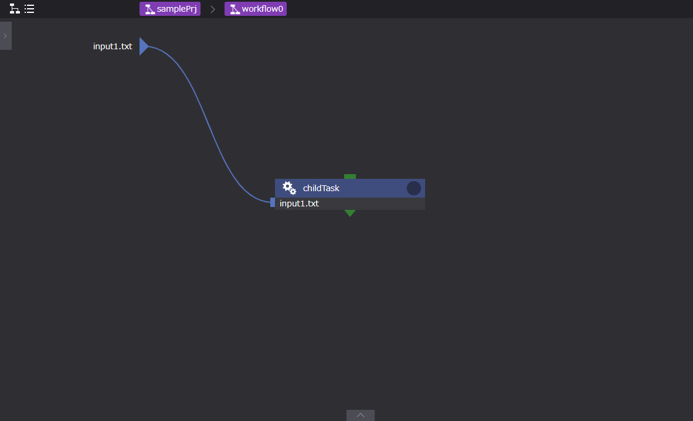
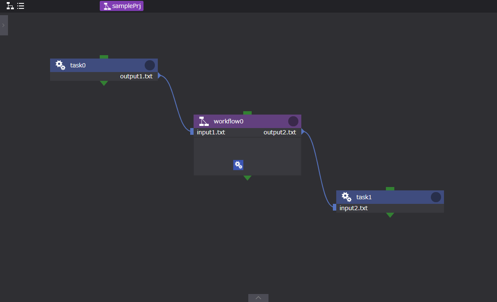
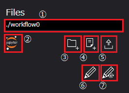

## 2. 各コンポーネントのプロパティ説明
この節では、ワークフローの作成に用いる各ワークフローコンポーネントのプロパティについて
説明します。

ワークフローコンポーネントは以下の7種です。  

  

以下で各コンポーネントについて説明します。

### Workflow コンポーネント
  

Workflowコンポーネントのプロパティについて説明します。

| プロパティ | 入力値 | プロパティ説明 |
|----|----|----|
| name | 文字列 *1 | コンポーネントを識別するための名称 |
| description | 文字列 | コンポーネントの説明文 | 
| inputFiles | ファイルまたはディレクトリ名 *2 | 先行コンポーネントから受け取るファイル | 
| outputFiles | ファイル, ディレクトリ名またはglobパターン *2 | 後続コンポーネントへ渡すファイル | 
| clean up flag | ラジオボタン | リモート環境に作成した一時ファイルの取り扱い決定フラグ | 
|  | clean up | 削除する | 
|  | keep files | 削除しない | 
|  | follow parent setting | 親コンポーネントと同じ挙動をする *3 | 

*1 プロパティに使用できる文字列は、半角英数字[0-9 a-Z]、ハイフン[ - ]、アンダースコア[ _ ]のみです。  
　ただし、Descriptionは任意の文字列を使用できます。    
*2 詳細は次節にて説明  
*3 clean up flag の初期値は、[ follow parent setting ]です。  
　ただし、rootワークフロー作成時は、[ clean up ]へ変更します。

### Task コンポーネント
  

Taskコンポーネントのプロパティについて説明します。

| プロパティ | 入力値 | プロパティ説明 |
|----|----|----|
| name | 文字列 | コンポーネントを識別するための名称 |
| description | 文字列 | コンポーネントの説明文 | 
| inputFiles | ファイルまたはディレクトリ名 | 先行コンポーネントから受け取るファイル | 
| outputFiles | ファイル, ディレクトリ名またはglobパターン | 後続コンポーネントへ渡すファイル | 
| script | ファイル名 | Task内の処理を記述したスクリプトのファイル名 | 
| host | セレクトボックス | Taskを実行するhost、localhostまたは登録済のremotehostのlabelを指定する | 
| useJobScheduler | チェックボックス | scriptをバッチスケジューラ経由で実行するか直接実行するかのフラグ | 
| queue | セレクトボックス | ジョブの投入先キュー(useJobSchedulerを使用しない場合は使われない) | 
| clean up flag | ラジオボタン | リモート環境に作成した一時ファイルの取り扱い決定フラグ | 
|  | clean up | 削除する | 
|  | keep files | 削除しない | 
|  | follow parent setting | 親コンポーネントと同じ挙動をする | 
| include | ファイル名 | リモート環境から回収してくるファイル *1 | 
| exclude | ファイル名 | リモート環境から回収しないファイル *1 | 
| state clean | ボタン | コンポーネントの進行状態を初期状態に戻す *2 | 

*1 include, excludeともにglobパターンを指定することができます。  
　includeにマッチしなおかつexcludeにマッチしないファイルを回収してくることができます。  
　ただし、outputFilesに指定されたファイルは、include/excludeの指定に関わらず全て回収されます。  
*2 コンポーネントの進行状態が"finished"もしくは"failed"の時のみ表示されます。

### Parameter Study コンポーネント
  

Parameter Studyコンポーネントのプロパティについて説明します。

| プロパティ | 入力値 | プロパティ説明 |
|----|----|----|
| name | 文字列 | コンポーネントを識別するための名称 |
| description | 文字列 | コンポーネントの説明文 | 
| inputFiles | ファイルまたはディレクトリ名 | 先行コンポーネントから受け取るファイル | 
| outputFiles | ファイル, ディレクトリ名またはglobパターン | 後続コンポーネントへ渡すファイル | 
| parameterFile | ファイル名 | パラメータスタディの設定を記述したファイル | 
| state clean | ボタン | コンポーネントの進行状態を初期状態に戻す *1 | 

*1 コンポーネントの進行状態が"finished"もしくは"failed"の時のみ表示されます。

### If コンポーネント
  

Ifコンポーネントのプロパティについて説明します。

| プロパティ | 入力値 | プロパティ説明 |
|----|----|----|
| name | 文字列 | コンポーネントを識別するための名称 |
| description | 文字列 | コンポーネントの説明文 | 
| inputFiles | ファイルまたはディレクトリ名 | 先行コンポーネントから受け取るファイル | 
| outputFiles | ファイル, ディレクトリ名またはglobパターン | 後続コンポーネントへ渡すファイル | 
| condition | ファイル名,またはJavaScriptの式 | 条件判定を行うスクリプトのファイル名、またはJavaScriptの式 *1 | 
| state clean | ボタン | コンポーネントの進行状態を初期状態に戻す *2 | 

*1 conditionに指定されたスクリプトの終了コードが0の時は真それ以外の時は偽と判定して後続のノードへ遷移します。  
　ただし、conditionに指定された文字列と一致するファイルが存在しなかった時は、Javascriptの式とみなしてそのコードを実行します。  
*2 コンポーネントの進行状態が"finished"もしくは"failed"の時のみ表示されます。

### For コンポーネント
これより説明するLoop系コンポーネント（For, While, Foreach）は、ループカウンタインデックスを環境変数`$WHEEL_CURRENT_INDEX`に持ちます。  
使用法等の詳細については[ワークフローの作成（使用例と実行）](./../9_create_workflow/create_workflow.md)`Loop系コンポーネント`をご確認ください。  

  
Forコンポーネントのプロパティについて説明します。

| プロパティ | 入力値 | プロパティ説明 |
|----|----|----|
| name | 文字列 | コンポーネントを識別するための名称 |
| description | 文字列 | コンポーネントの説明文 | 
| inputFiles | ファイルまたはディレクトリ名 | 先行コンポーネントから受け取るファイル | 
| outputFiles | ファイル, ディレクトリ名またはglobパターン | 後続コンポーネントへ渡すファイル | 
| start | 整数値 | ループの始値 | 
| end | 整数値 | ループの終値 | 
| step | 整数値 | 1回のループでのインデックスの増分（負値も可）| 
| state clean | ボタン | コンポーネントの進行状態を初期状態に戻す *1 | 

*1 コンポーネントの進行状態が"finished"もしくは"failed"の時のみ表示されます。

### While コンポーネント
  

Whileコンポーネントのプロパティについて説明します。

| プロパティ | 入力値 | プロパティ説明 |
|----|----|----|
| name | 文字列 | コンポーネントを識別するための名称 |
| description | 文字列 | コンポーネントの説明文 | 
| inputFiles | ファイルまたはディレクトリ名 | 先行コンポーネントから受け取るファイル | 
| outputFiles | ファイル, ディレクトリ名またはglobパターン | 後続コンポーネントへ渡すファイル | 
| condition | ファイル名,またはJavaScriptの式 | 条件判定を行うスクリプトのファイル名、またはJavaScriptの式 *1 | 
| state clean | ボタン | コンポーネントの進行状態を初期状態に戻す *2 | 

*1 conditionの取り扱いは `Ifコンポーネント` をご確認ください。  
*2 コンポーネントの進行状態が"finished"もしくは"failed"の時のみ表示されます。  

### Foreach コンポーネント
  

Foreachコンポーネントのプロパティについて説明します。

| プロパティ | 入力値 | プロパティ説明 |
|----|----|----|
| name | 文字列 | コンポーネントを識別するための名称 |
| description | 文字列 | コンポーネントの説明文 | 
| inputFiles | ファイルまたはディレクトリ名 | 先行コンポーネントから受け取るファイル | 
| outputFiles | ファイル, ディレクトリ名またはglobパターン | 後続コンポーネントへ渡すファイル | 
| indexList | 文字列 | ループインデックスに指定される値のリスト *1| 
| state clean | ボタン | コンポーネントの進行状態を初期状態に戻す *2 | 

*1 使用できる文字列は`Workflowコンポーネント`をご確認ください。  
*2 コンポーネントの進行状態が"finished"もしくは"failed"の時のみ表示されます。

## inputFileおよびoutputFile   
前節に示したコンポーネントのinputFiles, outputFilesに設定可能な入力値について説明します。　　

inputFiles, outputFilesには以下の4種類の文字列を指定することができます。  
・空文字列(inputのみ)  
・path.sep('\\'でも'/'でも良い)を含む文字列  
・path.sep('\\'でも'/'でも良い)を含まない文字列  
・globパターン(outputのみ)  

### inputが空文字列の場合  
inputは後続ノードのrootディレクトリ(そのノードのpathプロパティが指定されたディレクトリ)が指定されてものとして扱われます。  

### inputがpath.sepを含まない文字列の場合  
outputが単一のファイルの場合、inputはファイル名として扱われ別名でのシンボリックリンクが作成されます。  
outputがディレクトリの場合、inputはディレクトリ名として扱われその名前でディレクトリへのシンボリックリンクが作成されます。  
outputがglobパターンの場合、inputはディレクトリ名として扱われ、そのディレクトリの下にglobパターンで指定されたファイルへのシンボリックリンクが作成されます。  
いずれの場合でも、outputの指定文字列にpath.sepが含まれた場合は後続ノード側でも同じディレクトリが作成された上でシンボリックリンクが作成されます。  

### inputがpath.sepを含む文字列の場合  
最後のpath.sepまでを後続ノードのrootディレクトリからの相対ディレクトリ名として扱います。  
先頭と末尾のpath.sepは無視され、それぞれ取り除いた値が指定されたものとして扱います。  
例えば'/foo/bar/'という指定がされた場合は、'foo/bar'が指定されたものとして扱います。  
(もしあれば)末尾のものを除いて最後のpath.sep以降に続く文字列は"inputがpath.sepを含まない文字列の時"に準じてoutputの指定に応じた取り扱いを行います。    

## 階層間（親子間）のファイル移動    
Workflow, ParameterStudy, 及びLoop系（For, While, Foreach）のコンポーネントは、  
コンポーネント内にコンポーネント（子コンポーネント）を持つことができます。  
親コンポーネントから子コンポーネントへのファイル移動は、親子間ファイル移動機能を使用することで行うことができます。  
使用方法は以下です。  

### 親階層から子階層へ
1. 渡し元コンポーネント（task0）の出力ファイルを設定する（図1参照）
1. 渡し先コンポーネント（workflow0）の入力ファイル名を設定する
1. 渡し元コンポーネント（task0）の出力ファイルを渡し元コンポーネント（workflow0）の入力ファイルへ接続する
1. コンポーネントの子階層へ遷移する（図2参照）
1. 子階層にてコンポーネントを作成する（childTask）
1. 子コンポーネント（childTask）の入力ファイルを設定する
1. 親コンポーネントからの入力ファイルを子コンポーネント（childTask）の入力ファイルへ接続する  

##### 図1 コンポーネントの出力・入力ファイル設定（親階層から子階層へ）
  

##### 図2 親から子へのファイル転送
  

### 子階層から親階層へ
1. 渡し元コンポーネント（workflow0）の出力ファイルを設定する（図3参照）
1. 渡し先コンポーネント（task1）の入力ファイル名を設定する
1. 渡し元コンポーネント（workflow0）の出力ファイルを渡し先コンポーネント（task1）の入力ファイルへ接続する
1. コンポーネントの子階層へ遷移する（図4参照）
1. 子コンポーネント（childTask）の出力ファイルを設定する
1. 子コンポーネント（childTask）の出力ファイルを親コンポーネントの出力ファイルへ接続する

##### 図3 コンポーネントの出力・入力ファイル設定（子階層から親階層へ）
  

##### 図4 子から親へのファイル転送
  

ただし、子階層において親の入力ファイルを直接出力ファイルへ渡すこと（input1.txtをoutput2.txtへ接続する　図4参照）はできません。   

## コンポーネントディレクトリへのファイル操作
コンポーネントで使用するファイルは、コンポーネント選択時に表示されるプロパティ画面の[ Files ]領域より設定します。  

例：Workflowコンポーネントのプロパティ画面  

  

Files領域の構成は、以下です。  

  

1. rootワークフローからの相対パス表示領域
1. JupyterNotebookの起動ボタン
1. コンポーネントディレクトリへの新規ディレクトリの作成ボタン
1. コンポーネントディレクトリへの新規ファイルの作成ボタン
1. コンポーネントディレクトリへのファイルのアップロードボタン（ファイルブラウザの起動）
1. ファイル編集ボタン
1. PS用ファイル編集ボタン

以下で各ボタンの機能について説明します。

### コンポーネントディレクトリへの新規ディレクトリの作成
コンポーネントディレクトリへの新規ディレクトリの作成手順は以下になります。

1. 新規ディレクトリを作成したいコンポーネントをクリックする。
1. [ Files ]領域内の上記Files領域図ボタン「3」をクリックする。
1. 表示されるダイアログより、作成するディレクトリ名を入力し、[ OK ]ボタンをクリックする。

##### 新規ディレクトリの作成  

  

##### 作成結果 

  

### コンポーネントディレクトリへの新規ファイルの作成
新規ファイルの作成もディレクトリの作成と同様に以下の手順になります。

1. 新規ファイルを作成したいコンポーネントをクリックする。
1. [ Files ]領域内の上記Files領域図ボタン「4」をクリックする。
1. 表示されるダイアログより、作成するファイル名を入力し、[ OK ]ボタンをクリックする。

### コンポーネントディレクトリへのファイルのアップロード

コンポーネントディレクトリへのファイルのアップロード手順は以下になります。

1. 新規ディレクトリを作成したいコンポーネントをクリックする。
1. [ Files ]領域内の上記Files領域図ボタン「5」をクリックする。
1. 表示されるファイルブラウザ画面、アップロードしたいファイルを選択し、[ 開く ]ボタンをクリックする。

##### ファイルのアップロード 

  

##### アップロード結果 

  