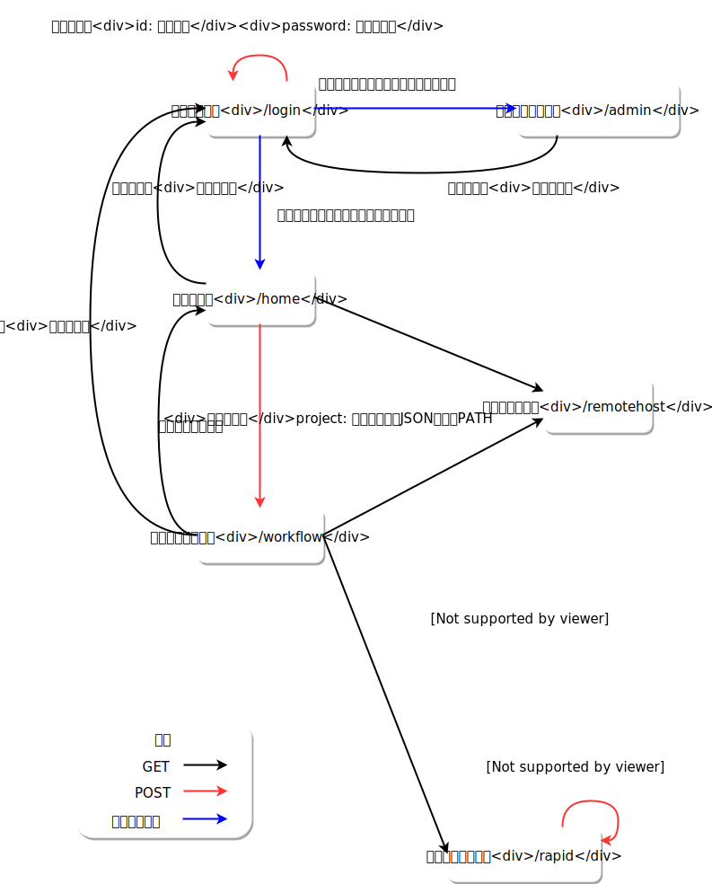

# 詳細設計書
## データ構造
wheelでは、ある解析を実行するための一連のプログラム実行や
入出力の受け渡しをまとめたものをProjectとよびます。

Projectの実体はnode.jsが動作するマシン上の任意のディレクトリ(以降はprojectRootとします)
以下のディレクトリ一式で、プロジェクト毎にgitによって管理されます。
また、projectRootのディレクトリ名は末尾に.wheelが付与されています。

projectRootにはprj.wheel.jsonという名前で、
次のような形式のJSONファイル(以降はprojectJSONとします)が
含まれている必要があります。
```
{
    "name": "Project name",
    "description": "This is new Project.",
    "state": "not-started",
    "root" : "/home/hoge/project.wheel",
    "ctime": yyyy/mm/dd-HH:MM:ss,
    "mtime": yyyy/mm/dd-HH:MM:ss,
    "componentPath":{
      "xxxx-xx-xxx1": "./foo/bar",
      "xxxx-xx-xxx2": "./foo",
      "xxxx-xx-xxx3": "./fizz",
      "xxxx-xx-xxx4": "./foo/baz",
    }
}
```

projectJSONの各プロパティに含まれる値は次のとおりです。

property      | description
--------------|--------------------------------------
name          | プロジェクト名(projectRootのディレクトリ名から.wheelを除いたもの)
description   | ユーザがプロジェクトにつける任意の説明文
state         | プロジェクトの実行状態を表す文字列
root          | projectRootディレクトリの絶対パス
ctime         | プロジェクト作成日時
mtime         | 最終更新時刻
componentPath | プロジェクトに含まれる全コンポーネントのIDとprojectRootからの相対パス

プロジェクトには、プログラム実行などの個々の処理を表す複数のworkflowComponentが含まれています。
workflowComponentの詳細は後のクラス構造の章で述べます。

個々のworkflowComponentの実体は、projectRoot以下のディレクトリで
コンポーネントの属性値などは当該ディレクトリ内に"define.wheel.json"という名前のJSONファイルとして
保存されます。なお、projectRootディレクトリ自体は必ずworkflowコンポーネントとなっており、
プロジェクト内の全てのコンポーネントはrootのワークフローの子孫コンポーネントとなります。

コンポーネントの種類には、次の7種類があります。

- Task
- If
- Workflow
- ParameterStudy
- For
- While
- Foreach

個々のworkflowComponentの説明は、クラス構造の章を参照してください。
taskコンポーネント内で実行するスクリプトなど、処理に必要なファイルは全て
各コンポーネントのディレクトリ内に含める必要があります。
(実装としては、../を使って自身のディレクトリ外のファイルを参照することも
禁じていませんが、リモートホストでtaskを実行する時には、コンポーネント単位での
ファイル転送を行うため、正常に動作しません。)

## クラス構成
workflowおよびその実行に関連するクラスのクラス図は次のとおりです。


BaseWorkflowComponentの各派生クラスのプロパティのうち、エンドユーザが設定することのできる項目は次のとおりです。

### Task
property        | type         | description
----------------|--------------|--------------
name            | string       | コンポーネンのディレクトリ名
index           | string       | コンポーネントを識別する一意な文字列
description     | string       | ユーザが指定するコンポーネントの説明文
previous        | number[]     | 先行コンポーネントのindex
next            | number[]     | 後続コンポーネントのindex
inputFiles      | inputFile[]  | 先行コンポーネントから受け取るファイル
outputFiles     | outputFile[] | 後続コンポーネントへ渡すファイル
script          | string       | Task内の処理を記述したスクリプトのファイル名
host            | string       | Taskを実行するhost、localhostまたは登録済のremotehostのlabelを指定することができる
useJobScheduler | boolean      | scriptをバッチスケジューラ経由で実行するか直接実行するかのフラグ
queue           | string       | ジョブの投入先キュー(useJobSchedulerがfalseの時は使われない)
cleanupFlag     | number       | リモート環境に作成した一時ファイルを削除するかどうかのフラグ *1
include         | string       | リモート環境から回収してくるファイル *2
exclude         | string       | リモート環境から回収しないファイル  *2

*1 0,1,2のいずれかの値を指定することができる。
0は削除、1は削除しない、2は親ノードと同じ挙動を意味する。
初期値は2だが、rootワークフローは作成時にserver.jsonに定義された"defaultCleanupRemoteRoot"の値に変更されます

*2 include, excludeともにglobパターンを指定することができる。
includeにマッチしなおかつexcludeにマッチしないファイルを回収してくる。
ただし、outputFilesに指定されたファイルは、include/excludeの指定に関わらず全て回収される。

### If
property        | type         | description
----------------|--------------|--------------
name            | string       | コンポーネンのディレクトリ名
index           | string       | コンポーネントを識別する一意な文字列
description     | string       | ノードの説明文
previous        | number[]     | 先行ノードのindex
next            | number[]     | 後続ノードのindex
inputFiles      | inputFile[]  | 先行ノードから受け取るファイル
outputFiles     | outputFile[] | 後続ノードへ渡すファイル
condition       | string       | 条件判定を行うスクリプトのファイル名 *1
else            | number[]     | 条件判定が偽だった時の後続ノードのindex

*1 conditionに指定されたスクリプトの終了コードが0の時は真それ以外の時は偽と判定して後続のノードへ遷移する。
conditionに指定された文字列と一致するファイルが存在しなかった時は、Javascriptの式とみなしてそのコードを実行します。

### Workflow
property        | type         | description
----------------|--------------|--------------
name            | string       | コンポーネンのディレクトリ名
index           | string       | コンポーネントを識別する一意な文字列
description     | string       | ノードの説明文
previous        | number[]     | 先行ノードのindex
next            | number[]     | 後続ノードのindex
inputFiles      | inputFile[]  | 先行ノードから受け取るファイル
outputFiles     | outputFile[] | 後続ノードへ渡すファイル

### ParameterStudy
property        | type         | description
----------------|--------------|--------------
name            | string       | コンポーネンのディレクトリ名
index           | string       | コンポーネントを識別する一意な文字列
description     | string       | ノードの説明文
previous        | number[]     | 先行ノードのindex
next            | number[]     | 後続ノードのindex
inputFiles      | inputFile[]  | 先行ノードから受け取るファイル
outputFiles     | outputFile[] | 後続ノードへ渡すファイル
parameterFile   | string       | パラメータスタディの設定を記述したファイル

### For
property         | type           | description
---------------- | -------------- | --------------
name            | string       | コンポーネンのディレクトリ名
index           | string       | コンポーネントを識別する一意な文字列
description      | string         | ノードの説明文
previous         | number[]       | 先行ノードのindex
next             | number[]       | 後続ノードのindex
inputFiles       | inputFile[]    | 先行ノードから受け取るファイル
outputFiles      | outputFile[]   | 後続ノードへ渡すファイル
start            | number         | ループの始値
end              | number         | ループの終値
step             | number         | 1回のループでのインデックスの増分(負値も可)

### While
property         | type           | description
---------------- | -------------- | --------------
name            | string       | コンポーネンのディレクトリ名
index           | string       | コンポーネントを識別する一意な文字列
description      | string         | ノードの説明文
previous         | number[]       | 先行ノードのindex
next             | number[]       | 後続ノードのindex
inputFiles       | inputFile[]    | 先行ノードから受け取るファイル
outputFiles      | outputFile[]   | 後続ノードへ渡すファイル
condition        | string         | 条件判定を行うスクリプトのファイル名 *1

*1 設定値の取り扱いはIfと同じ

### Foreach
property         | type           | description
---------------- | -------------- | --------------
name            | string       | コンポーネンのディレクトリ名
index           | string       | コンポーネントを識別する一意な文字列
description      | string         | ノードの説明文
previous         | number[]       | 先行ノードのindex
next             | number[]       | 後続ノードのindex
inputFiles       | inputFile[]    | 先行ノードから受け取るファイル
outputFiles      | outputFile[]   | 後続ノードへ渡すファイル
indexList        | string[]       | ループインデックスに指定される値のリスト

## inputFileおよびoutputFile
前章に示したworkflow componentのinputFilesおよびoutputFilesプロパティに格納する
inputFileおよびoutputFileオブジェクトは次のプロパティを持つ

### inputFile
property    | type     | description
------------|----------|--------------------------------------------
name        | string   | ファイルまたはディレクトリ名
src         | string[] | 
src.srcNode | string   | 送信元ノードのindex
src.srcName | string   | 送信元ノードでのファイルまたはディレクトリ名
src.transit | string   | 他階層からファイルを受け取る時に経由するコンポーネント(画面表示用)

### outputFile
property    | type     | description
------------|----------| --------------------------------------------
name        | string   | ファイル,ディレクトリ名またはglobパターン
dst         | string[] | 
dst.dstNode | string   | 送信先ノードのindex
dst.dstName | string   | 送信先ノードでのファイルまたはディレクトリ名
dst.transit | string   | 他階層からファイルを受け取る時に経由するコンポーネント(画面表示用)


## ノード間のファイル受け渡し処理について
inputFileおよびoutputFileのnameプロパティには、以下の4種類の文字列を指定することができます。
- 空文字列(inputのみ)
- path.sep('\'でも'/'でも良い)を含む文字列
- path.sep('\'でも'/'でも良い)を含まない文字列
- globパターン(outputのみ)

### inputが空文字列の時
inputは後続ノードのrootディレクトリ(そのノードのpathプロパティが指定されたディレクトリ)が
指定されてものとして扱われます。

### inputがpath.sepを含まない文字列の時
outputが単一のファイルだった時は、inputはファイル名として扱われ別名でのシンボリックリンクが作成されます。

outputがディレクトリだった時は、inputはディレクトリ名として扱われその名前でディレクトリへのシンボリックリンクが作成されます。

outputがglobパターンだった時は、inputはディレクトリ名として扱われ、
そのディレクトリの下にglobパターンで指定されたファイルへのシンボリックリンクが作成されます。

いずれの場合でも、outputの指定文字列にpath.sepが含まれた場合は後続ノード側でも同じディレクトリが作成された上で
シンボリックリンクが作成されます。


### inputがpath.sepを含む文字列の時
最後のpath.sepまでを後続ノードのrootディレクトリからの相対ディレクトリ名として扱います。

先頭と末尾のpath.sepは無視され、それぞれ取り除いた値が指定されたものとして扱います。
例えば'/foo/bar/'という指定がされた時は、'foo/bar'が指定されたものとして扱います。

(もしあれば)末尾のものを除いて最後のpath.sep以降に続く文字列は"inputがpath.sepを含まない文字列の時"に準じて
outputの指定に応じた取り扱いを行ないます。


## プロジェクト実行時の挙動
TODO 書き直し
プロジェクトの実行を開始すると、まずroot workflowがDispatcherクラスに渡されDispatcherクラスは
workflowの子ノードを順次探索して、実行可能な子ノードから順に処理していきます。

子ノードのうちTaskは、hostおよびjobSchedulerの設定に応じて、対応するExecuterクラスに渡され
プログラムの実行、ジョブ投入などの処理が行なわれます。

直接実行されるTaskについては実行後のcall backでstateプロパティが書き換えられます。
また、ジョブとしてバッチシステムに投入されたTaskはsetIntervalを使ったポーリングにより
実行状況が監視され、stateプロパティに反映されます。

dispatcherがWorkflow, ParamterStudy, For, While, Foreachを見つけた時は、
新規にDispatcherクラスを生成し以降の処理をそちらへ移譲します。

### プロジェクトおよび各コンポーネントのstatus表示について
プロジェクトの状態は以下5つのうちいずれかの状態を取ります。

- not-started 
- running
- finished
- unknown
- failed

初期状態は"not-started"で実行を開始すると"running"に遷移し、実行終了時にはfailed/unknown/finishedのいずれかの状態になります。
終了時の状態は、プロジェクトに含まれるコンポーネントのうち1つ以上failedのものがあればfailed, failedが1つも無いが
1つ以上のunknownがあればunknown、全てfinishedであればfinishedとなります。

各コンポーネントのstatusは以下の8種類の状態を取ります。

- not-started
- stage-in   (task only)
- waiting    (task only)
- running    running
- queued     (task only)
- stage-out  (task only)
- finished
- unknown
- failed

"stage-in"はリモートで実行もしくはリモートでジョブ投入を行なうtaskのみが取る状態で、リモートサーバへ必要なファイルを転送している状態を示します。

"waiting"は同時実行task数の制限により待ち状態となっていることを示します。

"queued"はジョブスケジューラに投入し実行開始を待っている状態を示します。

"stage-out"はリモートサーバでのtaskの実行が終了し必要なファイルを転送している状態を示します。

これらのstatusはジョブスケジューラが返すものとは異なりますので、ステージング方式を使用しているようなシステムへジョブを投入する場合、
ジョブスケジューラ上でstage-inやstage-out状態であってもwheelのstatusはququedとなります。
逆にwheelのstatus表示がstage-inまたはstage-out状態の時は、ジョブスケジューラ上では投入前もしくは完了後となります。

"unknown"ステータスはジョブスケジューラ経由で投入したtaskが、ステータスチェックに失敗するなどで正常終了か異常終了かの判定ができなかった場合に
発生します。
親コンポーネントのstatusは、自身および全ての子孫コンポーネントを対象にプロジェクトのステータスと同様の判定方法によって決められます。


## JobSchdulerの設定方法
Taskノードは、child\_process又はsshを用いて指定されたスクリプトを直接実行する以外に、ジョブスケジューラにジョブとして投入することもできます。
本機能に関する設定は次の6つがあります。

1. TaskクラスのuseJobSchedulerプロパティ {boolean}
  本プロパティがtrueの時、当該taskはジョブスケジューラ経由で実行されます。

2. Taskクラスのqueueプロパティ {string=null}
  本プロパティには、投入先のキュー名を指定することができます。
  null(デフォルト値)が指定されていた場合はジョブスケジューラ側で指定されているデフォルトキューに対してジョブが投入されます。

3. remotehost設定内のqueueプロパティ {string}
  本プロパティには当該ホストで使用可能なキューの一覧をカンマ区切りの文字列としてエンドユーザが指定することができます。
  本リストはTaskノードのproperty設定画面でエンドユーザに対して設定値の選択肢として呈示されます。
  ジョブ投入時にTaskクラスのqueueプロパティに設定された値が本リスト内に存在しない場合は、リストの先頭要素が指定されたものとして扱います。
  また、本リストが空の場合Taskの設定に関わらず、ジョブスケジューラ側で設定されたデフォルトキューに対してジョブを投入します。

4. remotehost設定内のjobSchedulerプロパティ {string}
  本プロパティには当該ホストから投入可能なジョブスケジューラの名称を指定します。

5. remotehost設定内のnumJobプロパティ {number}
  本プロパティに設定された値以下の投入本数を上限として、wheelからのジョブ投入を抑制します。

6. config/server.json内のqueueプロパティおよびjobSchedulerプロパティ
  node.jsが動作しているマシンからジョブを投入する際の利用可能キューリストおよびジョブスケジューラの名称を指定します。
  内容はそれぞれ3.および4と同様です。

ジョブスケジューラの定義は"app/db/jobSceduler.json"にて行ないます。
スケジューラの名称をkeyとし、以下の各keyを持つテーブルを値として各ジョブスケジューラを列挙します。
なお、全ての値は文字列型とする必要があります。

key             | value
----------------|-----------------------
submit          | ジョブ投入に用いるコマンド名
queueOpt        | 投入先キューを指定するためのsubmitコマンドのオプション
stat            | ジョブの状態表示に用いるコマンド名
del             | ジョブの削除に用いるコマンド名
reJobID         | submitコマンドの出力からジョブIDを抽出するための正規表現
reReturnCode    | statコマンドの出力からスクリプトの戻り値を抽出するための正規表現
reFinishdState  | statコマンドの出力を正常終了と判定するための正規表現
reFailedState   | statコマンドの出力を異常終了と判定するための正規表現

reFinishedStateとreFailedStateは、前者が先に評価され前者がマッチした場合は後者の判定は行なわずに正常終了と判定します。
また、両者にマッチしない場合はジョブは実行待ちもしくは実行中と判定します。

reJobIDおよびreReturnCodeは1つ以上のキャプチャを含む正規表現でなければなりません。また1つ目のキャプチャ文字列は
それぞれjobIDおよびスクリプトの戻り値を示す文字列として扱われます。
なお、reReturnCodeによる戻り値の取得は、reFinishedStateにマッチせず、reFailedStateにマッチした時のみに行なわれます。
また、reReturnCodeによる戻り値の取得に失敗した場合は、仮の戻り値として"-1"が設定されます。

いずれの正規表現もプログラム内でコンパイルして利用するため、正規表現リテラル(//)は使えないことに留意してください。

京のマイクロキュー用にカスタマイズしたparallel naviの設定は次のようになります。
```
  "ParallelNavi": {
    "submit": "pjsub -X -Lelapse=00:30:00",
    "queueOpt": "-Lrscgrp=",
    "stat": "pjstat -H day=3 --choose st,ec",
    "del": "pjdel",
    "reJobID": "pjsub Job (\\d+) submitted.",
    "reFinishedState": "^ST *EC\\nEXT *0",
    "reReturnCode": "^ST *EC\\nEXT (\\d+)",
    "reFailedState": "^ST *EC\\n(CCL|ERR|EXT|RJT)"
  }
```

## gitによる履歴管理
wheelではgitを用いたファイル履歴の管理を行なっています。
ユーザが行なう操作に対応して以下のコマンドに相当する処理が実行されます。

ユーザ操作                | gitコマンド
--------------------------|---------------
プロジェクト新規作成      | git init
プロジェクトのインポート  | git clone
ファイルのアップロード    | git add
ファイルの新規作成        | git add
編集したファイルの保存    | git add
saveボタンの押下          | git commit
revertボタンの押下        | git reset HEAD --hard
cleanボタンの押下         | rm -fr && git reset HEAD --hard


## 画面遷移


