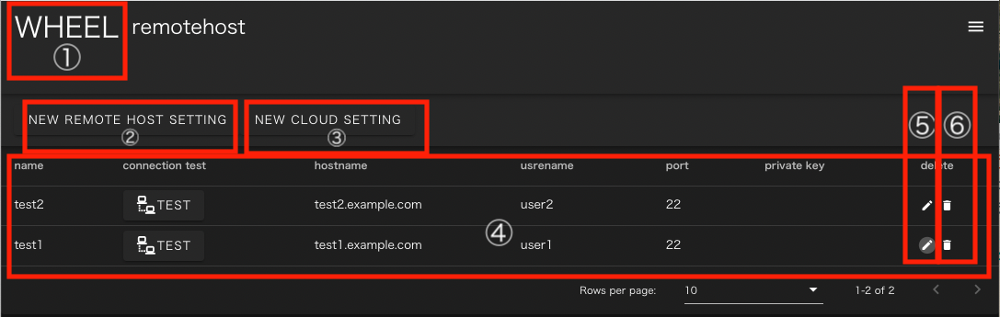
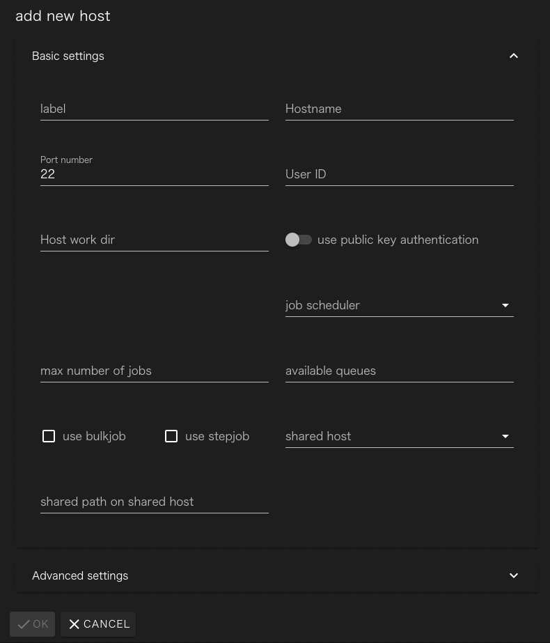
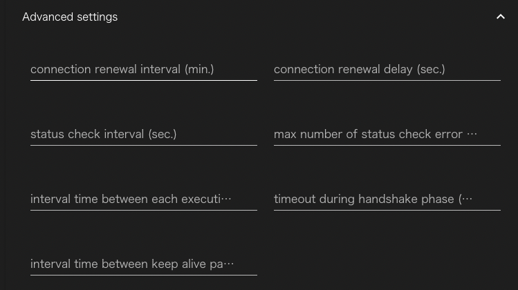

# リモートホストの登録
ワークフロー内でWHEELサーバ外の計算環境（以下、リモートホスト）を用いる場合、対象とするリモートホストにSSH接続し処理を実行します。
WHEELでは、ワークフロー画面（Taskコンポーネント）にて使用するリモートホストの情報及びリモートホストに登録されているユーザ情報をリモートホスト登録画面にて設定します。

## リモートホスト登録画面への移動
リモートホスト登録画面は、画面右上のハンバーガーメニューをクリックした時に表示されるリンクを
クリックすると表示されます


## リモートホスト登録画面
リモートホスト登録画面の構成は以下のようになっています。
TODO ダミーの設定情報を表示して撮影して差し替え


1. タイトル　：ホーム画面遷移ボタン
1. 新規リモートホスト登録ボタン：リモートホストへの接続情報を新しく作成します
1. 新規クラウド設定登録ボタン  ：クラウド上にクラスタを構成する設定を新しく作成します
1. リモートホストリスト：登録済みリモートホスト情報
    1. テストボタン: 設定した接続情報でリモートホストにアクセスできるかどうかを確認します
    1. 編集ボタン  : 入力済の接続情報を編集します
    1. 削除ボタン  : 入力済の接続情報を削除します

### 新規リモートホスト登録画面
新規リモートホスト登録ボタンをクリックすると次の画面が表示されます。



フォームの各部には次の情報を設定してください。

|||
|----------|---------------------------------|
|label| 接続情報を区別するための一意な文字列|
|Hostname| 接続先のホスト名(IPアドレスでも可)|
|Port number| 接続先のポート番号|
|User ID| ログインに使用するユーザ名|
|Host work dir| 接続先で、実行に使うディレクトリの最上位のパス|
|use public key authentication| on にすると公開鍵認証が、offにするとパスワード認証が使われます。|
|private key path|秘密鍵のファイルパス(use public key...がonの時のみ表示されます |
|job scheduler|リモートホストで使われているジョブサーバ|
|max number of jobs|同時に投入するジョブの最大値|
|available queues|リモートホスト上で利用可能なキューの名前。カンマ区切りで記載してください|
|use bulkjob|(富岳のみ)バルクジョブを使えるサイトかどうか|
|use stepjob|(富岳のみ)ステップジョブを使えるサイトかどうか|
|shared host|ストレージを共用している他のリモートホストのラベル|
|shared path on shared host|shared host上でHost work dirへアクセスするためのパス|

`Advanced settings`の右にある▽をクリックすると、詳細設定の入力フォームが開きます。



|||
|----------|---------------------------------|
| connection renewal interval(min.) | sshを定期的に再接続する時の間隔 [分]<br> 0の時(デフォルト)は再接続しない|
| connection renewal delay(sec.) | 再接続時の待ち時間[秒] （デフォルト値 0）|
| status check interval(sec.) | ジョブ投入後のステータス確認を行う間隔[秒]（デフォルト値 10）|
| max number of status check error allowed | ステータス確認の失敗を何回まで許容するか|
| interval time between each executions | 1つのジョブ実行が終わった後、次のジョブを実行するまでの待ち時間[秒] |
| timeout during handhake phase(msec.) | sshのハンドシェイク時の待ち時間[ミリ秒]|
| interval time between keep alive packet(msec.) | sshクライアントがkeep alive packetを投げる間隔[ミリ秒]|

必要な情報を入力し、OKボタンをクリックするとリモートホスト接続設定が保存されます。

### Cloud
詳細は[Cloud(AWS)インスタンス利用方法](../../../doc/Cloud.md)を参照ください

新規クラウド設定登録ボタンをクリックすると次の画面が表示されます。


フォームの各部には次の情報を設定してください。

||||
|----|----|----|
| Label | リモートホスト識別ラベル | 重複不可 * |
| Cloud service provider | クラウドサービスプロバイダー名 | 現バージョン(ver1.2.3)では、「aws」のみ対応 * |
| OS | OS名 | 現バージョン(ver1.2.3)では、「ubuntu16」のみ対応 * |
| region | インスタンスを起動するリージョン | *  ex. ap-northeast-1 |
| numNodes | 起動するノード数 | * |
| InstanceType | 起動するインスタンスタイプ | * ex. t2.micro |
| rootVolume | rootのEBSボリューム | 起動するインスタンスにアタッチされるrootのEBSボリュームのサイズ（デフォルト値 8 [GB]） |
| shareStorage | 共有ストレージの利用設定 |（デフォルト値 利用する）|
| mpi | MPI | ー |
| compiler | コンパイラ | ー |
| playbook | 起動時に実行されるplaybook | ー |
| additionalParams | aws-sdkのEC2.runInstancesに渡すことのできる設定値 | access keyおよび secret access key等を設定可能 |
| additionalParamsForHead | additionalParamsのうちヘッドノードのみに適用する値 | ー |
| JobScheduler | WHEELに登録されているジョブスケジューラ名 | app/config/jobSceduler.jsonに定義されているジョブスケジューラ名を設定する <br> ただし、インスタンスにジョブスケジューラがインストールされている必要がある。<br> ジョブスケジューラ「PBSPro」を設定した場合、WHEELが起動するクラスタにPBSProをインストールする|
| Max Job | ジョブ投入制限数 | 接続先リモートホストから同時に投入できる最大ジョブ数（デフォルト値 5）|
| Queue | Queue名 | 接続先ホストからジョブを投入する時に使えるキュー、カンマ区切りで複数入力可（ex. A, B, C）|

`Advance settings` の項目はリモートホストと同じです。

必要な情報を入力し、OKボタンをクリックするとクラウド設定が登録されます。


### JobSchedulerへの設定方法

ワークフローをリモートホスト上で処理する場合、Taskコンポーネントにリモートホストの設定を行います。（Taskコンポーネントに関する詳細は後述）
Taskコンポーネントは、child_process又はsshを用いて指定されたスクリプトを直接実行する以外に、ジョブスケジューラにジョブとして投入することが可能です。
本機能に関する設定は次の5つがあります。
1. Taskコンポーネントの[ useJobScheduler ]プロパティを有効にしている場合、Taskはジョブスケジューラ経由で実行されます。
1. Taskコンポーネントの[ queue ]プロパティには、投入先のキュー名を指定することができます。
null(デフォルト値)が指定されていた場合は、ジョブスケジューラ側で指定されているデフォルトキューに対してジョブが投入されます。
1. ホスト登録画面[ JobScheduler ]には、当該ホストから投入可能なジョブスケジューラの名称を設定します。
1. ホスト登録画面[ Max Job ]には、本プロパティに設定された値以下の投入本数を上限として、WHEELからのジョブ投入を抑制します。
1. ホスト登録画面[ Queue ]で登録したQueue情報は、Taskコンポーネントの[ queue ]プロパティでセレクトボックスとして表示されます。

ジョブスケジューラの定義は"app/config/jobSceduler.json"にて行います。 スケジューラの名称をkeyとし、以下の各keyを持つテーブルを値として各ジョブスケジューラを設定します。

| key | value |
|----|----|
| submit | ジョブ投入に用いるコマンド名 |
| queueOpt | 投入先キューを指定するためのsubmitコマンドのオプション |
| stat | ジョブの状態表示に用いるコマンド名 |
| del | ジョブの削除に用いるコマンド名 |
| reJobID | submitコマンドの出力からジョブIDを抽出するための正規表現 |
| reFinishdState | statコマンドの出力を正常終了と判定するための正規表現 |
| reFailedState | statコマンドの出力を異常終了と判定するための正規表現 |

reJobIDは1つ以上のキャプチャを含む正規表現でなければなりません。また、1つ目のキャプチャ文字列がjobIDを示す文字列として扱われます。
reFinishedStateとreFailedStateは、前者が先に評価され前者がマッチした場合は後者の判定は行なわずに正常終了と判定します。また、両者にマッチしない場合はジョブは実行待ちもしくは実行中と判定します。
※いずれの正規表現もプログラム内でコンパイルして利用するため、正規表現リテラル(//)は使うことができません。

> 富士通 ParallelNaviでの設定は次のようになります。
```
{
　"ParallelNavi": {
    "submit": "pjsub -X",
    "queueOpt": "-L rscgrp=",
    "stat": "pjstat -v -H day=3 --choose st,ec",
    "del": "pjdel",
    "reJobID": "pjsub Job (\\d+) submitted.",
    "reFinishedState": "^ST *EC *\\ nEXT *0",
    "reReturnCode": "^ST *EC *\\nEXT *(\\d+)",
    "reFailedState": "^ST *EC *\\n(CCL|ERR|EXT|RJT)",
    "reJobStatus": "^ST *EC *\\n(\\S+)"
　}
}
```


--------
[リファレンスマニュアルのトップページに戻る](../index.md)
