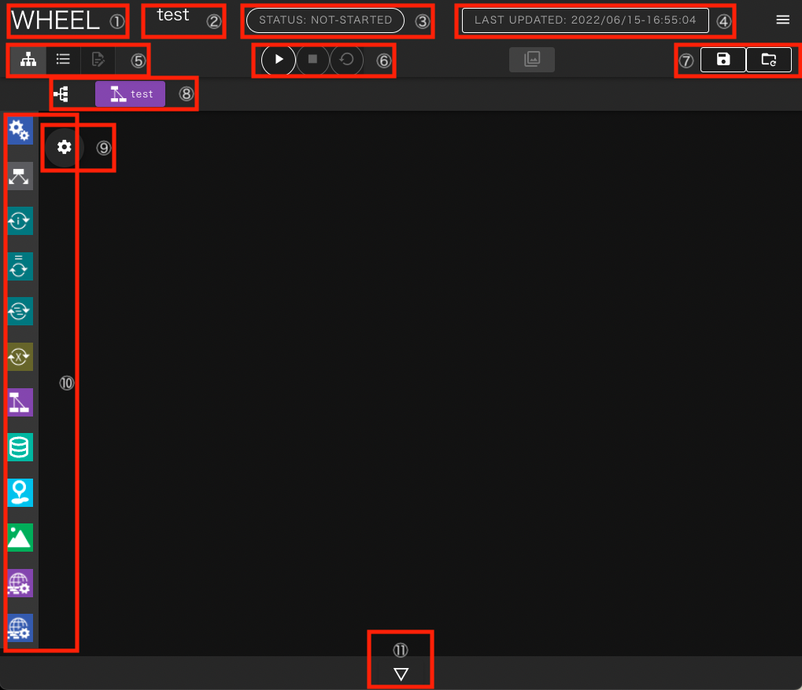
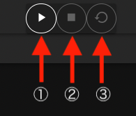
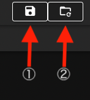
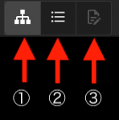
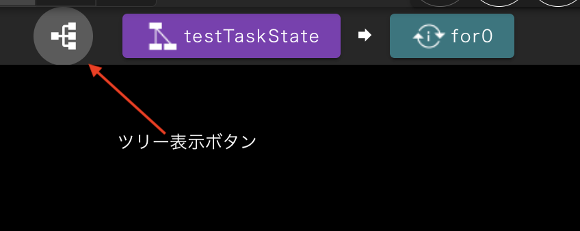
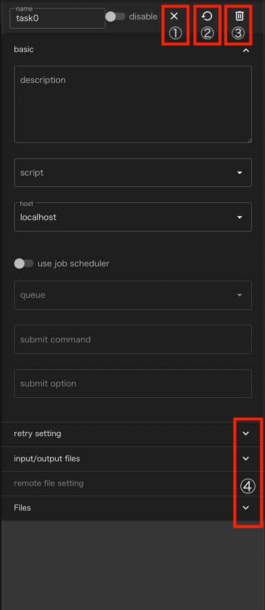

# 1. グラフビュー画面
本章では、グラフビュー画面の機能について説明します。

ワークフローの作成・実行方法の具体例は、後述の「ワークフローの作成」において説明します。

グラフビュー画面は以下のように構成されています。

 1. タイトル　　　　　　　　　　　　　：ホーム画面遷移ボタン
 2. プロジェクト名　　　　　　　　　　：ワークフロー編集中のプロジェクト名
 3. 状態表示エリア　　　　　　　　　　：プロジェクトのstate（実行状態）表示
 4. 編集日時表示エリア　　　　　　　　：プロジェクトの作成、更新日時
 5. ワークフロー画面切替ボタン　　　　：グラフビュー、リストビュー、テキストエディタの切替ボタン
 6. プロジェクト操作ボタンエリア　　　：プロジェクトの実行、停止、クリーンボタン
 7. プロジェクト編集ボタンエリア　　　：プロジェクトの保存、変更の破棄ボタン
 8. 階層表示・遷移ボタン　　　　　　　：現在表示中のプロジェクトディレクトリの階層表示
 9. 環境変数エディタ表示ボタン　　　　：ワークフロー作成用のライブラリ表示用ボタン
10. コンポーネントライブラリ　　　　　：ワークフローの構成要素であるコンポーネントを追加するためのパレット
11. ログ表示ボタン　　　　　　　　　　：ワークフローの作成、実行に関するログ表示用ボタン

次に各エリア、ボタンの詳細について説明します。

### 状態表示エリア
状態表示エリアは、プロジェクト全体の進行状態によって以下の状態を示します。

1. not-started：プロジェクト実行前

2. running    ：プロジェクト実行中

3. finished   ：プロジェクト終了(正常終了)

4. failed     ：プロジェクト終了(エラー発生)

5. holding     : 投入済ジョブ確認中

6. unknonw     : プロジェクトの状態不明

### 操作ボタンエリア
このエリアには、プロジェクトの実行に関わるボタンが表示されます。

1. run ボタン：プロジェクトの実行開始
1. stop ボタン：プロジェクトの実行を停止し実行前の状態に戻す
1. clean：プロジェクトの実行中に生成されたファイルなどを削除し、実行開始前の状態に戻す

### 保存ボタンエリア
このエリアには編集したプロジェクトの保存に関わるボタンが表示されます。

1. save ボタン：プロジェクトを保存する
1. revert ボタン：プロジェクトを直前の保存状態に戻す

WHEELでは、gitを用いたファイル管理を行っております。
グラフビュー画面上での編集内容はサーバサイドのファイルにすぐに反映されますが
SAVEボタンをクリックするまではgitリポジトリには登録されません。
revertボタンをクリックすると最後にコミットしてから後に行なった変更を全て破棄して
リポジトリに最後にコミットした時の状態に戻します

git操作の詳細については開発者向けドキュメント[詳細設計書](../../../doc/design/design.md)をご確認ください。

### 画面表示切替ボタン
初期表示のグラフビュー画面から、listビューおよびテキストエディタ画面へ遷移するためのボタンです

1. graph view ボタン
2. list view ボタン
3. テキストエディタボタン

テキストエディタへの遷移は、
ファイルの選択状態やプロジェクトの選択状態によって制限されており、
遷移できない時はボタンがクリックできない状態になっています。

### 階層表示・遷移ボタン
ワークフローはコンポーネントの階層構造を持ちますが、
グラフビュー画面では同一階層のコンポーネントしか同時に表示できません。

階層表示部には現在表示中のコンポーネントが、プロジェクトのルートコンポーネントから
どのような階層を降りてきた位置に存在するのか表示します。

また、階層表示部の左端にある、ツリー表示ボタンをクリックすると
プロジェクト全体の階層構造が表示されます。

どちらの表示でも、コンポーネントをクリックすると、表示されているコンポーネントに表示が切り替わります。

### 環境変数エディタ表示ボタン
このボタンをクリックすると
プロジェクト内で実行されるシェルスクリプトなどで使える環境変数を
設定するための画面が表示されます。

- name欄に環境変数名、value欄に値を入力して[+]ボタンをクリックすると、新しく環境変数を追加することができます。
- 環境変数、値ともに表示領域をクリックすることで変更することができます。
- 右端に表示されているゴミ箱アイコンをクリックすることで設定済の環境変数を削除できます。

設定を変更した後は、[SAVE] ボタンをクリックすることで変更内容が実際に反映されます。
変更を破棄して終了する場合は [CANCEL] ボタンをクリックしてください。

### ワークフロー作成用エリア
現在表示中のコンポーネントが持つ子コンポーネントが表示されています。
初期状態ではプロジェクトのルートコンポーネントの直接の子コンポーネントが表示されています。

この領域に、コンポーネントライブラリから、ドラッグ&ドロップすることでプロジェクトにコンポーネントを追加します。

表示されているコンポーネントをダブルクリックすることで、
そのコンポーネントの下位コンポーネントを表示するように切り替わります。

上位コンポーネントへの切り替えは、前述の階層表示部またはコンポーネントツリーを使ってください。

表示されているコンポーネントをシングルクリックすると
そのコンポーネントの設定値(プロパティ)を編集する領域が表示されます。

1. closeボタン : プロパティ表示を閉じます
2. cleanボタン : コンポーネント(もしあれば下位コンポーネントも)の状態を最新の保存状態に巻き戻します
3. deleteボタン: コンポーネントを削除します

コンポーネントの種類毎にこの領域に表示される内容は異なります。
プロパティへの設定内容はコンポーネントの章をご参照ください

### ログ表示ボタン
ワークフローの作成時や実行時等に出力されるログを表示します。

ボタンをクリックすると、次のようなログ表示エリアが表れます。

ログ表示は内容に応じて複数のタブにそれぞれ出力されます。

1. Info：エラー、ワーニングなどの重大な情報と、プロジェクトの実行状況や操作に関する一般的な情報
1. Stdout：ローカルホストで実行されたtaskの標準出力
1. Stderr：ローカルホストで実行されたtaskの標準エラー出力
1. Stdout(SSH)：リモートホストで実行されたtaskの標準出力
1. Stderr(SSH)：リモートホストで実行されたtaskの標準エラー出力

ラベルの色は次の意味を現わします。
- 青: 現在表示中
- 緑: 新規情報があり、未表示
- 灰: 非表示中

[CLEAR ALL LOG] ボタンをクリックすると、それまでに表示された全てのログが消去されます。

最上部の△ボタンをクリックするとログ表示部が下部に折り畳まれます。

--------
[リファレンスマニュアルのトップページに戻る](../index.md)
