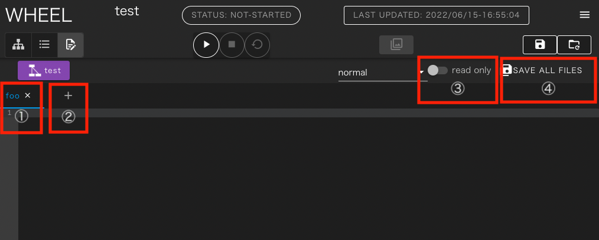
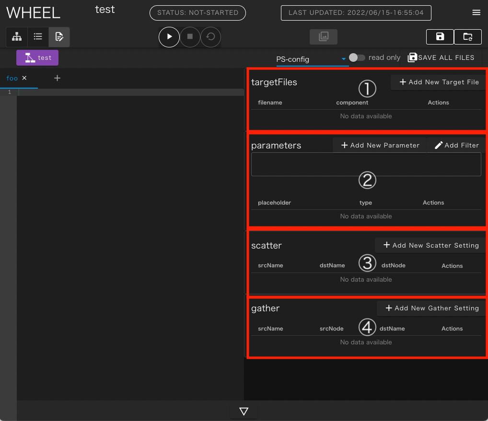
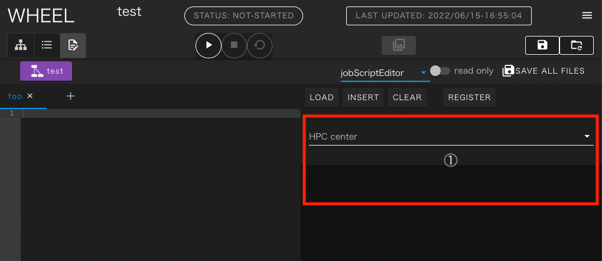
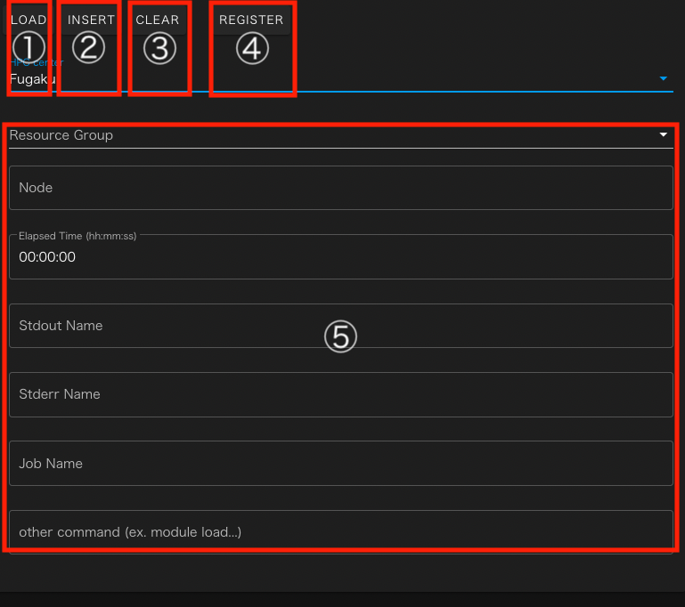

# テキストエディタ画面
本章では、テキストエディタ画面の機能について説明します。

テキストエディタ画面には次の3つのモードが存在します。
- normalモード
- PS-configモード
- jobScriptEditorモード

これらのモードの切り替えは画面上部のドロップダウンリストで行ないますが
テキストエディタ画面に遷移する前にグラフビュー画面で選択したコンポーネントによっては
移行できないモードがあります。

### normalモード
本節ではnormalモードおよび全モード共通の機能について説明します。

1. ファイルタブ
2. 新規ファイルOpenボタン
3. readonlyモード切り替えスイッチ
4. 一括セーブボタン

テキストエディタを開いた時、通常はnormalモードとして起動します。
このモードは、タブエディタとなっており、グラフビューモードで選択していたファイルが
1番目のタブに読み込まれた状態で起動します。

ファイルタブには開いたファイルのファイル名が表示されており、現在表示中のタブは青色で示されます。
タブのファイル名をクリックすると [save] または [close without save] の2つのメニューが表示されます。

[save]を選択すると編集した内容が保存されますが、この状態ではgitリポジトリにはコミットされておらず、画面上部のrevertボタンをクリックすると編集内容は破棄されます。

[close without save] をクリックすると編集内容を破棄してそのタブを閉じます

新規ファイルOpenボタンをクリックすると、ファイル名の入力が求められ、有効なファイル名を入力すると空ファイルが作成されます。
ファイルは同時に新しいタブで開かれるので、内容を追加して保存してください。

readonlyモード切り替えスイッチを有効にすると、表示されたテキストに変更が加えられなくなります。
テキストファイルの内容を確認する時などにご活用ください。

一括セーブボタンをクリックすると、現在開いている全てのタブ、後述のPS-configモードで設定中のパラメータスタディ設定が全てsaveされます。タブの[save]メニューと同じく、この状態ではまだgitリポジトリにはコミットされていないため、画面上部のrevertボタンをクリックすると編集内容は破棄されます。

### PS-configモード
本節ではPS-configモードの機能を説明します。

パラメータスタディ機能自体は、[PSコンポーネント]( ../4_component/08_ParameterStudy.md)に解説されているので、そちらも合わせてご確認ください。

1. targetFile入力エリア
2. parameter入力エリア
3. scatter設定入力エリア
4. gather設定入力エリア

targetFile入力エリアでは、パラスタ実行時にパラメータ値で内容を上書きする元になるファイルを設定します。

parameter入力エリアは、パラスタ実行時に使われるパラメータ空間の定義を行ないます。

scatter設定入力エリアはパラスタ実行前に、各サブコンポーネントに個別に配布されるファイルの設定を行ないます。

gather設定入力エリアはパラスタ完了後に、各サブコンポーネントから回収するファイルの設定を行ないます。

### jobScriptEditorモード
本節ではjobScriptEditorモードの機能を説明します。

1. 対象スパコン選択リスト

jobScriptEditorモードでは、編集中のテキストファイルに対して、
バッチサーバに投入するジョブスクリプトの冒頭部分に記載する
オプション行を対話的に生成、編集する機能を提供します。

起動直後は、normalモードと同じタブエディタの右側の領域に
[HPC center]と書かれたドロップダウンリストが表示されています。

ドロップダウンリストから、ジョブを投入する対象のシステムを選択すると
そのバッチシステムで使われるオプション内容を入力するフォームが表示されます。

1. LOADボタン
2. INSERTボタン
3. CLEARボタン
4. REGISTERボタン
5. オプション入力フォーム

[LOAD]ボタンをクリックすると後述の[REGISTER]ボタンで保存したオプション設定をフォーム部に読み込みます。

[INSERT]ボタンをクリックすると現在、フォームに入力されているオプション値を
ジョブスクリプトに適した形式でタブエディタ側で開いているファイルの先頭部分に挿入します。
また、タブエディタ側で開いているファイルに既にオプション値が挿入されていた場合はこのボタンの表示は[UPDATE]に切り替わり、クリックすると既に入力された内容を現在の設定値で置き換えるように機能します。

[CLEAR]ボタンをクリックするとフォーム部に入力済の内容を初期値に戻します。
この時タブエディタ側のファイルに既に入力された内容はそのまま残ります。

[REGISTER]ボタンをクリックすると、フォーム部に入力された設定値に名前を付けて
保存することができます。
保存した内容を[LOAD]ボタンで呼び出すことで、複数のスクリプトに同じ設定を容易に入力することができます。

[REGISTER] で入力した内容はプロジェクトのファイルとは別の場所に保存されているため、他のプロジェクトで用いた設定値を呼び出すことも可能です。

保存済の内容を削除する時は、[LOAD]ボタンをクリックした時に表示されるリストの右端にあるゴミ箱アイコンをクリックしてください。

なお、jobScriptEditorモードのフォームでは入力された値のバリデーションは行なっていません。

例えば、指定可能な書式とは異なる形式でオプションを設定していたり、
認められているリソース以上のリソースを要求するようなオプションを入力していても、
ジョブスクリプトは生成されますので、ユーザ自身で利用するシステムのドキュメント等を確認して
有効な設定値を入力してください。

--------
[リファレンスマニュアルのトップページに戻る](../index.md)
