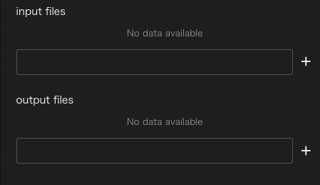

# コンポーネント共通項目
本節では全コンポーネントに共通する仕様について説明します。

## name,description
全てのコンポーネントは共通して、`name`プロパティと`description`プロパティを持ちます。

nameは、そのコンポーネントに必要なファイルを格納するディレクトリ名として扱われるため
同一階層に同じ名前のコンポーネントを作成することはできません。

また、nameには、英数字、ハイフン`-`、およびアンダーバー`_`しか使うことができません。

descriptionはnameのような制約が無く自由に記述することができます。
nameのみでは識別し難いようなコンポーネントを区別したり、
コンポーネントの処理内容を説明するために(スクリプトやソースコードにおける)コメントのような
使い方をすることができます。

## inputFile/outputFile
WHEELにはコンポーネント内のファイルを別のコンポーネントで使うために
転送するinputFile/outputFileという機能があります。

あるコンポーネントのoutputFileに指定したファイルと別のコンポーネントのinputFileに指定したファイルを
画面上で接続すると、後続コンポーネントの実行前に先行コンポーネントのディレクトリ内の
必要なファイルに対してシンボリックリンクを作成するので
後続コンポーネント内のスクリプトからもファイルにアクセスすることができます。

TODO 結線した様子のスクショを入れる

inputFileとoutpuFileの指定方法によってそれぞれ次のような挙動を示します。

### inputFileが空白でoutputFileに通常のパスが指定された時
outputFileに指定されたファイルまたはディレクトリへのシンボリックリンクが
後続コンポーネントの最上位ディレクトリに作成されます。

### inputFileが'/'で終わらない文字列、outputFileに通常のパスが指定された時
後続コンポーネントのディレクトリ内に、outputFileに指定されたファイルまたはディレクトリへの
シンボリックリンクが、inputFileに指定された名前で作成されます。

### inputFileが'/'で終わらない文字列で、outputFileに指定されたパスがglob(\*や\?など)を含む時
後続コンポーネントのディレクトリ内に、inputFileに指定された文字列のディレクトリが作成され
その中に、outpuFileで指定されたglobと一致するファイル、ディレクトリへのシンボリックリンクが
作成されます。

### inputFileに'/'で終わる文字列が指定された時
後続コンポーネントのディレクトリ内に、inputFileに指定された文字列のディレクトリが作成され
outputFileに指定されたファイル、ディレクトリへのシンボリックリンクが作成されます。

--------
[リファレンスマニュアルのトップページに戻る](../readme.md)
