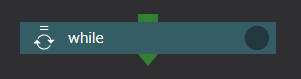

# While

Whileコンポーネントは、各種プログラミング言語のWhileループと同様に
設定された条件判定が真の間、
下位コンポーネントを繰り返し実行します。

Whileコンポーネントに設定できるプロパティは以下のとおりです。

### use javascript expression for condition check
Taskコンポーネントのretry判定と同じく、
繰り返し実行を行うかどうかの判定にシェルスクリプトを用いるか
Javascriptの式を用いるかを指定します。

### script name for condition check
use javascript expression for condition checkが無効の時のみ
条件判定に用いるシェルスクリプトをドロップダウンリストから選択します。

### jacascript expression
use javascript expression for condition checkが有効の時のみ
条件判定に用いるjavascript式を設定します。

### number of instances to keep
各インデックスで処理を行なった時のディレクトリを最大何個まで残すかを指定します。
無指定の時は、全てのディレクトリが保存されます。

## Whileコンポーネント実行時の挙動
ForeachコンポーネントもForコンポーネントと同様の挙動をしますが
ディレクトリ名の末尾にはインデックス値の代わりに、
0から始まる数字を1刻みで使用します。

また終了判定もインデックス値の計算ではなく設定されたシェルスクリプトの戻り値か
Javascript式の評価結果を用います。

--------
[リファレンスマニュアルのトップページに戻る](../readme.md)
