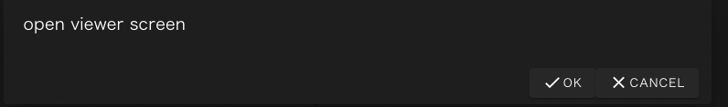

# Viewer

Viewerコンポーネントはプロジェクト実行中に生成される画像ファイルなどを
ブラウザから確認するためのコンポーネントです。

Viewerコンポーネントに指定できる固有のプロパティはありません。
また、ViewerコンポーネントにはoutputFilesプロパティを設定することはできません。

### Viewerコンポーネントの挙動
Viewerコンポーネントは先行するコンポーネントの実行終了後に
inputFileから接続されたファイルを受け取ります。

これらのファイルに、ブラウザで表示可能な画像ファイル(bmp, jpeg, pngなど)が含まれている時は
(初回のみ)ブラウザ上にダイアログが表示され、
`OK`をクリックすると別のタブでビューワー画面が表示されます。

また、画面上部のビューワー画面表示ボタンが有効になり
以降はこのボタンをクリックすることでもビューワー画面を表示することができます。

--------
[リファレンスマニュアルのトップページに戻る](../readme.md)
