# Advanced tutorial

## 応用編チュートリアルについて
本チュートリアルでは、基礎編では触れなかった機能を扱います。

基礎編とは違い全ての項目は独立しています。
個々に新規プロジェクトを作成してからチュートリアルを実行してください。

### 1. 条件分岐
ワークフローの中で、ある処理の実行結果に応じて
後続の処理を変えることがあります。

WHEELでは、このような条件分岐を実現するために ifコンポーネントを用意しています。

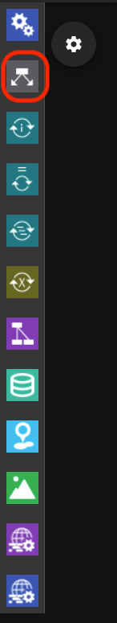

ここではifコンポーネントを使って、スクリプトの実行結果の成否に応じて
それぞれ異なるスクリプトを実行してみましょう。

まず、新規プロジェクトを作成してください。
続いて、ワークフローに、taskコンポーネントを2つとifコンポーネントを1つ追加してください。
以降はそれぞれ、task0, task1, if0 という名前で呼びます。

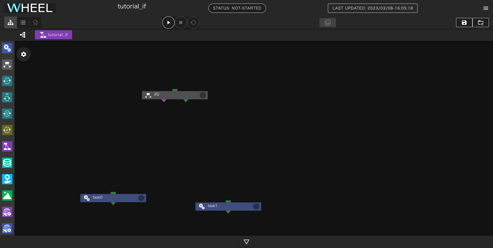

先に、if0から分岐した後で実行するtask0, task1を作成します。

それぞれのコンポーネントで新規ファイルを作成し、テキストエディタで次の内容を入力してください。
また、scriptプロパティに作成したファイルを指定しておいてください。

task0:

```
echo task0
```

task1:

```
echo task1
```

それぞれ、標準出力に対して __task0__ または __task1__ と出力します。

続いて、ifコンポーネントの条件分岐を指定します。
プロパティ画面を開いて、 `check.sh` という名前で新規ファイルを作成し
このファイルをテキストエディタで開いてください。

check.shの戻り値が0であればif節、0以外であればelse節へと分岐するので
まずは、
```
exit 0
```
とだけ記入して必ずif節を通るようにしてみましょう。

コンポーネントのプロパティ画面に戻って __condition setting__ の行をクリックし
__script name for condition check__ と書かれた覧に `check.sh` を指定してください。


最後に、if0の下に表示されている紫色の▼をtask0に、緑の▼をtask1に接続してください。

緑のコネクタは、check.shの戻り値が0の時、紫色のコネクタは戻り値が0以外の時に
進むコンポーネントを示します。

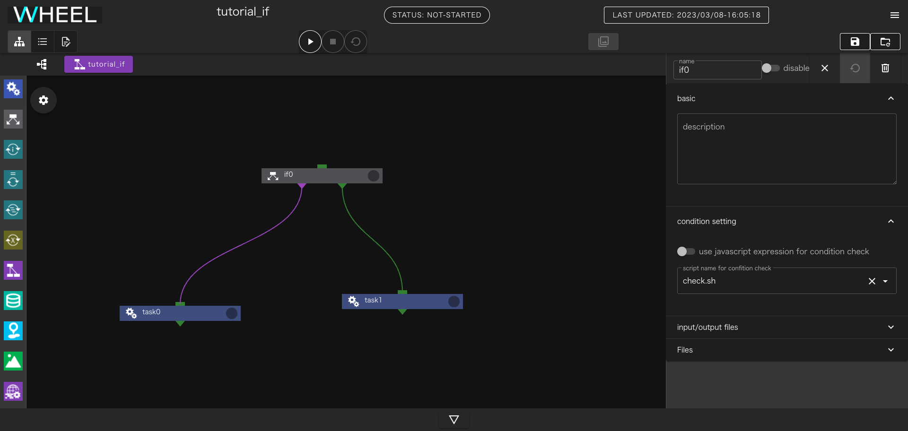

このワークフローを実行すると、check.shは0を返すので、task1のみが実行され
STDOUTには `task1` とだけ表示されます。


一度、プロジェクトを初期化してcheck.shの内容を `exit 1` に変更して再度実行してみましょう。
今度は、task0のみが実行され、STDOUTには `task0`とだけ表示されます。

### 2. ループ
ワークフローの中で繰り返し同じ処理を実行することがあります。

WHEELにはこのような時に使える、for(1)、while(2)、foreach(3)という
3種類のループコンポーネントがあります。

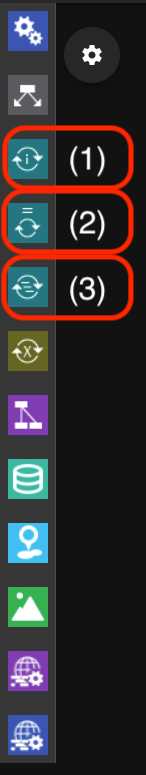

各コンポーネントの中には、入れ子したワークフローを定義することができ、
これらのコンポーネントに指定された条件を満たすまで、下位ワークフローを繰り返し実行します。

それぞれのコンポーネントでは次の方法で条件を指定できます。

 - for: 始値から終値までのカウントアップまたはカウントダウン
 - while: 指定されたシェルスクリプトまたはjavascriptの文を実行して戻り値が0(JSの場合はtrue)になるまで
 - foreach: 使用する値を全て列挙する

ここでは、代表例としてforコンポーネントを使って、1から10まで順に出力するワークフローを作りましょう。

始めにプロジェクトにforコンポーネントを1つ追加してください。

forコンポーネントのプロパティに __start__ __end__ __step__ という3つの数字を指定する欄があります。
それぞれ、 1、5、2 と指定してください。

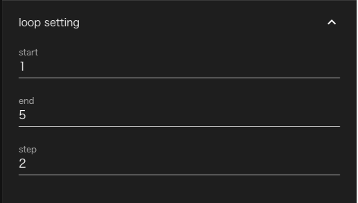


次に、forコンポーネントをダブルクリックしてください。
これで、forコンポーネント内のコンポーネントが表示された状態になりますが、
今は何もコンポーネントが無いので表示されていません。

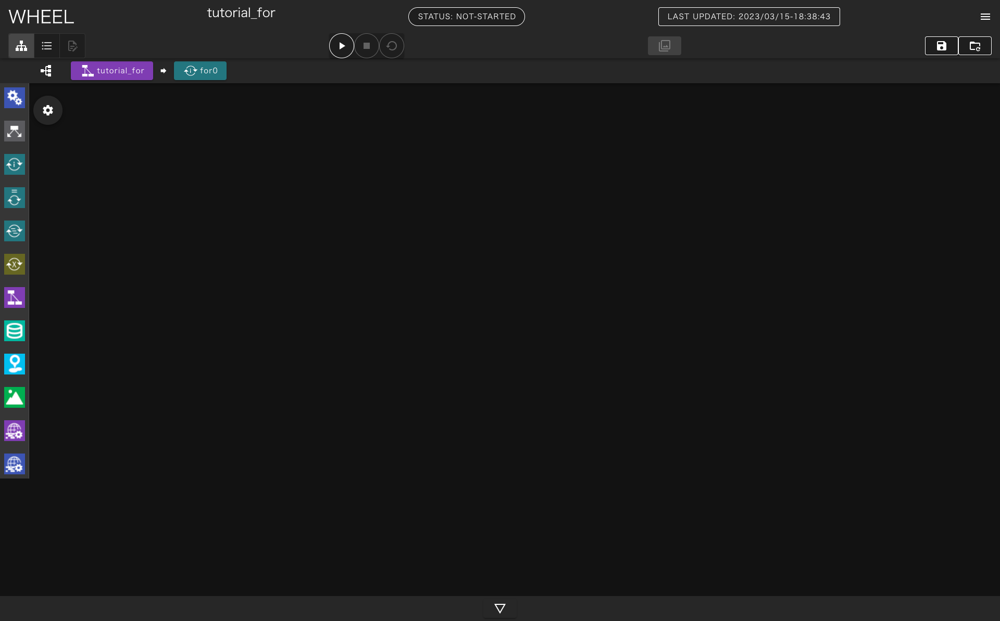

ここに、taskコンポーネントを1つ追加してください。
また、taskコンポーネントに空のファイルを追加してscriptプロパティに指定してください

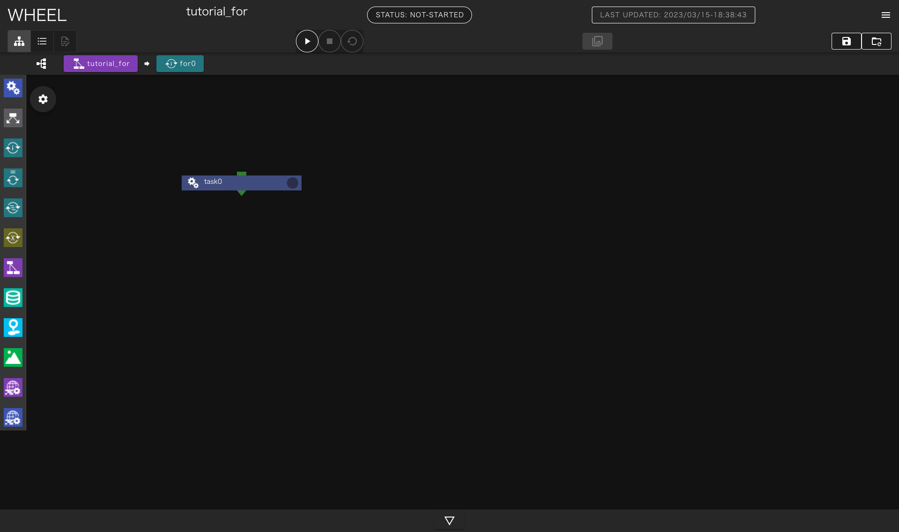


forコンポーネント内のtaskコンポーネントでは、ループ変数の値を示す `$WHEEL_CURRENT_INDEX` 環境変数が利用できます。
スクリプトに指定したファイルをテキストエディタで開き、以下の行を記入してください。

```
echo $WHEEL_CURRENT_INDEX
```

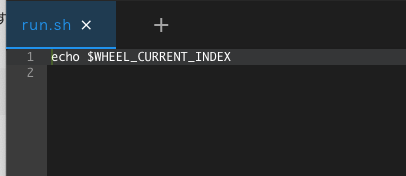

プロジェクトを実行すると、標準出力に 1,3,5 と表示されます。

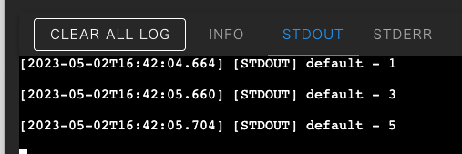

この例で示したように、forコンポーネントのendプロパティとindex変数の値が等しい時も
内部のコンポーネントは実行されます。


### 3. パラメータスタディ
計算機シミュレーションのワークフローでは、入力データのパラメータを
一部変更して、同じ計算を繰り返し実行することがあります。

WHEELには、このような処理をサポートするパラメータスタディコンポーネントがあります。

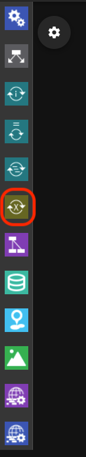

パラメータスタディコンポーネントの中には入れ子にしたワークフローを定義することができます。
下位ワークフロー内の任意のファイルを指定されたパラメータ値で書き換えて実行するため同じ処理をパラメータを変えて複数回実行することができます。

ここでは、シェルスクリプト内書き換えて実行することで、
echoコマンドに様々な引数を渡してみましょう。


始めにプロジェクトに1つPSコンポーネントを追加してください。

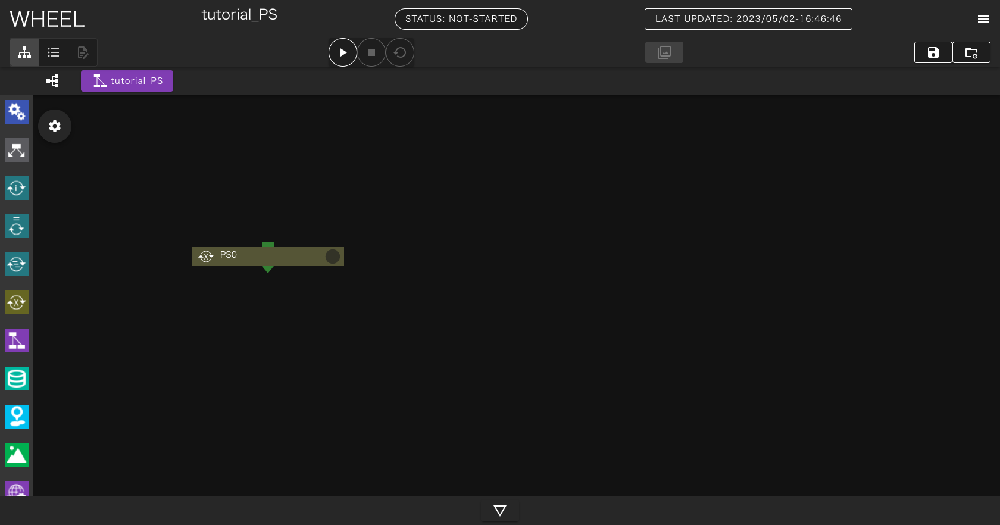

続いて、PSコンポーネントをダブルクリックしてPSコンポーネント内部を表示しtaskコンポーネントを1つ追加してください。
また、taskコンポーネント内に `run.sh` という空ファイルを追加してscriptプロパティに指定してください。

`run.sh`の中には

```
echo number
```

と書いてください。

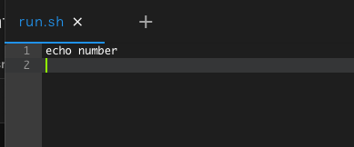

run.shを保存したらグラフビューに戻り、
画面上部に表示されている __tutorial_PS__ をクリックしてプロジェクトのrootコンポーネントに戻ります。

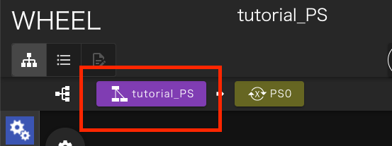

PSコンポーネントのプロパティ画面を開いてFilesエリアを表示し、parameterSetting.jsonをクリックして選択した状態で
テキストエディタ画面へ移動します。

画面左側は、これまでと同様のテキストエディタですが、画面右側に、パラメータスタディ用の設定を行なうための画面が表示されています。

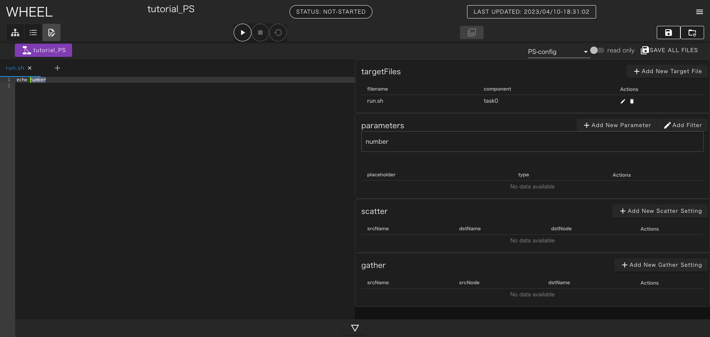

まず、画面右上の __+Add New Target File__ ボタンをクリックしてください。
コンポーネントツリー画面が表示されるので、 __task0__ をクリックし、ファイル名に __run.sh__ と入力して __OK__ ボタンをクリックしてください。

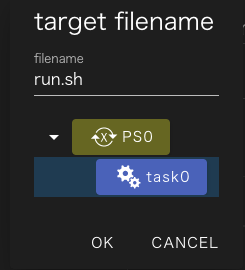

テキストエディタ部に、さきほど作成したrun.shが表示されるので、`number`の部分をドラッグして選択してください。
画面右側の __parameters__ と書かれた場所のすぐ下に __number__ と表示されます。

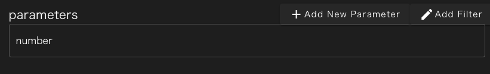

この状態で、 __+ Add New Parameter__ ボタンをクリックすると、 __number__ の部分に対するパラメータ設定を行うことができます。
ここでは、ドロップダウンリストを __list__ に変更し、 __foo__ __bar__ __baz__ の3つの値を入力してください。


最後に __SAVE__ ボタンをクリックすると、__number__ に対するパラメータ設定が登録され、
__run.sh__ の __number__ の部分は、 __{{ number }}__ と書き換えられます。

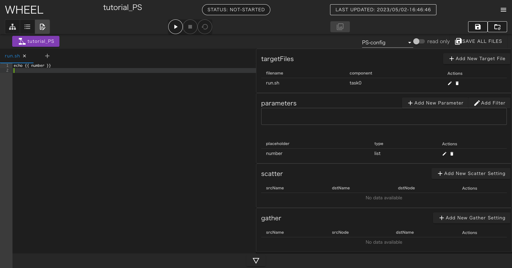

実行時には、この部分が実際のパラメータ(foo, bar, baz)で置き換えられてそれぞれ実行されます。

最後に、画面右上の __SAVE ALL FILES__ ボタンをクリックして編集結果を保存してください。

プロジェクトを実行すると、STDOUTに foo, bar, baz とそれぞれechoコマンドの出力結果が表示されます。

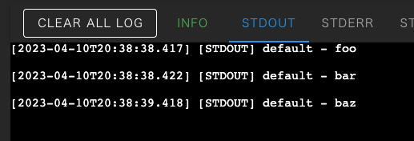


#### パラメータ置換に関する補足
さきほどの、 __{{ number }}__ をtargetfileに指定したファイル内の別の場所に記載すれば、そちらも同様にパラメータに置換されます。

また、二重括弧の中には、フィルタを追加することができます。
例えば __{{ number | upper }}__ とすればパラメータを大文字にすることができます。

他にも __{{ "true" if number == "foo" else "false" }}__ とすれば、number がfooの時のみ "true"それ以外の時は"false" に置き換えられます。

利用可能なフィルタはこちらをご参照ください

[https://mozilla.github.io/nunjucks/templating.html#builtin-filters](https://mozilla.github.io/nunjucks/templating.html#builtin-filters)


### 4. 入力ファイル
シミュレーションの内容によっては、プリプロセスはインタラクティブに実施したいが
ソルバー以降の処理はワークフローで自動的に実行したいというケースもあります。

WHEELには、実行時にファイルをアップロードしてワークフローの __入力データ__ として
扱うsourceコンポーネントが用意されています。


ここでは、ローカルPCで作成した任意のテキストファイルを
catコマンドで表示するワークフローを作成して、sourceコンポーネントについて学びましょう

まずはじめに、プロジェクトにtaskコンポーネントとsourceコンポーネントを1つづつ追加してください。

sourceコンポーネントのプロパティを開いて、upload settingの行をクリックし __upload on demand__ のスイッチを有効にしてください。
自動的にsourceコンポーネントのoutputFileに __UPLOAD_ON_DEMAND__ と表示されます。

続いて、taskコンポーネント内に `run.sh` という空ファイルを追加してscriptプロパティに指定してください。
run.shには次の内容を記載してください。

```
cat input.txt
```

最後にtaskコンポーネントのinputFileに __input.txt__ を追加し、sourceコンポーネントの __UPLOAD_ON_DEMAND__ と接続してください。
以上でワークフローの作成は完了です。

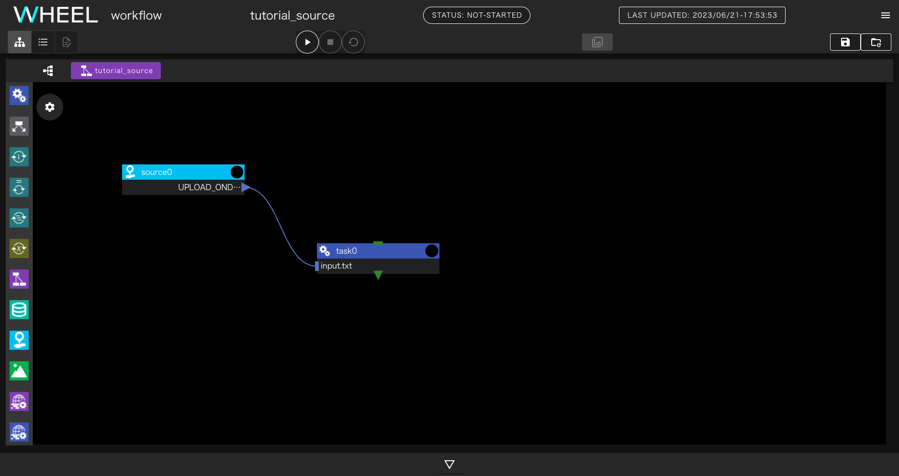

実際に、入力ファイルとして使うためのテキストファイルをPC上に用意してください。

プロジェトを実行すると、sourceコンポーネントのoutputfileとして使うファイルをアップロードするためのダイアログが表示されるので
さきほど用意したファイルを指定してください。
アップロードが完了すると、 __Drop file here__ と書かれた部分がアップロードされたファイル名に変更されます。

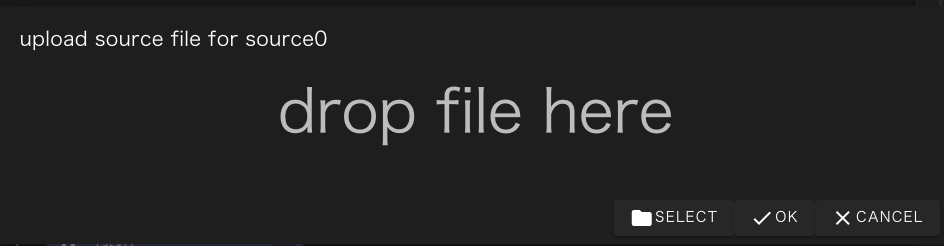


OKボタンをクリックするとプロジェクトの実行が再開され、catコマンドによってアップロードされたファイルの中身が
STDOUTに出力されます。

なお、OKボタンをクリックするまでは、ファイルのアップロードは何度でもやり直すことができるので
指定するファイルを間違えた時は再度アップロードすれば後から指定したファイルが使われます。


### 5. 結果表示
ポストプロセスまで自動化されたワークフローでは、
計算結果として画像ファイルを出力することがよくあります。

WHEELには、代表的な形式の画像ファイルをブラウザ上で表示するviewerコンポーネントが用意されています。
このコンポーネントを使うと、計算結果のファイルをPCにダウンロードすることなく
簡単に結果を確認することができます。

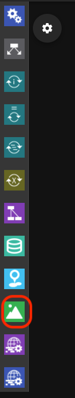

ここでは、事前に用意した画像ファイルをviewerコンポーネントに渡すワークフローを作成して
viewerコンポーネントについて学びましょう。

まずはじめに、プロジェクトにtaskコンポーネントとviewerコンポーネントを1つづつ追加してください。

続いて、taskコンポーネント内に `run.sh` という空ファイルを追加してscriptプロパティに指定してください。
run.shには次の内容を記載してください。

```
ls *
```

viewerコンポーネントで表示するための、画像データをtaskコンポーネントにアップロードし
outputFileに、 __*.jpg__ のような形でファイル名を記述してください。
1ファイルのみを表示する場合はファイル名をそのまま書いても構いません。
また、1つにまとめず複数のoutputFileを指定しても問題ありません。

最後にviewerコンポーネントのinputFileに __./__ を追加しtaskコンポーネントのoutputFileと接続してください
以上でワークフローの作成は完了です。

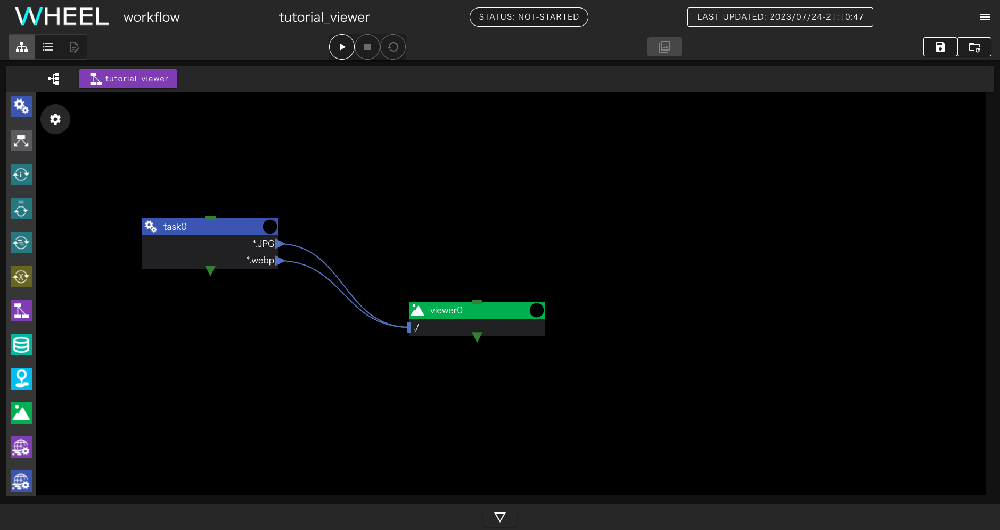

プロジェクトを実行すると、 __open viewer screen__ というダイアログが表示されるので
OKボタンをクリックすると別のタブで画像ビューワーが表示されます。

初期状態ではタイル表示になっていますが、表示された画像をクリックするとスライドショー状態になります。
この状態では、画像の拡大縮小などを行うことができます。

### 6. ファイル保存
WHEELでワークフローを実行した時に、作成される出力ファイルなどは
プロジェクトを初期化した際に毎回削除されてしまいます。

人間が介在して、結果の確認や設定の調整を行ないながら繰り返しワークフローを実行する時には
毎回の実行時の結果を保存しておきたいこともあります。

このような時には、storageコンポーネントを使うとプロジェクトの初期化時にも削除されずに残すことができます。


ここでは、storageコンポーネントを使って、ファイルを保存しながら
複数回プロジェクトの実行と初期化を繰り返して、全てのファイルが保存されることを確認しましょう。

まずはじめに、プロジェクトにtaskコンポーネントとstorageコンポーネントを1つづつ追加してください。

続いて、taskコンポーネント内に `run.sh` という空ファイルを追加してscriptプロパティに指定してください。
run.shには次の内容を記載してください。

```
echo foo >foo.txt
```

また、taskコンポーネントのoutputFileに __*.txt__ を追加してください。
このコンポーネントは __foo.txt__ しか出力しませんが、これから出力ファイル名を書き換えながら
何回かプロジェクトを実行するため、ファイル名を*で指定しています。

次にstorageコンポーネントのプロパティ画面を開き __directory path__ の欄に
__/tmp__ と記述してください。また、inputFileに __./__ を指定してください。

> もし、/tmpが存在しない、または/tmpに書き込み権限が無い場合は他の任意のディレクトリを指定してください。
  ただし、プロジェクトファイルが保存されているディレクトリツリーの範囲外のパスを指定する必要があります。

最後に、taskコンポーネントのoutputFileとstorageコンポーネントのintpuFileを接続してください。
以上でワークフローの作成は完了です。

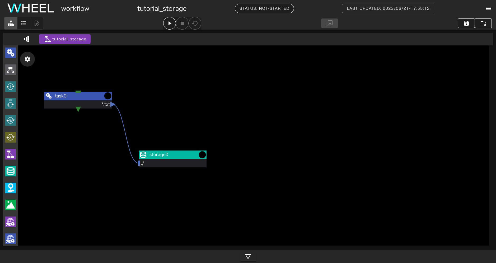

プロジェクトを実行すると、task0, storage0それぞれのコンポーネントの下に foo.txtが表示されます。

プロジェクトを初期化すると、task0の下のfoo.txtは削除されますが、storage0の下のfoo.txtは残ります。

task0のrun.shを編集して、出力ファイル名をbar.txtに変更して再実行すると、storage0コンポーネント内に
foo.txt, bar.txtが表示されます。

このように、プロジェクトの初期化を行なってもstorageコンポーネント内に保存したファイルは
保持されるので、リスタート計算用のファイルの保存などに活用することができます。


### 7. バルクジョブ
富岳を初めとした、富士通株式会社製の "Technical Computing Suite" ジョブスケジューラを
採用したシステムでは、バルクジョブ機能を使用することができます。

WHEELには、この機能をGUIから簡単に使うための bulkjobTask コンポーネントが用意されています。

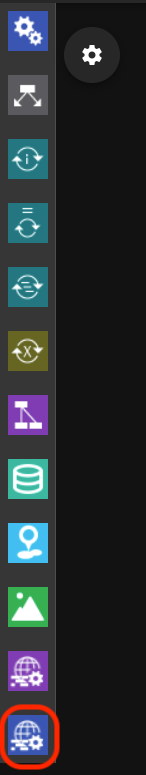

ここではバルクジョブを用いてパラメータスタディと同じ内容のワークフローを作成してみましょう。

はじめに、新規プロジェクトを作成し、builkjobTaskコンポーネントを1つ追加してください。

デフォルトではlocalhostでの実行になっているので、プロパティのhostを変更して
bulkjob機能が利用可能なリモートホストを指定してください。

なお、実際に利用するホストで稼動しているジョブスケジューラが
バルクジョブ機能をサポートしていても、remotehost設定で __use bulkjob__ を有効にしていないと
バルクジョブ機能は使えませんので、ご注意ください。

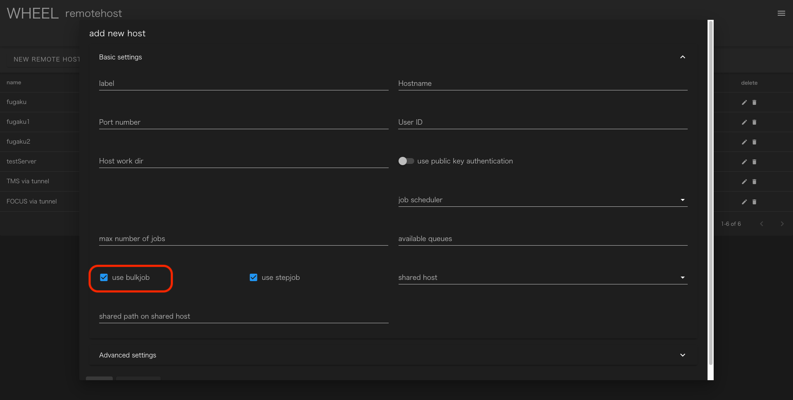

プロパティ画面を開いて、 `run.sh` という名前で空ファイルを作成し
テキストエディタを開いて `echo ${PJM_BULKNUM}` と記入してください。
ジョブ実行時には、`${PJM_BULKNUM}` の部分が設定したパラメータに置き換えられます。

プロパティ画面に戻って、scriptに `run.sh` を設定してください。

最後に、 __bulkjob setting__ の行をクリックしてパラメータを指定します。
ここでは、 __use parameter setting file for bulk number__ のチェックを外して
startに __0__ endに __5__ を指定してください。


最後に、各サブジョブの標準出力を回収するために、__remote file setting__ の行をクリックして
__include__ に `run.sh*` と指定してください。


プロジェクトの実行が完了すると、run.sh.xxxxx[`${PJM_BULKNUM}`].out という形式のファイル名で
標準出力が、出力されているので、各`PJM_BULKNUM`とファイルに出力されたechoコマンドの出力が
一致することを確認してください。


### 8. ステップジョブ
富岳を初めとした、富士通株式会社製の "Technical Computing Suite" ジョブスケジューラを
採用したシステムでは、ステップジョブ機能を使用することができます。

WHEELには、この機能をGUIから簡単に使うための stepJob および stepJobTask コンポーネントが
用意されています。


WHEELのステップジョブ機能は、stepJobコンポーネントの中にstepJobTaskコンポーネントを複数定義して
依存関係を定義したものを、ジョブスケジューラのstepjob機能を用いて実行するものです。

はじめに、新規プロジェクトを作成しstepJobコンポーネントを1つ追加してください。

デフォルトではlocalhostでの実行になっているので、プロパティのhostを変更して
stepjob機能が利用可能なリモートホストを指定してください。

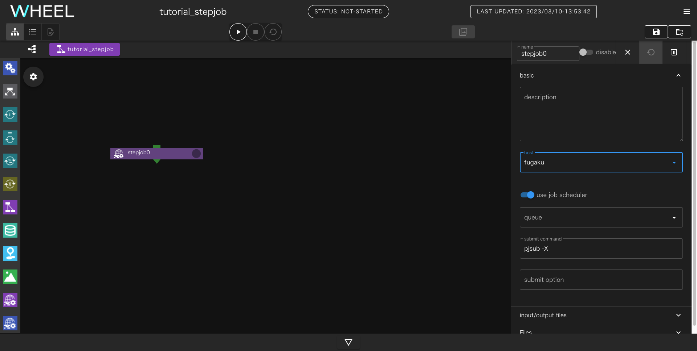

なお、実際に利用するホストで稼動しているジョブスケジューラが
ステップジョブ機能をサポートしていても、remotehost設定で __use stepjob__ を有効にしていないと
ステップジョブ機能は使えませんので、ご注意ください。


続いて、__stepjob0__ をダブルクリックしてstepjob0コンポーネント以下を表示させてください。

stepjob コンポーネント内には、stepjobTask コンポーネントしか配置できませんので
画面が左側のコンポーネントライブラリ部分が切り替わってstepjobTask コンポーネントのみが表示された状態になります。


ここに、stepjobTaskコンポーネントを2つ追加してください。

stepjobTask0とstepjobTask1という2つのコンポーネントができるので、
それぞれのコンポーネントに __run.sh__ という名前で空ファイルを作成し、
__script__ プロパティに指定してください。

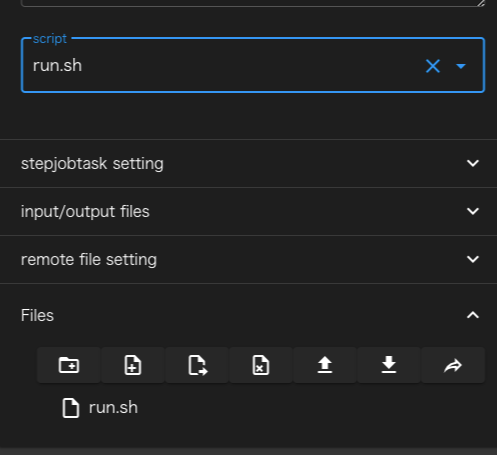

stepjobTask0のスクリプトには、次のように指定してください

```
exit 1
```

これでstepjobTask0は毎回エラー終了するようになります。

stepjobTask1のスクリプトは次のように指定してください

```
echo stepjobTask1 > stdout.txt
```

まず、stepjobTask0とstepjobTask1の実行順を指定します。
stepjobTask0の ▼ をドラッグしてstepjobTask1にドロップしてください

線が接続され、stepjobTask1の左肩に表示されているアイコンの番号が1に変わります。


次に、stepjobTask1の実行条件を指定します。
プロパティ画面の __stepjobtask setting__ の覧をクリックして開き
__use dependency__ を有効に、__dependencyForm__ に  `sd=ec==1`
と入力してください。
これで、stepjobTask1はstepjobTask0の戻り値が1の時のみ実行されます。
__dependencyForm__ の記述方法については、TCSのドキュメントやお使いのスパコンシステムの
ユーザガイドを参照してください。

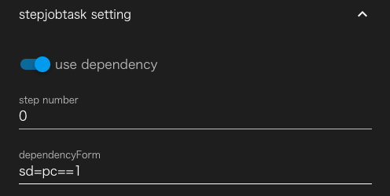

最後にstepjobTask1が出力するファイルを回収するために、
__remote file setting__ の行をクリックして開きincludeの欄に `stdout.txt` と入力してください。

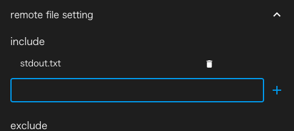

プロジェクトを実行すると、stepjobtask0がfaildとなりますが、
stepjobTask1は実行され、stdout.txtの中に `stepjobTask1` と書かれています。

一度、プロジェクトを初期化してから、stepjobTask1の __dependencyForm__ を
`sd=ec==0` と変更して実行してください。

今度は、stepjobTask0がfaildになった後、stepjobTask1は実行されずそのまま
ワークフロー全体が終了します。

これで、応用編のチュートリアルは終了です。

実際にアプリケーションを動かすワークフローについて知りたい方は
[実践編のチュートリアル](../3_application_tutorial/index.md) に進んでください。

また、個々の機能の詳細な内容については、[リファレンスマニュアル](../../3_reference_manual/index.md) をご参照ください。


--------
[チュートリアルのトップページに戻る](../index.md)
