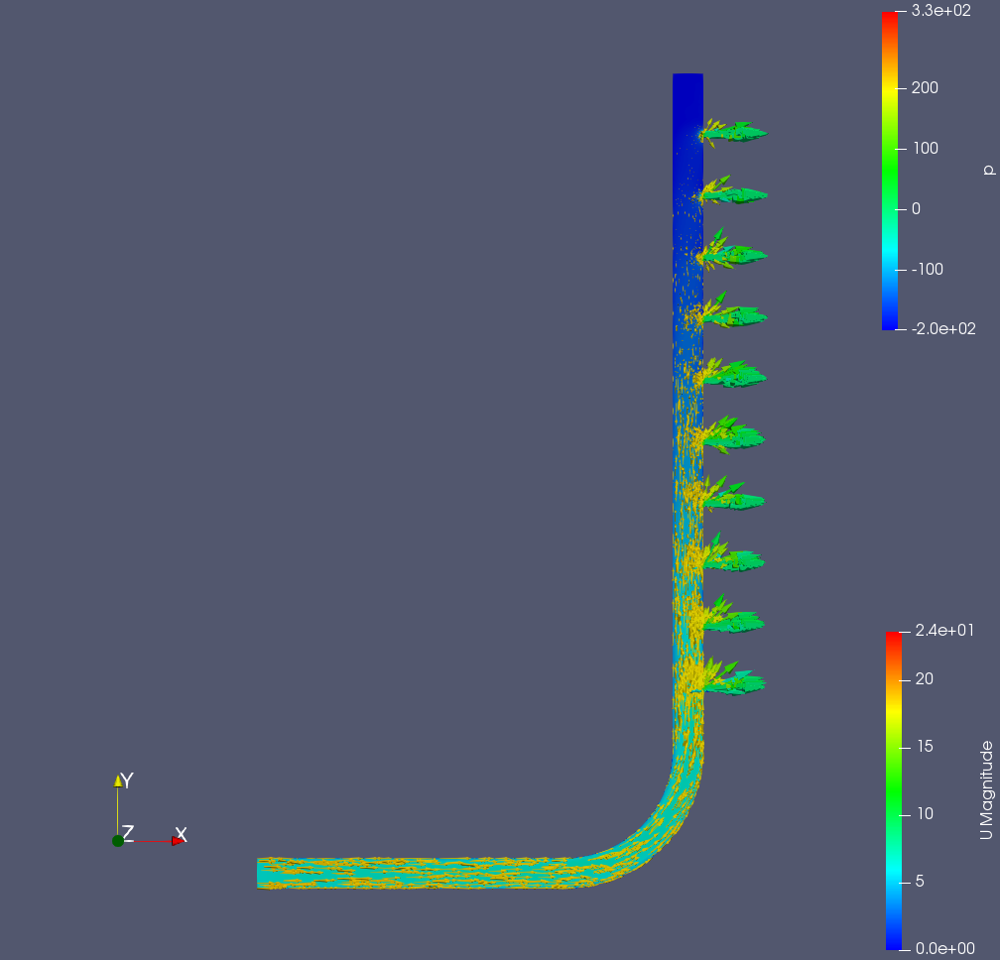

# OpenFOAMを利用したパラメトリックスタディ解析ワークフロー
本章では、WHEELを用いた計算事例として「OpenFOAMを利用したパラメトリックスタディ解析ワークフロー」を紹介します。

3次元CADで作成した分配菅モデルに対して、intletの流速を対象としたパラメータスタディを行ないます。

目次
1. 解析概要
1. WHEELによるワークフローの作成
　1. Parameter Study コンポーネント
　2. Task コンポーネント
1. ジョブの投入
1. 解析結果の確認

## 1. 解析概要
本事例で使用する解析対象モデルは、分配菅モデルです。

#### 解析モデル D50-d10


inletから流入した流体がoutletから出ていく解析を実施します。

事前に[こちら](https://....)のファイルをダウンロードして展開しておいてください。
アーカイブ内には次の3つのファイルが含まれます。

- __pipe.unv__ メッシュ
- __U__        流速の初期条件ファイル
- __D50-d10.tgz__ ケースファイル

なお、メッシュはCADモデルを元に、「SALOME-MECA」を用いて作成し
Ideas universal形式でメッシュデータをエキスポートしたものです。

## 2. ワークフロー作成
新規プロジェクトを作成し、taskコンポーネントを2つとPSコンポーネントを1つ
追加してください。
1つ目のtaskコンポーネントの名前は __convert__、2つ目のtaskコンポーネントの名前は
__extractとしてください。

また、PSコンポーネント内部にtaskコンポーネントを1つ追加し、
__solve__ という名前にしてください。

### convertコンポーネントの設定
__convert__ コンポーネントのファイルエリアを開き、事前にダウンロードした
__pipe.unv__ をアップロードしてください。

また、__run.sh__  という名前で新規ファイルを作成し次の内容を記入してください。

```
. /vol0004/apps/oss/spack-v0.17.0/share/spack/setup-env.sh

spack load 'openfoam@2012%fj@4.8.0'

ideasUnvToFoam pipe.unv
```

このスクリプトでは、Ideas universal形式のメッシュファイルを
OpenFOAM形式へと変換します。

正常に終了すると __constant/polyMesh__ ディレクトリに次のファイルが
生成されます。

- boundary
- owner
- faces
- neighbor
- points

コンポーネントのプロパティ画面を開いて、以下の4項目を設定してください

- script: run.sh
- host: fugaku
- useJobScheduler: 有効
- outputFiles: constant

### solveコンポーネントの設定
__solve__ コンポーネントのファイルエリアを開き、事前にダウンロードした
ケースファイルをアップロードしてください。
また、__run.sh__  という名前で新規ファイルを作成し次の内容を記入してください。

```
. /vol0004/apps/oss/spack-v0.17.0/share/spack/setup-env.sh

spack load 'openfoam@2012%fj@4.8.0'

tar xvzf D50-d10.tgz
mv ./U ./D50-d10/0
cd ./D50-d10

decomposePar
mpiexec -n 12 simpleFoam -parallel
reconstructPar
touch result.foam

cd ..
tar cvzf D50-d10.tar.gz D50-d10
```

コンポーネントのプロパティ画面を開いて、以下の3項目を設定してください

- script: run.sh
- host: fugaku
- useJobScheduler: 有効


### PSコンポーネントの設定
PSコンポーネントをクリックし、__output files__ に `results` を追加してください。

ファイルエリア内のある __parameterSetting.json__
ファイルを選択した状態でテキストエディタを開いてPS設定モードにします。

__Add New Target File__ ボタンをクリックして __solve__ コンポーネント内の
__U__ を対象にします。


左ペインに __U__ ファイルが開かれるので boundaryField -> inlet -> value の行
にある、 __uniform (5 0 0);__ のうち __5__ の部分を
マウスで選択してください。

右ペインの __parameters__ と書かれた部分の下のテキストフィールドに
__5__ と表示されます。


この状態で、 __Add New Parameter__ ボタンをクリックしてinletの流速に設定する値を
入力します。
ここでは、5 m/sから7m/sまで1m/s刻みでパラメータスタディを行なうので
min=5, max=7, step=1 を設定してください。


最後に __solve__ コンポーネントの実行結果を回収する設定を追加します。

__Add New Gather Setting__ ボタンをクリックしてgather設定ダイアログを表示し
solveを選択した状態で、 __srcName__ に `D50-d10.tar.gz` __dstName__に
`results/{{ U }}/D50-d10.tar.gz` と入力してください。


以上で、PS設定ファイルの編集は完了です。画面右上の __SAVE ALL FILES__ ボタンを
クリックして編集内容を保存してください。

### extractコンポーネントの設定
__extract__ コンポーネントに
__run.sh__  という名前で新規ファイルを作成し次の内容を記入してください。

```
for i in results/*
  do
    pushd $i
    tar xfz  D50-d10.tar.gz
    popd
  enddo
```

このスクリプトは、 __solve__ コンポーネントの出力結果を順に展開し、
paraviewを起動する準備をします。

最後にコンポーネントのプロパティを開いて、scriptに __run.sh__ を設定してください。


### ファイル依存関係の設定
__convert__ のoutputFileに設定した、`constatnt` をPSコンポーネントに
ドロップして接続してください。

また、PSコンポーネントのoutputFileに設定した `results` を
__extract__ コンポーネントにドロップして接続してください。

以上でワークフローの作成は完了です。

## 3. プロジェクトの実行
__run__ ボタンをクリックして、プロジェクトを実行してください。
初めに、富岳へのログインに必要な秘密鍵のパスワードが聞かれますが、それ移行はワークフローの終了まで操作は不要です。

## 4. 解析結果の確認

解析結果の確認を行います。

__extract__ コンポーネントのプロパティ画面を開いてFilesエリアを表示し

`results`ディレクトリ -> 流入速度のディレクトリ と辿っていってください。
その下に `result.foam` ファイルが表示されるので、これをクリックして選択し
shareボタンをクリックしてください。


__result.foam__ ファイルのパスが表示されるので、
コピーボタンをクリックしてコピーしこのファイル名を引数に
このファイル名を引数にparaviewを起動してください。


### 解析結果
流入速度、5[m/s], 6[m/s], 7[m/s] の各

**流入速度5[m/s]** の解析結果において、分配菅の断面図に **速度 U** を、ベクトルで **圧力 p** を表示した結果は以下になります。

##### 流入速度5[m/s]


同様に、**流入速度6[m/s]**、**流入速度7[m/s]** の結果を示します。

##### 流入速度6[m/s]



##### 流入速度7[m/s]


OpenFOAMを利用したパラメトリックスタディ解析ワークフロー例は以上になります。
