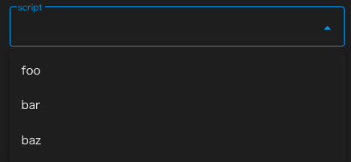
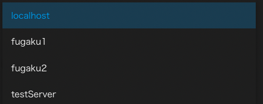
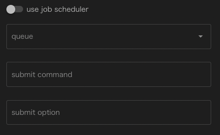
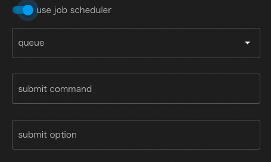
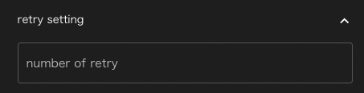
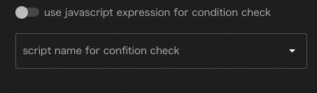
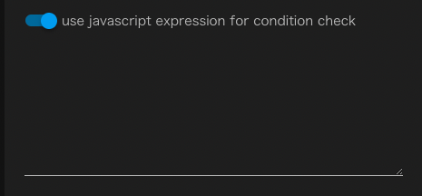

# Task

Taskコンポーネントは、WHEELの用意するコンポーネントの中で最も基本的かつ重要なコンポーネントです。
[ script ]プロパティに設定されたスクリプトファイルを実行環境(host/useJobScheduler/queueプロパティ)の設定に応じて実行します。

Taskコンポーネントに指定することのできるプロパティは以下のとおりです。
なお、name, description, inputFile, outpuFileの4項目については[共通項目](./00_common.md)をご参照ください。

### script
Taskコンポーネントの実行時に呼ぶスクリプトのファイル名を設定します。

scriptプロパティの入力欄はセレクトボックスになっており、
Taskコンポーネント内に存在するファイルの中から選ぶことができます。

### host
[リモートホスト設定](../../2_remotehost_screen/remotehost.md)にて設定されたリモートホストのラベル
または"localhost"を設定します。

hostが"localhost"の時は、scriptはWHEELが動作しているマシン上で実行されますが
それ以外の値が設定されている時は、リモートホストへsshでディレクトリ全体を転送し
リモートホスト上で実行されます。(後述のuseJobSchedulerが設定されている時は、バッチサーバにジョブを投入します)

### useJobScheduler
scriptの実行をバッチサーバに投入する時に有効にします。
useJobSchedulerを有効に設定した時のみ、次のqueue, submit optionプロパティを設定することができます。

無効のとき

有効のとき

### queue
ジョブを投入するキューをリモートホスト設定で設定したキューの中から選びます。
無指定の場合はバッチサーバのデフォルトキューに対してジョブを投入します。

### submit command
この欄は実際にはTaskコンポーネントのプロパティではなく、リモートホスト設定で指定された
バッチサーバにジョブを投入する時のコマンド名が表示されています。

ここでは変更することはできません。

### submit option
ジョブ投入時に追加で指定するオプションを設定します。

### number of retry
Taskコンポーネントの実行に失敗した時に、自動的に再実行を行なう回数を指定します。
無指定時は再実行は行ないません。

### use javascript expression for condition check
Taskコンポーネントの成功/失敗を判定するのに
javascript式を用いるか、シェルスクリプトを用いるか指定します。

無効の時は、シェルスクリプトを選択するドロップダウンリストが表示されており
Taskコンポーネント実行終了後に指定されたシェルスクリプトが実行されて
戻り値が0であれば成功、0以外であれば失敗と判定されます。

なお、無指定の時は[script]に指定したスクリプトの戻り値で同様の判定を行ないます。

有効の時は、ジャバスクリプトの式を記述することができます。
Taskコンポーネントの実行終了後にこの式を評価し、Truthyな値を返せば成功、
Falthyな値を返せば失敗と判定されます。

スクリプト名、javascript式ともに未設定で、number of retryの値のみを設定していた場合は
スクリプトが正常終了するか、retryに設定した回数に達するまで再実行を繰り返します。

### include, exclude
Taskコンポーネントがリモートホストで実行された後、リモートホスト上のディレクトリ内にあるファイルは
outputFileに指定されているなど、その後の処理で必要にならない限りそのままの状態で残されます。

実行時にアプリケーションが出力するログファイルなど、その後のワークフローの処理には不要だが
確認したいファイルなどは、`include`に指定することでTaskコンポーネント実行終了時にダウンロードされ
Filesエリアで確認することができます。

`include`にはディレクトリ名やglobなどを指定することができますが、さらに`exclude`を指定すれば
ダウンロード対象から除外することができます。

例えば、`include`に`*.txt`、excludeに`foo.txt`を指定して、実行終了時にfoo.txt,bar.txt,baz.txtが生成されていたとすると
実際にダウンロードされるファイルは、bar.txt, baz.txtの2つのみとなります。

### cleanup flag
リモートホストでの実行終了後にリモートホスト上に残されたファイルを削除するかどうかを指定します。
`remove files`を指定すれば削除、`keep files`を指定すればリモートホスト上に保存されます。

デフォルト設定は`same as parent`が指定されており、上位コンポーネントの設定と同じ動作をします。

--------
[リファレンスマニュアルのトップページに戻る](../index.md)
