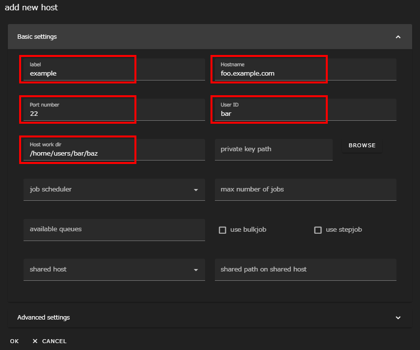
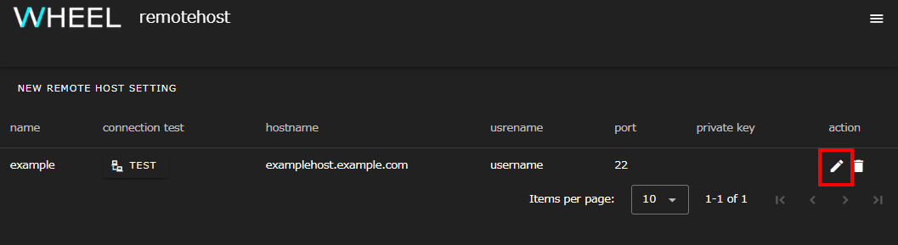
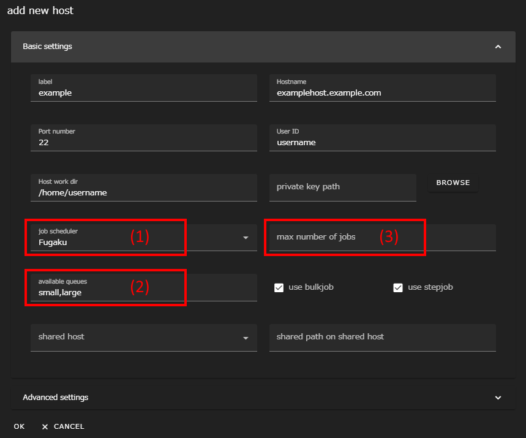

## Advance Preparation
Use Docker to launch WHEEL. Install the latest [Docker](https://www.docker.com/).
A typical configuration pattern is shown below. Consider the optimal configuration based on the number of users, available machines, and other factors.

### Configuration Pattern 1: Building a WHEEL Environment for Each User
This pattern installs Docker on each of the user's work PCs. Then, expand and launch the WHEEL container image.


### Configuration Pattern 2: Aggregating and building the WHEEL environment on the server
This pattern installs Docker on a single server. Then, unpack the WHEEL container image for the number of users using WHEEL and launch it on the server. To separate the WHEEL used for each user, you need to control by port number.


## How to start
The method for starting the WHEEL is as follows.
This section assumes that the [Configuration Pattern 1](#configuration-pattern-1-building-a-wheel-environment-for-each-user) is followed.


__How to Use HTTP Communication__  
If you want to use HTTP instead of HTTPS communication, add the following options when you run `docker run` in step 3.
```
-e WHEEL_USE_HTTP=1
```
HTTP communication should be used only in environments where there are no security issues, such as a trial in a local network.



1. Create a directory in any location. (From now on, this directory is `CONFIG_DIR`.)
1. Store the server certificate and key files for HTTPS communication in `CONFIG_DIR` under the names `server.crt` and `server.key`, respectively.
    Refer to the documentation at the following URL when using self-certificates:

    [https://letsencrypt.org/docs/certificates-for-localhost/](https://letsencrypt.org/docs/certificates-for-localhost/)

    If you use WHEEL for HTTP communication, you do not need to store the server certificate and key file in `CONFIG_DIR`.
    Skip this step.

1. Start Terminal and enter the following command:

    ```
    > docker run -d -v ${HOME}:/root -v CONFIG_DIR:/usr/src/server/app/config -p 8089:8089 tmkawanabe/wheel:latest
    ```

    where `CONFIG_DIR` must be the absolute path on the host machine.

    In the above command:

    - The project file is created in ${HOME}.
    - WHHEL port number is specified as 8089.

1. When the WHEEL server starts, open a web browser on the host machine and click
    Go to `http(s)://localhost:8089`.

<div class="notice--info">{{ notice-http | markdownify }}</div>


## Remote Host Settings
WHEEL can perform tasks on the compute server where you logged in via ssh.
In this section, you configure the remote host settings for connecting to the compute server from the WHEEL.

There are two patterns of remote host configuration. Specify settings according to the calculation server to be used.
- [Without a batch system](#without-a-batch-system)  
Perform this procedure if the compute server does not have a batch system, or if the compute server has a batch system but you do not want to use it.
- [Additional settings if you have a batch system](#additional-settings-if-you-have-a-batch-system)  
If you are using a batch system on a compute server, perform this step in addition to the steps in [Without a batch system](#without-a-batch-system).

### Without a batch system
First, go to WHEEL and click the hamburger menu at the top right of the screen.


Click __Remotehost editor__ in the menu that appears. The Remote Host Settings window appears in a separate tab.


Click the __NEW REMOTE HOST SETTING__ button at the top of the screen. The New Host Configuration dialog appears.


In the form, enter the following values:

label
: Any string

Hostname
: Host name or IP address to connect to

<!-- Port number
: Port number to connect to
-->
User ID
: User ID on the destination host

Host work dir
: Directory path used within the remote host

For example, if you create a configuration named `example` for the `foo.example.com` host that connects as user `bar` and executes tasks under the `/home/users/bar/baz` directory, the input would be as follows:




label is a case-sensitive string that allows WHEEL to distinguish the destination host.

Hostname and User ID are the host name (or IP address) and user ID of the connection destination.
These fields can also have values set in `~/.ssh/config`.

For Host work dir, specify the absolute path of the working directory on the connection-target host.
When WHEEL executes a program on a remote host, it transfers the file under the directory specified here before executing it.

Normally you would specify the home directory of the host you are connecting to, but on some systems it may be better to use a different area because of space limitations or I/O performance.
Select an appropriate directory by referring to the connection destination system usage guide, etc.


__Using public key authentication to connect to a remote host__  
Enable the __use public key authentication__ switch when you use public key authentication to connect to remote hosts.
At the bottom, a field for specifying the private key appears, enter the path of the private key or click the __BROWSE__ button to select the file.

<div class="notice--info">
  {{ notice-https | markdownify }}
</div>

For other detailed settings, refer to the [Reference Manual]({{ site.baseurl }}/reference/2_remotehost_screen/ "remotehost configuration").

### Additional settings if you have a batch system
This section describes the additional remote host configuration required if the compute server has a batch system. Before performing this procedure, perform the procedure described in [Without a batch system](#without-a-batch-system) .

Start the Remote Host Editor.
When the remote host that you registered under [Without a batch system](#without-a-batch-system) is displayed, click the pencil icon on the far right to display the Edit Host Information dialog.






Select the type of batch system used by the remote host from the __job scheduler__ field (1).
The following six values are currently available.

- PBSPro
- PBSProWithoutHistory
- SLURM
- Fugaku
- TCS (Technical Computing Suite)
- UGE (Univa Grid Engine)

__About PBSProWithoutHistory__  
Some PBSPros do not store information about jobs that have finished running in the batch system settings.
In this case, use __PBSProWithoutHistory__ instead of __PBSPro__.
{: .notice--info}

__About Fugaku__  
At Fugaku, TCS is used, but some of the behavior is different from other sites, so we have a special setting (Fugaku) for Fugaku.
If you use Fugaku, choose __Fugaku__ instead of __TCS (Technical Computing Suite)__.
{: .notice--info}


Then enter the available queue names in the __available queues__ column (2), separated by commas.
On a system with a default queue, you can leave this blank if you want to use only the default queue.

Finally, enter the __max number of jobs__ field (3) if you want to limit the number of concurrent jobs.

For example, in a system where the number of concurrently input jobs is limited to 10, if you try to input the 11 th job, an error occurs and job input cannot be accepted.
This error can be suppressed by restricting the WHEEL side.
However, the number of jobs submitted without using WHEEL is not counted. Therefore, if the number of concurrent jobs in a group is limited, the limit may be violated.


--------
[Return to home page]({{ site.baseurl }}/)