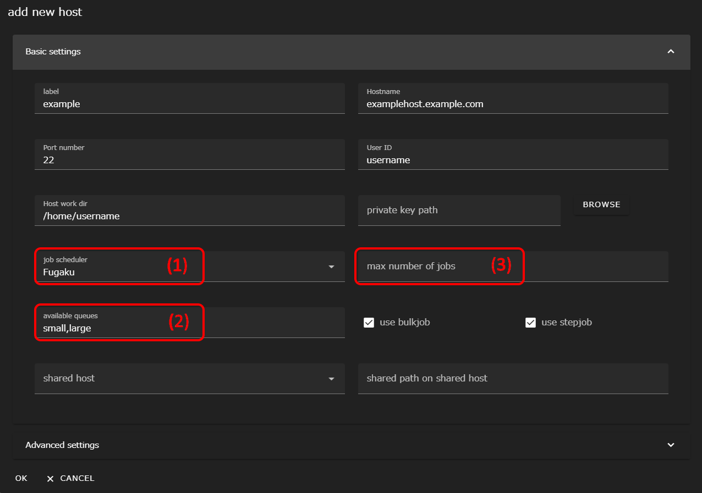

## 事前準備
WHEELの起動にはDockerを使用します。最新の [Docker](https://www.docker.com/) をインストールしてください。  
なお、代表的な構成パターンを以下に示します。利用ユーザー数や使用可能なマシンなどの環境に従い、最適な構成をご検討ください。

### 構成パターン1：ユーザごとにWHEEL環境を構築
本パターンでは、ユーザの作業用PCそれぞれにDockerをインストールします。その上で、WHEELのコンテナイメージを展開し起動します。


### 構成パターン2：サーバにWHEEL環境を集約し構築
本パターンでは、1台のサーバにDockerをインストールします。その上で、WHEELを使用するユーザ数分のWHEELコンテナイメージを展開し、サーバ上で起動します。ユーザごとに使用するWHEELを分けるため、port番号での制御が必要となります。


## 起動方法
WHEELの起動方法は以下の通りです。  
なお、ここでは [構成パターン1：ユーザごとにWHEEL環境を構築](#構成パターン1ユーザごとにwheel環境を構築) にて構築することを前提として説明します。


__HTTP通信を使用する方法__  
HTTPS通信の代わりにHTTP通信を使う場合は、 手順3. にて`docker run`を実行する際に以下のオプションを追加します。
```
-e WHEEL_USE_HTTP=1
```
なお、HTTP通信はローカルネットワーク内での試用など、セキュリティ上の問題が無い環境でのみお使いください。



1. 任意の場所にディレクトリを作成します。(以降では、このディレクトリを`CONFIG_DIR`とします。)
1.  HTTPS通信用のサーバ証明書および鍵ファイルを、それぞれ`server.crt`, `server.key`という名前で`CONFIG_DIR`に格納します。
    自己証明書を使用する際は次のURLのドキュメントを参考にしてください。

    [https://letsencrypt.org/docs/certificates-for-localhost/](https://letsencrypt.org/docs/certificates-for-localhost/)

    なお、HTTP通信にてWHEELを使用する場合は、`CONFIG_DIR`にサーバ証明書と鍵ファイルを格納する必要はありません。
    本手順をスキップしてください。

1. ターミナルを起動し、以下のコマンドを入力します。

    ```
    > docker run -d -v ${HOME}:/root -v CONFIG_DIR:/usr/src/server/app/config -p 8089:8089 tmkawanabe/wheel:latest
    ```

    このとき、`CONFIG_DIR`は、ホストマシン上での絶対パスである必要があります。

    上記コマンドでは、

    - プロジェクトファイルの作成先を${HOME}に指定しています。
    - WHHELのポート番号を8089に指定しています。
        
1. WHEELサーバが起動したら、ホストマシン上でwebブラウザを開いて、
    `http(s)://localhost:8089`にアクセスします。

<div class="notice--info">{{ notice-http | markdownify }}</div>


## リモートホスト設定
WHEELは、sshでログインした先の計算サーバ上でタスクを実行することが可能です。  
ここでは、WHEELから計算サーバに接続するためのリモートホスト設定を行います。

リモートホスト設定には、以下の2パターンが存在します。使用する計算サーバに応じて設定を行ってください。
- [バッチシステムがない場合](#バッチシステムがない場合)  
計算サーバにバッチシステムがない場合、もしくは計算サーバにバッチシステムがあっても使用しない場合は、本手順を実施します。
- [バッチシステムがある場合の追加設定](#バッチシステムがある場合の追加設定)  
計算サーバのバッチシステムを使用する場合は、[バッチシステムがない場合](#バッチシステムがない場合)の手順に加えて、本手順を追加実施します。

### バッチシステムがない場合
まず、WHEELにアクセスし、画面右上のハンバーガーメニューをクリックします。


表示されたメニュー内の __Remotehost editor__ をクリックします。リモートホスト設定画面が別タブで表示されます。


画面上部の __NEW REMOTE HOST SETTING__ ボタンをクリックします。新規ホスト設定ダイアログが表示されます。


フォームのうち次の項目に、値を入力してください。

label
: 任意の文字列

Hostname
: 接続先のホスト名またはIPアドレス

<!-- Port number
: 接続先のポート番号
-->
User ID
: 接続先ホストでのユーザID

Host work dir
: リモートホスト内で使用するディレクトリのパス

例えば、 `foo.example.com` ホストに対して、ユーザー `bar` で接続しタスクの実行を `/home/users/bar/baz` ディレクトリ以下で行なう設定を`example` という名前で作成する場合、入力内容は次のようになります。


labelはWHEELが接続先ホストを区別するための文字列で、大文字小文字が区別されます。

Hostname, User IDは接続先のホスト名(IPアドレスでも可)とユーザIDです。
これらのフィールドには、 `~/.ssh/config` で設定した値を指定することもできます。

Host work dirには接続先ホストでの作業ディレクトリを絶対パスで指定します。
WHEELがリモートホストでプログラムを実行する時には、ここで指定したディレクトリの下にファイルを転送してから実行します。

通常は接続先ホストのホームディレクトリを指定しますが、システムによっては容量制限やI/O性能の都合で他の領域を使う方が良い場合もあります。
接続先システムの利用ガイド等を参照して適切なディレクトリを選択してください。


__リモートホストへの接続に公開鍵認証を使用する場合__  
リモートホストへの接続に公開鍵認証を使用する際は、 __use public key authentication__ のスイッチを有効にします。
下側に、秘密鍵を指定する欄が表示されるので、秘密鍵のパスを入力するか、 __BROWSE__ ボタンをクリックしてファイルを選択します。

<div class="notice--info">
  {{ notice-https | markdownify }}
</div>

その他の詳細な設定内容は [リファレンスマニュアル]({{ site.baseurl }}/reference/2_remotehost_screen/ "remotehost設定") をご参照ください。

### バッチシステムがある場合の追加設定
ここでは、計算サーバにバッチシステムがある場合に必要な追加のリモートホスト設定について説明します。
本手順を実施する際は、事前に[バッチシステムがない場合](#バッチシステムがない場合)の手順を実施してください。

リモートホストエディタを起動します。  
[バッチシステムがない場合](#バッチシステムがない場合)で登録したリモートホストが表示されるので、右端の鉛筆アイコンをクリックしてホスト情報編集ダイアログを表示します。




リモートホストで使われているバッチシステムの種類を、 __job scheduler__ の欄(1)から選びます。
現在設定可能な値は次の6種類です。

- PBSPro
- PBSProWithoutHistory
- SLURM
- Fugaku
- TCS (Technical Computing Suite)
- UGE (Univa Grid Engine)

__PBSProWithoutHistoryについて__  
PBSProには、バッチシステムの設定で実行終了したジョブの情報を保存しないものがあります。  
この場合 __PBSPro__ ではなく __PBSProWithoutHistory__ を使用してください。
{: .notice--info}

__Fugakuについて__  
富岳では、TCSが採用されていますが他サイトとは一部挙動が違うため、富岳専用の設定(Fugaku)を用意しています。  
富岳を使用する場合は、__TCS (Technical Computing Suite)__ ではなく __Fugaku__ を選択してください。
{: .notice--info}


続いて、使用可能なキュー名を __available queues__ の欄(2)にカンマ区切りで入力します。
デフォルトキューが設定されているシステムで、デフォルトキューのみを使う場合は空欄のままでも構いません。

最後に、ジョブの同時投入本数に制限を行ないたい場合は、 __max number of jobs__ の欄(3)を入力します。

例えば、同時投入本数が10本に制限されているシステムでは11本目のジョブを投入しようとするとエラーになりジョブ投入が受け付けられません。  
そこでWHEEL側で制限を行なうことでこのようなエラーの発生を抑制できます。
ただし、WHEELを使わずに投入されたジョブ数は数えられません。そのため、グループ単位での同時投入ジョブ数が制限されているような場合は、制限に抵触する可能性もありますのでご留意ください。


--------
[トップページに戻る]({{ site.baseurl }}/)
