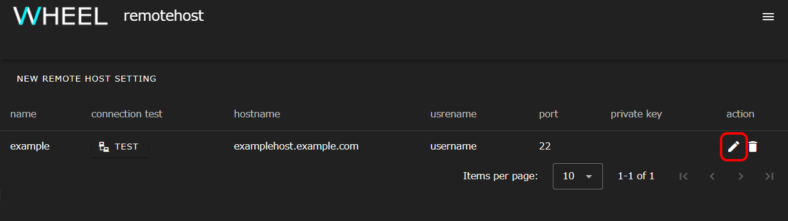

## 事前準備
WHEELの起動にはdockerを使用します。
最新の [docker](https://www.docker.com/) をインストールしてください。

## 起動方法
1. 任意の場所にディレクトリを作成します。(以降では、このディレクトリを`CONFIG_DIR`とします。)
2.  HTTPS通信用のサーバ証明書および鍵ファイルを、それぞれ`server.crt`, `server.key`という名前で`CONFIG_DIR`に格納します。
    自己証明書を使用する際は次のURLのドキュメントを参考にしてください。

    https://letsencrypt.org/docs/certificates-for-localhost/

    また、起動時に環境変数 WHEEL_USE_HTTP=1を指定することで、httpでの通信を行なうこともできます。
    ローカルネットワーク内での試用など、セキュリティ上の問題が無い環境でのみお使いください。

3. ターミナルを起動し、以下のコマンドを入力します。

```
> docker run -d -v ${HOME}:/root -v CONFIG_DIR:/usr/src/server/app/config -p 8089:8089 tmkawanabe/wheel:latest
```

このとき、`CONFIG_DIR`は、ホストマシン上での絶対パスである必要があります。

上記コマンドでは、

- プロジェクトファイルの作成先を${HOME}に指定しています。
- WHHELのポート番号を8089に指定しています。

httpsの代わりにhttp通信を使いたい場合は`docker run`に次のオプションを追加して実行してください。
この場合は、サーバ証明書と鍵ファイルを`CONFIG_DIR`に置く必要はありません。

```
-e WHEEL_USE_HTTP=1
```

WHEELサーバが起動したら、ホストマシン上でwebブラウザを開いて、
`http(s)://localhost:8089`にアクセスしてください。

## リモートホスト設定
WHEELには、sshでログインした先のマシン上でタスクを実行する機能があります。
この機能を使うためには、初めに接続先ホストの情報をWHEEL上で設定する必要があります。

まず、WHEELにアクセスし、画面右上のハンバーガーメニューをクリックしてください。


表示されたメニュー内の __Remotehost editor__ をクリックすると別のタブでリモートホスト設定画面が表示されます。


画面上部の __NEW REMOTE HOST SETTING__ ボタンをクリックすると新規ホスト設定ダイアログが表示されます。


フォームのうち次の項目に、値を入力してください。

- label          任意の文字列
- Hostname       接続先のホスト名またはIPアドレス
- User ID        接続先ホストでのユーザID
- Host work dir  リモートホスト内で使用するディレクトリのパス

例えば、 `foo.example.com` ホストに対して、ユーザー `bar` で接続しタスクの実行を `/home/users/bar/baz` ディレクトリ以下で行なう設定を`example` という名前で作成するとすれば、入力内容は次のようになります。


labelはWHEELが接続先ホストを区別するための文字列で、大文字小文字が区別されます。

Hostname, UserIDは接続先のホスト名(IPアドレスでも可)とユーザIDです。
これらのフィールドには、 `~/.ssh/config` で設定した値を指定することもできます。

Host work dirには接続先ホストでの作業ディレクトリを絶対パスで指定します。
WHEELがリモートホストでプログラムを実行する時には、ここで指定したディレクトリの下にファイルを転送してから、実行します。

通常は接続先ホストのホームディレクトリを指定しますが、システムによっては容量制限やI/O性能の都合で他の領域を使う方が良い場合もあります。
接続先システムの利用ガイド等を参照して適切なディレクトリを選択してください。

また、リモートホストへの接続に公開鍵認証を使う場合は、 __use public key authentication__
のスイッチを有効にしてください。
下側に、秘密鍵を指定する欄が表示されるので、秘密鍵のパスを入力するか、 __BROWSE__ ボタンをクリックしてファイルを選択してください。

その他の詳細な設定内容は[リファレンスマニュアル](/reference/2_remotehost_screen/ "remotehost設定") をご参照ください。

## バッチシステム経由でのタスク実行
同じ内容のワークフローをバッチシステム経由で実行することも可能です。
バッチシステム経由でタスク実行する場合は、以下の通りリモート設定を行います。

まずは、リモートホストエディタを起動してください。
さきほど登録したリモートホストが表示されているので、右端の鉛筆アイコンをクリックして
ホスト情報編集ダイアログを表示します



リモートホストで使われているジョブスケジューラの種類を、 __job scheduler__ (1) の欄から選んでください。
現在設定可能な値は次の6種類です。

- PBSPro
- PBSProWithoutHistory
- SLURM
- TCS (Technical Computing Suite)
- Fugaku
- UGE (Univa Grid Engine)

富岳では、TCSが採用されていますが他サイトとは一部挙動が違うため、富岳専用の設定(Fugaku)が用意されています。
また、PBSProは、ジョブスケジューラの設定で、実行終了したジョブの情報を保存しないものがあります。
この場合 __PBSPro__ ではなく __PBSProWithoutHistory__ を使ってください。

続いて、使用可能なキュー名を __available queues__ の欄(2)にカンマ区切りで入力してください。
デフォルトキューが設定されているシステムで、デフォルトキューのみを使う場合は
空欄のままでも構いません。

最後に、ジョブの同時投入本数に制限を行ないたい場合は、 __max number of jobs__ の欄(3) に入力してください。

例えば、同時投入本数が10本に制限されているシステムでは11本目のジョブを投入しようとするとエラーになり
ジョブ投入が受け付けられません。WHEEL側で制限を行なうことでこのようなエラーの発生を抑制できます。
ただし、WHEELを使わずに投入されたジョブ数は数えられませんので、グループ単位での同時投入ジョブ数が
制限されているような場合は、制限に抵触する可能性もあります。

以上でリモートホスト設定の変更は終了です。

--------
[トップページに戻る](../)
