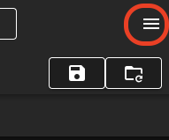
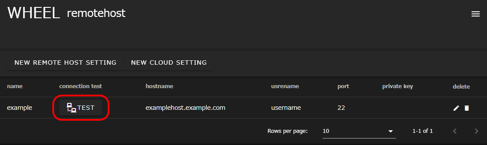
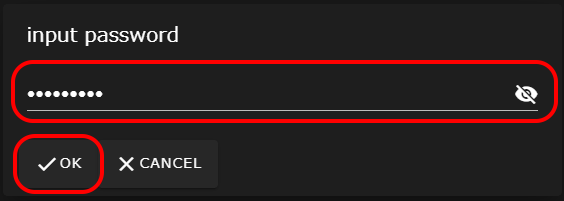
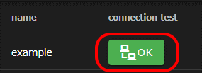
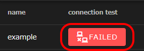

## 利用開始前の確認
WHEELの利用開始前に、初期設定として行われたリモートホスト設定の内容が正しいことを確認します。

### リモートホスト設定の確認
まず、WHEELにアクセスし、画面右上のハンバーガーメニューをクリックします。

表示されたメニュー内の __Remotehost editor__ をクリックすると別のタブでリモートホスト設定画面が表示されます。

[リモートホスト設定](#リモートホスト設定)で登録されたリモートホストが表示されているので、右端の鉛筆アイコンをクリックしてホスト情報編集ダイアログを表示します。

設定内容が正しいことを確認します。

Hostname
: 接続先のホスト名またはIPアドレス

User ID
: 接続先ホストでのユーザID

Host work dir
: リモートホスト内で使用するディレクトリのパス

設定内容に誤りがある場合は、修正してください。
__Remotehost editor__ ボタンをクリックして、ダイアログを閉じます。

## リモートホストへの接続確認
続いて、WHEELからリモートホストに接続できることを確認します。

リモートホスト設定画面を表示します。

リモートホスト一覧の __connection test__ 列に表示された __TEST__ ボタンをクリックし、リモートホストへの接続テストを行います。

パスワード入力ダイアログが表示されるので、リモートホストに接続するためのパスワードを入力し、 __OK__ ボタンをクリックします。

リモートホストへの接続テストが実施され、リモートホスト一覧の __connection test__ 列に結果が表示されます。
リモートホストへの接続が成功した場合は、以下の __OK__ ボタンが表示されます。

リモートホストへの接続が失敗した場合は、以下の __FAILED__ ボタンが表示されます。  
[リモートホスト設定の確認](#リモートホスト設定の確認)に従い、設定内容を見直してください。

--------
[トップページに戻る]({{ site.baseurl }}/)