Create a new project or edit an existing project from the Home screen.
The Home screen is organized as follows.

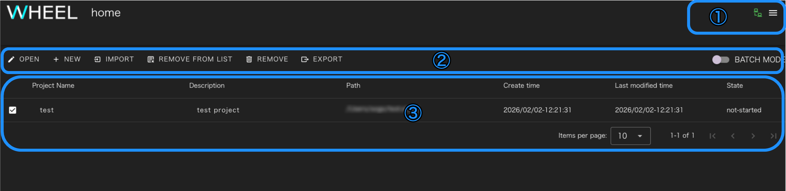

|| Component | Description |
|----------|----------|---------------------------------|
|1| OPEN button                | Opens an existing project                                                                           |
|2| NEW button                 | Creates a new project                                                                         |
|3| IMPORT button | Imports a project archive |
|4| REMOVE FROM LIST button    | Deletes the project from the project list area (the entity file remains).                       |
|5| REMOVE button              | Deletes the project                                                                             |
|6| EXPORT button | Exports a project archive |
|7| BATCH MODE switch        | Switches to mass delete mode for multiple projects. When enabled, multiple projects can be selected |
|8| Hamburger menu    | Opens a drawer with links to the User Guide, Remote Host Configuration screen                               |
|9| Project List Area | Lists previously opened projects.                                                         |

The following items are displayed in the Project List area.

|| Component | Description |
|----------|----------|---------------------------------|
|1| Project Name | Displays the project name |
|2| Description | Displays a description of the project |
|3| Path | Displays the root directory path of the project file |
|4| Create time | Displays the date and time the project was created |
|5| Last modified time | Displays the date and time the project was modified |
|6| State | Shows project execution status |

## Creating a New Project
To create a new project:

1. Click the __NEW__ button to display the Create New Project dialog.
1. Optionally, select a project data creation location in the directory tree.
1. Enter a project name.
1. Click the __create__ button.

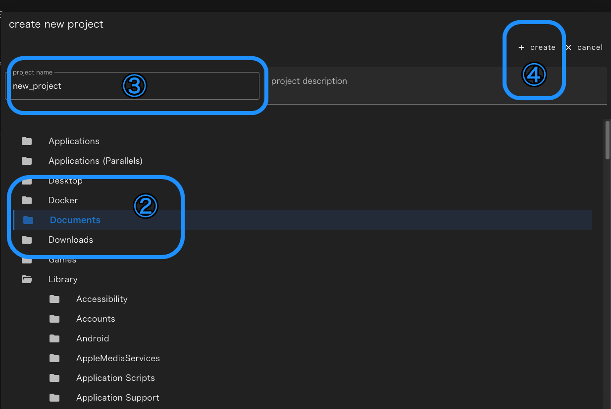

When a new project is created, it appears in the Project List area.
Follow the steps in [Open Project](#open-project) below to enter the workflow screen.

__About Directory Trees__   
The directory tree in the Create New Project dialog shows the folder configuration under the base directory.  
Also, the base directory is the directory specified by the -v option when WHEEL is started.  
For details, refer to [How to start]({{site.baseurl}}/for_admins/how_to_boot/#how-to-start).
{: .notice--info}

## Open Project
To open a project and transition to the workflow screen:

1. In the Project Browser area, click to select the check box to the left of the project name you want to open.
1. Click the __OPEN__ button to switch to the [workflow screen]({{site.baseurl}}/reference/3_workflow_screen/1_graphview.html).

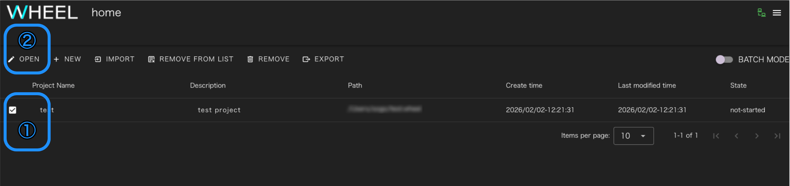

## Rename Project
Click a project name in the Project List area to display the Rename Project dialog.
Edit the project name and press the __Enter__ key to rename the project.

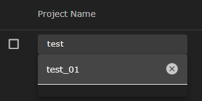

__About Project Names__  
The project name is used as part of the directory name.  
Therefore, if the directory name after the project name change overlaps with the existing directory name, .1 (When .1 is also used, the value of .2 .3 ・・・ is successively larger.) is automatically appended to the end of the project name.
{: .notice--info}

## Delete Project
To delete a project:
1. In the Project List area, click to select the check box to the left of the project name that you want to delete.
1. Click the __REMOVE__ button to delete the selected project.  
   If you click the __REMOVE FROM LIST__ button instead, the project will be removed from the project list area, but the actual file of the project can remain on the server side.

## Mass Delete Multiple Projects
Enabling the __BATCH MODE__ switch allows you to select multiple projects.
In this state, you can delete multiple projects at once by clicking the __REMOVE__ or __REMOVE FROM LIST__ button.

## Export Project
To export a project:

1. In the Project List area, click to select the check box to the left of the project name you want to export.
2. Click the __EXPORT__ button to display a dialog for writing metadata to the archive.

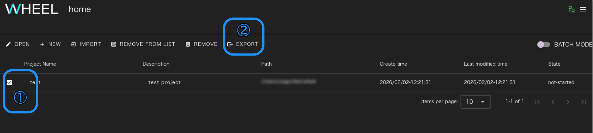

The following items can be entered in the dialog.

| Item | Content |
|---|---|
| name | Name of the project creator |
| email | Email address of the project creator |
| memo | A memo about the project |

All items are written to a JSON file in the project. Since WHEEL project files are managed as git repositories, please note that the contents can be restored even if they are deleted later.

This information is used only by the user to verify that the archive file is the intended one when importing.

Even if all the items are blank, it does not affect the operation of the WHEEL system, so please be careful when deciding whether to enter information about the project creator.

Click the __OK__ button to generate a project archive with the file name `WHEEL_project_***.tgz` and save it to the browser's default download destination.

The project name is entered in the `***` part of the file name.

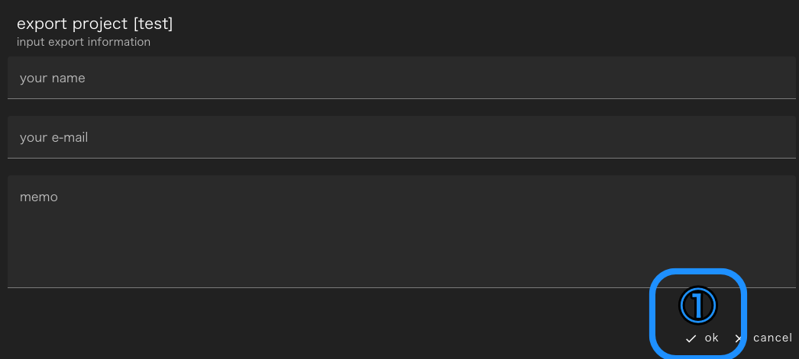

## Import Project
After clicking the __IMPORT__ button to display the import project dialog, import the project by following these steps.

1. Select the destination directory for the project.
2. Specify the project archive file to import.
3. Click the __OK__ button.

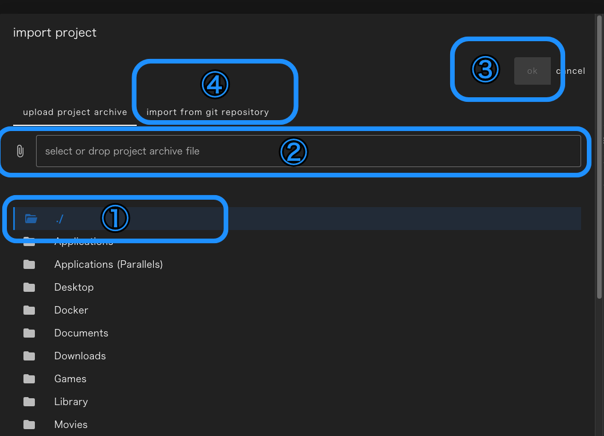

To import directly from a repository such as github, instead of specifying an archive file, click the `import from git repository` button, enter the URL, and click the __OK__ button.

Importing from a git repository that requires authentication is not supported.

__About Directory Display__
This screen displays the directory structure under the base directory, similar to when the Open button is pressed. However, to import a project directly under the base directory, `./` is also displayed, which means the current directory. You can click and select `./`, but unlike other directories, the directory tree will not be displayed below it even if you open it.
{: .notice--info}

After that, a warning screen will be displayed, and if you click the __OK__ button again, the project archive will be extracted under the specified directory.

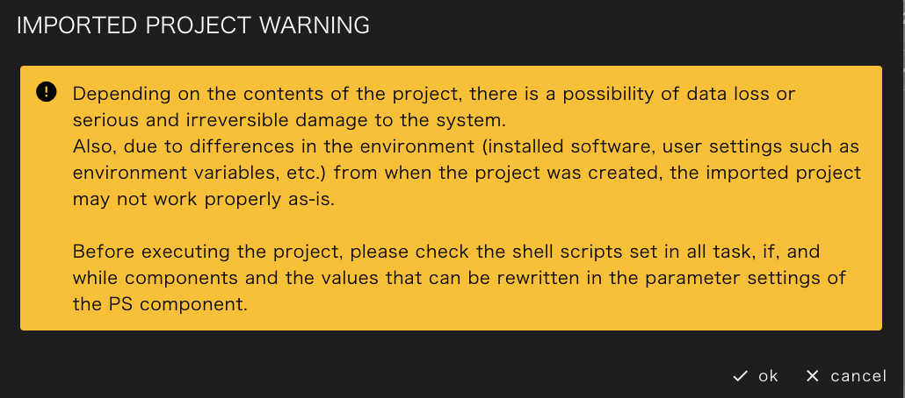

### Replacing remote host settings
If a component that uses a remote host is included in the project to be imported, a screen for mapping host settings as shown below will open.

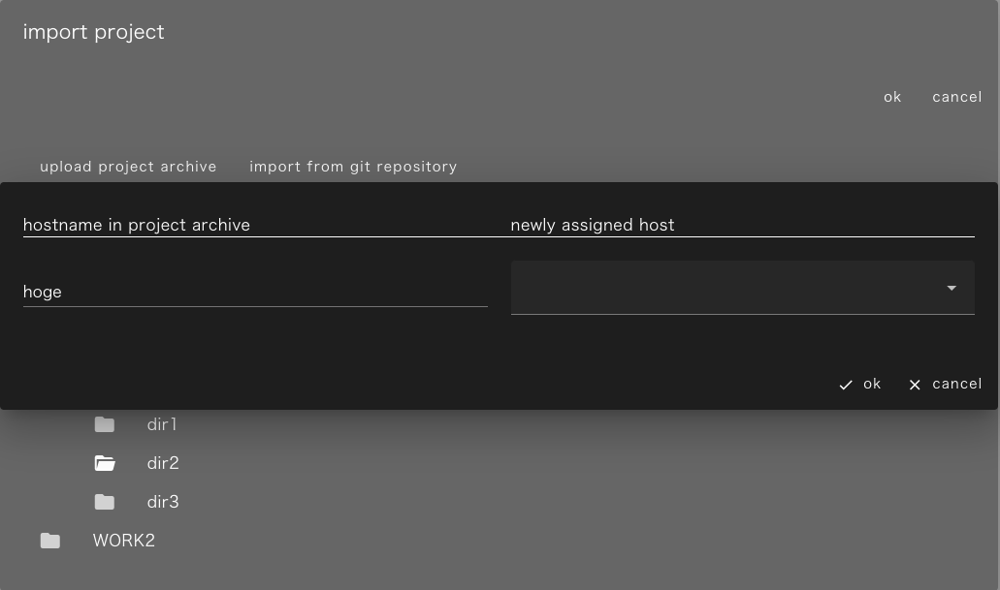

The remote hosts set in the original project are listed on the left side, and when you click the drop-down list on the right, the list of remote hosts set in the environment where "localhost" and WHEEL are currently running is displayed as follows.

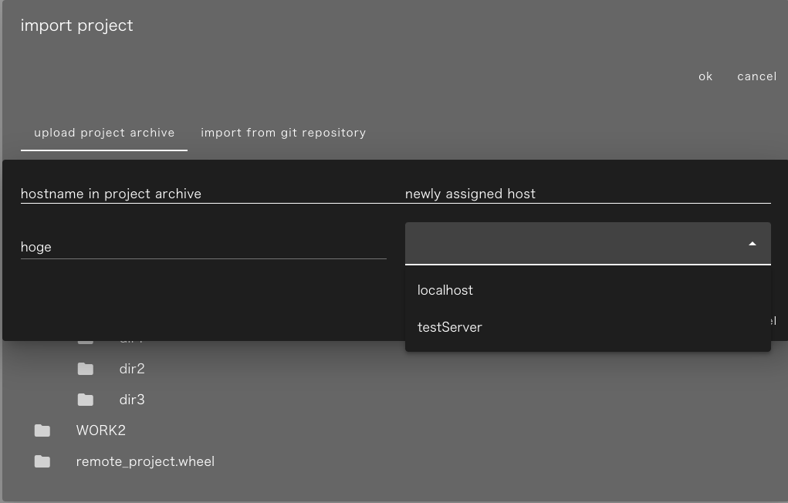

Specify the new host to be set for each remote host and click the __OK__ button to replace the host settings of all components in the project.

Components that were set to the same remote host in the original project will be set to the same remote host, so if you want to change the execution host for each component, open the workflow screen after import and set each one individually.

Clicking the __cancel__ button interrupts the import process and returns to the home screen.

### Changing the status of projects and components
If the project to be imported is set to read-only or has a status other than "not-started", a confirmation screen will be displayed as shown below to ask if you want to restore these settings.

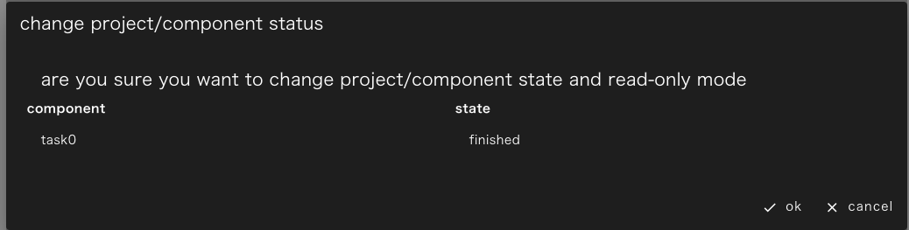

When you click the __OK__ button, the read-only setting of the project is deleted, the status is returned to "not-started", and the status of all components is also returned to "not-started".

Clicking the __cancel__ button interrupts the import process and returns to the home screen.

### Notes on imported projects
Problems may occur due to differences between the execution environment of the imported project and the execution environment of the imported project.

For example, if you try to run a project created in an environment where the program to be executed is placed in `/usr/share/app` in an environment where it is placed in `/opt/share/bin`, it is highly likely that it will not work properly even if the same version of the program is installed.

In addition to not working, there is also the possibility of serious damage.

For example, a user who was using `${HOME}/tmp` as a temporary file storage may have a process in the project that deletes this directory.

If you execute such a project with the necessary files in `${HOME}/tmp`, the files will be lost.

Furthermore, if the project was created by a malicious third party, it could have a serious impact on future system use, such as:

- Changing the user's password to prevent login
- Deleting all files under ${HOME}

To avoid such damage, be sure to check the processing contents of all scripts before executing the imported project.

In addition to what is set in the `script` of the task component, what is set in the `retry condition` and what is set in the `condition` of the if component and while component are also executed as shell scripts.

Also, since the contents of the scripts of the components under the PS component may be rewritten and executed, please also check the target files and set values of the parameter study.

--------
[Return to Reference Manual home page]({{site.baseurl}}/reference/)
