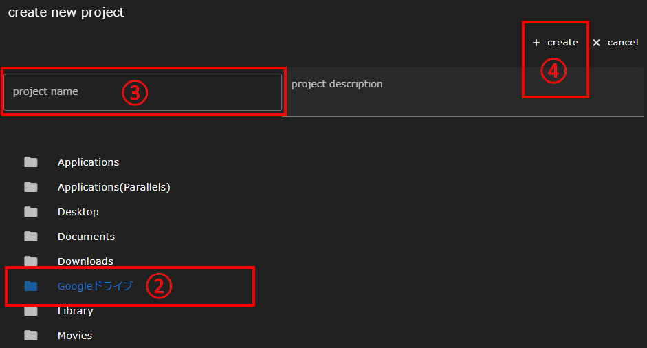

Create a new project or edit an existing project from the Home screen.
The Home screen is organized as follows.

|| Component | Description |
|----------|----------|---------------------------------|
|1| OPEN button                | Opens an existing project                                                                           |
|2| NEW button                 | Creates a new project                                                                         |
|3| REMOVE FROM LIST button    | Deletes the project from the project list area (the entity file remains).                       |
|4| REMOVE button              | Deletes the project                                                                             |
|5| BATCH MODE switch        | Switches to mass delete mode for multiple projects. When enabled, multiple projects can be selected |
|6| Hamburger menu    | Opens a drawer with links to the User Guide, Remote Host Configuration screen                               |
|7| Project List Area | Lists previously opened projects.                                                         |

The following items are displayed in the Project List area.

|| Component | Description |
|----------|----------|---------------------------------|
|1| Project Name | Displays the project name |
|2| Description | Displays a description of the project |
|3| Path | Displays the root directory path of the project file |
|4| Create time | Displays the date and time the project was created |
|5| Last modified time | Displays the date and time the project was modified |
|6| State | Shows project execution status |

## Creating a New Project
To create a new project:

1. Click the __NEW__ button to display the Create New Project dialog.
1. Optionally, select a project data creation location in the directory tree.
1. Enter a project name.
1. Click the __create__ button.

When a new project is created, it appears in the Project List area.
Follow the steps in [Open Project](#open-project) below to enter the workflow screen.

## Open Project
To open a project and transition to the workflow screen:

1. In the Project Browser area, click to select the check box to the left of the project name you want to open.
1. Click the __OPEN__ button to switch to the [workflow screen]({{site.baseurl}}/reference/3_workflow_screen/1_graphview.html).

## Rename Project
Click a project name in the Project List area to display the Rename Project dialog.
Edit the project name and press the __Enter__ key to rename the project.

__About Project Names__  
The project name is used as part of the directory name.  
Therefore, if the directory name after the project name change overlaps with an existing directory name, the project name will end with .1
(When .1 is also used, the value of .2.3 ・・・ is successively larger.) is automatically granted.
{: .notice--info}

## Delete Project
To delete a project:
1. In the Project List area, click to select the check box to the left of the project name that you want to delete.
1. Click the __REMOVE__ button to delete the selected project.  
   Click the __REMOVE FROM LIST__ button instead.
   It is removed from the project list area, but the files that constitute the project can remain on the server side.

## Mass Delete Multiple Projects
Enabling the __BATCH MODE__ switch allows you to select multiple projects.
In this state, you can delete multiple projects at once by clicking the __REMOVE__ or __REMOVE FROM LIST__ button.

--------
[Return to Reference Manual home page]({{site.baseurl}}/reference/)
