新規プロジェクトの作成や既存プロジェクトの編集はホーム画面で行います。
ホーム画面の構成は以下のとおりです。

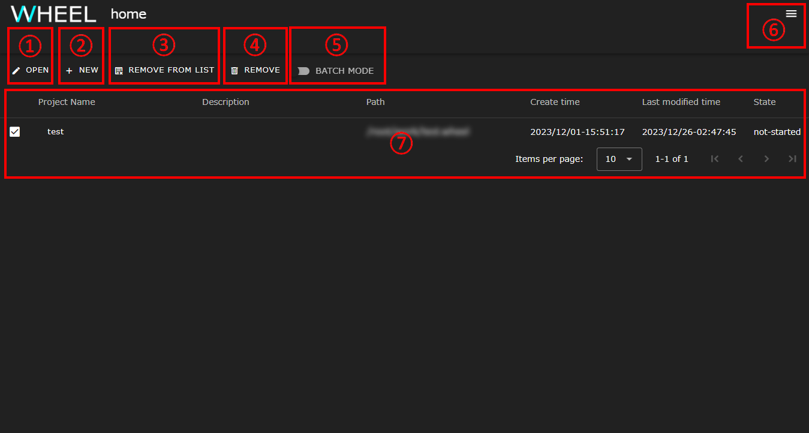

|| 構成要素                    | 説明                                                                                                  |
||-----------------------------|-------------------------------------------------------------------------------------------------------|
|1| OPEN ボタン                | 既存プロジェクトを開きます                                                                            |
|2| NEW ボタン                 | 新規プロジェクトを作成します                                                                          |
|3| IMPORT ボタン              | プロジェクトアーカイブをインポートします                                                              |
|4| REMOVE FROM LIST ボタン    | プロジェクト一覧表示エリアからプロジェクトを削除します(実体ファイルは残ります)                        |
|5| REMOVE ボタン              | プロジェクトを削除します                                                                              |
|6| EXPORT ボタン              | プロジェクトアーカイブをエクスポートします                                                            |
|7| BATCH MODE スイッチ        | 複数プロジェクトの一括削除モードへの切り替えます。有効にした場合、複数プロジェクトが選択可能となります|
|8| ハンバーガーメニュー       | ユーザガイド、リモートホスト設定画面へのリンクを含むドロワーを開きます                                |
|9| プロジェクト一覧表示エリア | 過去に開いたプロジェクトがリスト表示されます                                                          |

プロジェクト一覧表示エリアには、以下の項目が表示されます。

||構成要素|説明|
||---------------------|------------------------------------------------------------|
|1| Project Name       | プロジェクト名が表示されます                               |
|2| Description        | プロジェクトの説明文が表示されます                         |
|3| Path               | プロジェクトファイルのルートディレクトリパスが表示されます |
|4| Create time        | プロジェクトの作成日時が表示されます                       |
|5| Last modified time | プロジェクトの更新日時が表示されます                       |
|6| State              | プロジェクトの実行状況が表示されます                       |

## 新規プロジェクトの作成
次の手順で、新規プロジェクトを作成します。

1. __NEW__ ボタンをクリックし、新規プロジェクト作成ダイアログを表示します。
1. 必要に応じて、ディレクトリツリーでプロジェクトデータ作成場所を選択します。
1. プロジェクト名を入力します。
1. __create__ ボタンをクリックします。

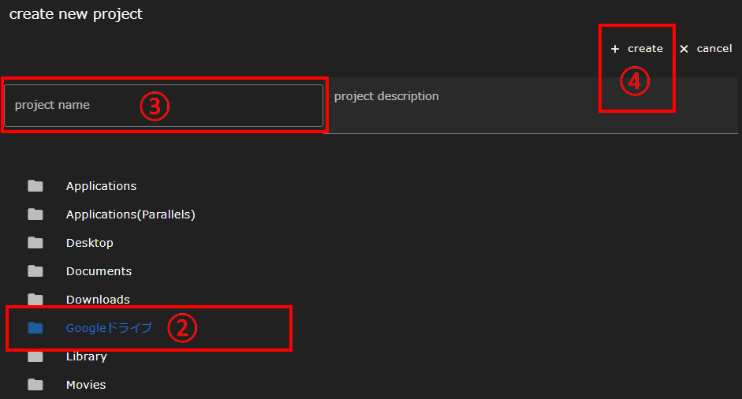

新規プロジェクトが作成されると、プロジェクト一覧表示エリアに表示されます。
次の「[プロジェクトを開く](#プロジェクトを開く)」の手順に沿ってワークフロー画面に遷移してください。

__ディレクトリツリーについて__
新規プロジェクト作成ダイアログのディレクトリツリーには、ベースディレクトリ配下のフォルダ構成が表示されます。
またベースディレクトリは、WHEEL起動時に-vオプションで指定されたディレクトリとなります。
詳細については、[起動方法]({{site.baseurl}}/for_admins/how_to_boot/#起動方法)をご確認ください。
{: .notice--info}

## プロジェクトを開く
次の手順で、プロジェクトを開いてワークフロー画面に遷移します。

1. プロジェクト一覧表示エリアで、開きたいプロジェクト名の左にあるチェックボックスをクリックして選択します。
1. __OPEN__ ボタンをクリックすると[ワークフロー画面]({{site.baseurl}}/reference/3_workflow_screen/1_graphview.html)に遷移します。

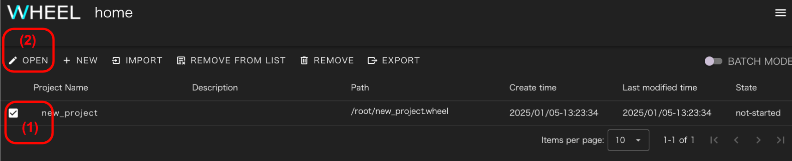

プロジェクト一覧に表示されていないプロジェクトを開く時は、チェックボックスを全て外した状態で __OPEN__ ボタンをクリックしてください。

新規プロジェクト作成時と同様のディレクトリツリーが表示されるので次の手順でプロジェクトを開きワークフロー画面に遷移します。

1. プロジェクトのルートディレクトリか、ルートディレクトリ直下にあるprj.wheel.jsonファイルを選択した状態で
2.  __open__ ボタンをクリックします。

なお、このディレクトリツリー内では、ディレクトリとprj.wheel.json以外のファイルは表示されません。

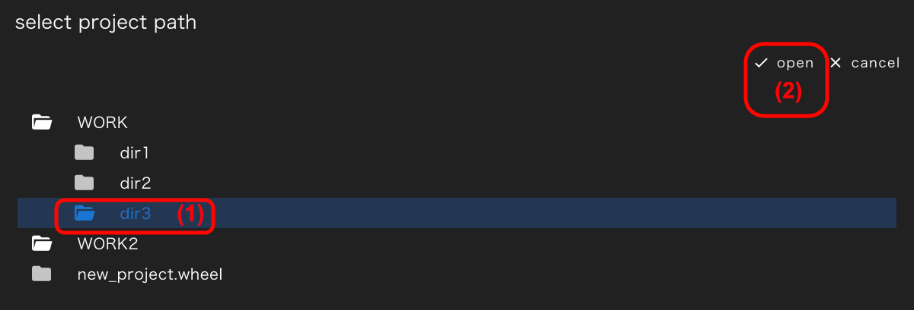

## プロジェクト名の変更
プロジェクト一覧表示エリアのプロジェクト名をクリックすると、プロジェクト名変更ダイアログが表示されます。
プロジェクト名を編集して、__Enter__ キーを押下するとプロジェクト名が変更されます。

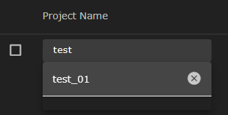

__プロジェクト名について__
プロジェクト名は、ディレクトリ名の一部として使われています。
そのため、プロジェクト名変更後のディレクトリ名が既存のディレクトリ名と重複する場合は、プロジェクト名の末尾に.1 (.1も使われている時は.2 .3・・・と順次大きい数値) が自動付与されます。
{: .notice--info}

## プロジェクトの削除
次の手順で、プロジェクトを削除します。
1. プロジェクト一覧表示エリアで、削除したいプロジェクト名の左にあるチェックボックスをクリックして選択します。
1. __REMOVE__ ボタンをクリックすると、選択したプロジェクトが削除されます。
   このとき、代わりに __REMOVE FROM LIST__ ボタンをクリックすると、プロジェクト一覧表示エリアからは削除されますが、プロジェクトの実体となるファイルはサーバ側に残すことができます。

## 複数プロジェクトの一括削除
__BATCH MODE__ スイッチを有効にすると、複数のプロジェクトを選択できるようになります。
この状態で、__REMOVE__ または __REMOVE FROM LIST__ ボタンをクリックすると複数プロジェクトを一括で削除することができます。

## プロジェクトのエクスポート
次の手順でプロジェクトをエクスポートします。

1. プロジェクト一覧表示エリアで、エクスポートしたいプロジェクト名の左にあるチェックボックスをクリックして選択します。
2. __EXPORT__ ボタンをクリックすると、アーカイブにメタデータを書き込むためのダイアログが表示されます。

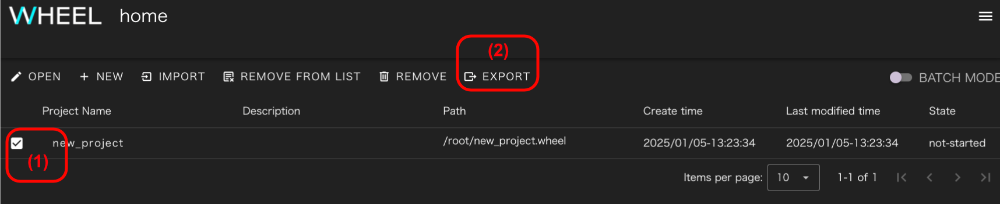

ダイアログには次の項目を入力することができます。

|項目名 |内容                                  |
|-------|--------------------------------------|
|name   | プロジェクト作成者の名前             |
|email  | プロジェクト作成者のemailアドレス    |
|memo   | プロジェクトの内容に関するメモ       |

全ての項目はプロジェクト内のJSONファイルに書き込まれます。WHEELのプロジェクトファイルはgitリポジトリとして管理されているため
後から削除しても記入した内容を復元できることに留意してください。

これらの情報は、インポートを行なう時に意図したアーカイブファイルかどうかを
ユーザが確認するためにのみ使われます。

WHEELのシステム上は全ての項目が空欄となっていても、動作に影響は無いので
特にプロジェクトの作成者に関する情報を入力するかどうかは慎重に判断してください。

__OK__ ボタンをクリックすると `WHEEL_project_***.tgz` というファイル名でプロジェクトアーカイブが生成され
ブラウザのデフォルトのダウンロード先に保存されます。

なお、ファイル名の __***__ の部分はプロジェクト名が入ります。

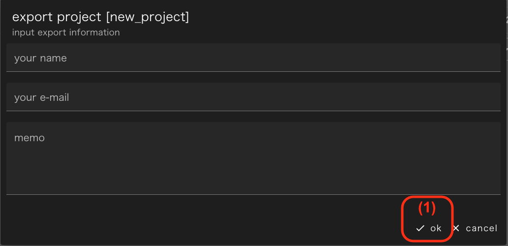

## プロジェクトのインポート
__IMPORT__ ボタンをクリックして import project ダイアログを表示した後、次の手順でプロジェクトをインポートします。

1. プロジェクトの展開先ディレクトリを選択
2. インポートするプロジェクトアーカイブファイルを指定
3. __OK__ ボタンをクリック

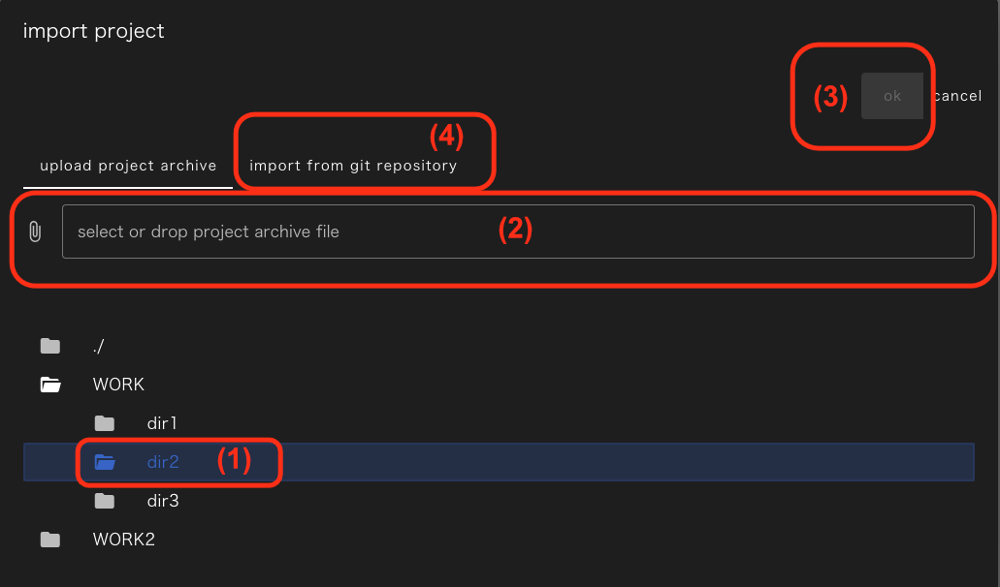

その後に、警告画面が表示されるので再度 __OK__ ボタンをクリックすると指定したディレクトリの下に
プロジェクトアーカイブを展開する処理が行なわれます。

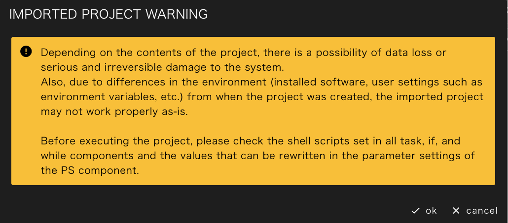

### リモートホスト設定の置換
インポートするプロジェクトの中にリモートホストを使用するコンポーネントがあった場合は、
次のようなhost設定のマッピングを行なう画面が開きます。

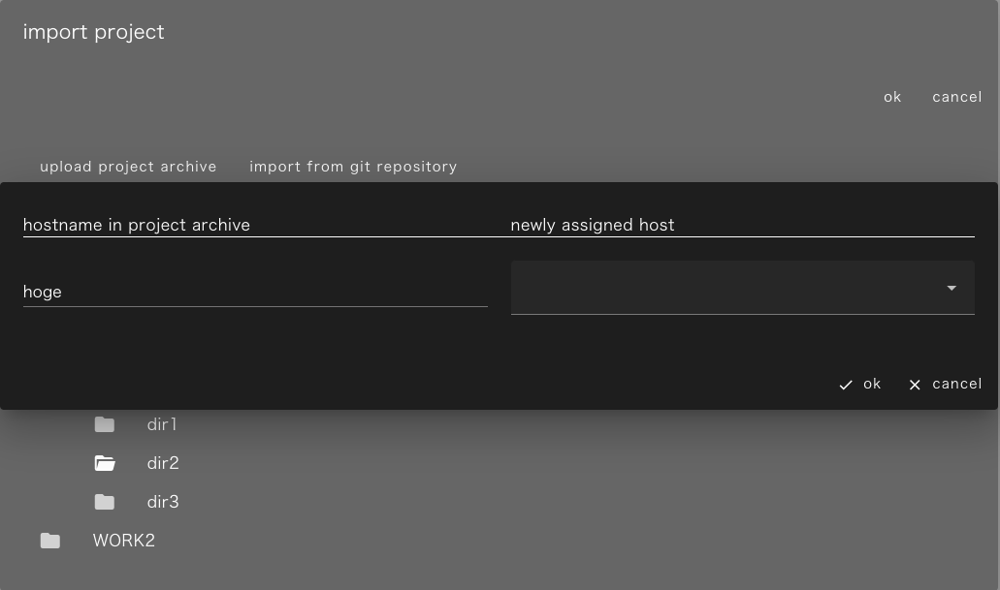

左側に元のプロジェクトで設定されていたリモートホストが並んでおり、右のドロップダウンリストをクリックすると
次のように、"localhost" および現在WHEELを実行している環境で設定されたリモートホストの一覧が表示されます。

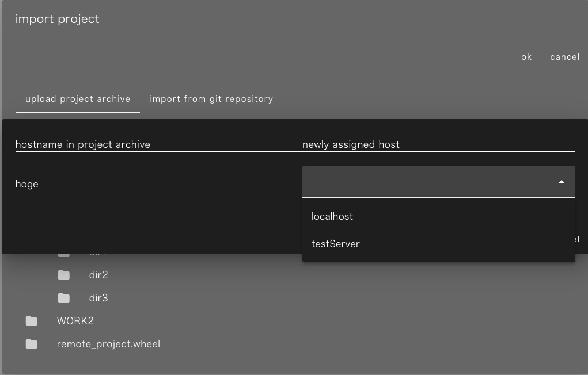

各リモートホストに新しく設定するホストを指定して __OK__ ボタンをクリックするとプロジェクト内の全コンポーネントの
ホスト設定が置換えられます。

元のプロジェクトで、同じリモートホストが設定されていたコンポーネントは
同じリモートホストが設定されるので、コンポーネント毎に実行ホストを変更したい場合は、
インポート終了後にワークフロー画面を開いて個々に設定してください。

__cancel__ ボタンをクリックした時はインポート処理を中断しホーム画面に戻ります。

### プロジェクトおよびコンポーネントのステータス変更
インポートするプロジェクトがread-onlyに設定されていたり、"not-started"以外のステータスになっていた場合は
次のように、これらの設定を戻してよいかの確認画面が表示されます。

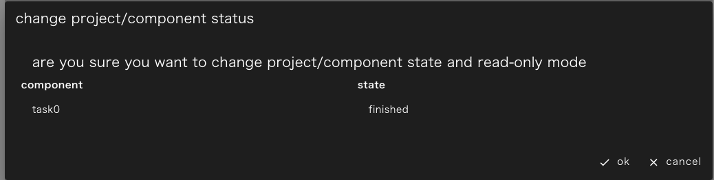

__OK__ ボタンをクリックすると、プロジェクトのread-only設定が削除され、ステータスが"not-started"に戻されるとともに
全コンポーネントのステータスも"not-started"に戻されます。

__cancel__ ボタンをクリックした時はインポート処理を中断しホーム画面に戻ります。

### インポートしたプロジェクトに関する注意
インポートしたプロジェクトの実行環境とインポートしたプロジェクトの実行環境の違いにより
問題が起きる可能性があります。

例えば、実行するプログラムを `/usr/share/app` に置いた環境で作成したプロジェクトを
`/opt/share/bin` に置いた環境で動かそうとすると、同じバージョンのプログラムがインストールされていたとしても
正常に動作しない可能性が高いです。

また動作しないだけではなく、重大な被害が生じる可能性もあります。

例えば、 `${HOME}/tmp` をテンポラリファイル置き場として使用していたユーザが
プロジェクト内で、このディレクトリを削除する処理を行なうかもしれません。

もし、 `${HOME}/tmp` の中に必要なファイルを置いた状態でこのようなプロジェクトを実行してしまうと
そのファイルは失なわれてしまいます。

さらに、悪意のある第三者が作成したプロジェクトであれば、

- ユーザのパスワードを変更してログインできないようにする
- ${HOME}以下のファイルを全て削除する

など、今後のシステム利用に重大な影響を及ぼす可能性があります。

このような被害を避けるため、インポートしたプロジェクトを実行する前に必ず全てのスクリプトの
処理内容を確認してください。

taskコンポーネントの `script` に設定されたもの以外にも `retry condition` に設定されたものや
ifコンポーネントやwhileコンポーネントの`condition` に設定されたものもシェルスクリプトとして実行されます

また、PSコンポーネントの下にあるコンポーネントはスクリプトの内容が
書き換えられて実行される可能性があるので、パラメータスタディの対象ファイルや設定値も確認してください。

--------
[リファレンスマニュアルのトップページに戻る]({{ site.baseurl }}/reference/)
