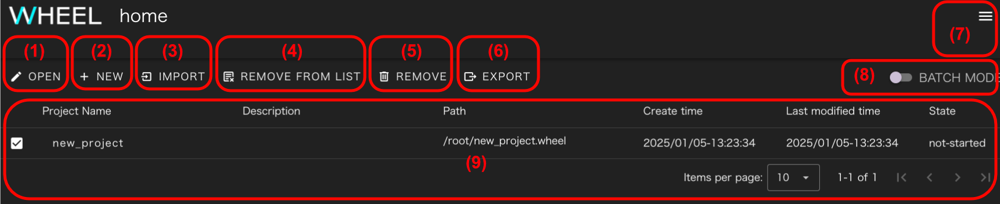

新規プロジェクトの作成や既存プロジェクトの編集はホーム画面で行います。
ホーム画面の構成は以下のとおりです。

||構成要素|説明|
|----------|----------|---------------------------------|
|1| OPEN ボタン                | 既存プロジェクトを開きます                                                                           |
|2| NEW ボタン                 | 新規プロジェクトを作成します                                                                         |
|3| REMOVE FROM LIST ボタン    | プロジェクト一覧表示エリアからプロジェクトを削除します(実体ファイルは残ります)                       |
|4| REMOVE ボタン              | プロジェクトを削除します                                                                             |
|5| BATCH MODE スイッチ        | 複数プロジェクトの一括削除モードへの切り替えます。有効にした場合、複数プロジェクトが選択可能となります|
|6| ナビゲーションドロワー     | ユーザガイド、リモートホスト設定画面へのリンクを含むドロワーを開きます                               |
|7| プロジェクト一覧表示エリア | 過去に開いたプロジェクトがリスト表示されます                                                         |

プロジェクト一覧表示エリアには、以下の項目が表示されます。
- プロジェクト名
- 説明文
- プロジェクトファイルのルートディレクトリパス
- 作成日
- 更新日
- 実行状況

## 新規プロジェクトの作成
次の手順で、新規プロジェクトを作成します。

1. __NEW__ ボタンをクリックし、新規プロジェクト作成ダイアログを表示します。
1. 必要に応じて、ディレクトリツリーでプロジェクトデータ作成場所を選択します。
1. プロジェクト名を入力します。
1. __create__ ボタンをクリックします。

新規プロジェクトが作成されると、プロジェクト一覧表示エリアに表示されます。
次の「[プロジェクトを開く](#プロジェクトを開く)」の手順に沿って
ワークフロー画面に遷移してください。

## プロジェクトを開く
次の手順で、プロジェクトを開いてワークフロー画面に遷移します。

1. プロジェクト一覧表示エリアで、開きたいプロジェクト名の左にあるチェックボックスをクリックして選択します。
1. __OPEN__ ボタンをクリックするとワークフロー画面に遷移します。

## プロジェクト名の変更
プロジェクト一覧表示エリアのプロジェクト名をクリックすると、プロジェクト名変更ダイアログが表示されます。
プロジェクト名を編集して、__Enter__ キーを押下するとプロジェクト名が変更されます。

__プロジェクト名について__  
プロジェクト名は、ディレクトリ名の一部として使われています。  
そのため、プロジェクト名変更後のディレクトリ名が既存のディレクトリ名と重複する場合は、プロジェクト名の末尾に.1
(.1も使われている時は.2 .3・・・と順次大きい数値)が自動付与されます。
{: .notice--info}

## プロジェクトの削除
次の手順で、プロジェクトを削除します。
1. プロジェクト一覧表示エリアで、削除したいプロジェクト名の左にあるチェックボックスをクリックして選択します。
1. __REMOVE__ ボタンをクリックすると、選択したプロジェクトが削除されます。  
   このとき、代わりに __REMOVE FROM LIST__ ボタンをクリックすると、
   プロジェクト一覧表示エリアからは削除されますが、プロジェクトの実体となるファイルはサーバ側に残すことができます。

## 複数プロジェクトの一括削除
__BATCH MODE__ スイッチを有効にすると、複数のプロジェクトを選択できるようになります。
この状態で、__REMOVE__ または __REMOVE FROM LIST__ ボタンをクリックすると複数プロジェクトを一括で削除することができます。

--------
[リファレンスマニュアルのトップページに戻る]({{ site.baseurl }}/reference/)
