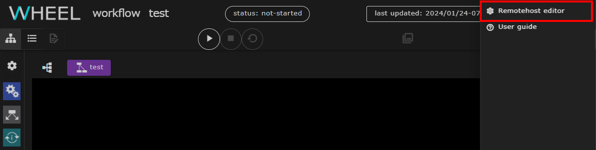

If a calculation environment (The following are remote hosts:) outside the WHEEL server is used in the workflow, SSH to the target remote host and perform processing.  
The remote host information to be used when creating a workflow and the user information to be used when making an SSH connection to a remote host are registered in the Remote Host Configuration window.

## Displaying the remote host setting screen
To display the Remote Host Settings screen, click the hamburger menu in the upper-right corner of the screen, and then click
Click the __Remotehost editor__ link that appears to view it.

## Remote host setting screen
The following shows the configuration of the Remote Host Settings window.

|| Component | Description |
|----------|----------|---------------------------------|
|1| Title (WHEEL) button         | Go to the Home screen                                              |
|2|NEW REMOTE HOST SETTING button | Creates new connection information to the remote host.                          |
|3| Remote host list           | Displays a list of registered remote host information.                      |
|4|TEST button                    | Checks whether the remote host can be accessed using the configured connection information |
|5| Edit button                    | Edits entered connection information                                        |
|6| Delete button                    | Deletes the entered connection information                                        |

## Creating a New Remote Host Configuration
Click the __NEW REMOTE HOST SETTING__ button to open the New Remote Host Setup window.

Each part of the form must have the following information:

| Item | Setting |
|----------|---------------------------------|
|label| Unique string to distinguish connection information |
|Hostname| Destination host name (can be an IP address) |
|Port number| Destination port number|
|User ID|Username to use for login |
|Host work dir| Top-level path of the directory used to execute Tasks and submit jobs at the destination |
|private key path| Private key file path   (Displayed when the use public key authentication switch is enabled) |
|job scheduler| Type of batch system used on the remote host |
|max number of jobs| Maximum number of jobs to be input simultaneously |
|available queues| Name of the queues available on the remote host, separated by commas |
|use bulkjob| (Fujitsu TCS sites only) Indicates whether the site can use bulk jobs |
|use stepjob| (Fujitsu TCS sites only) Whether the site can use step jobs |
|shared host| Label for other remote hosts sharing storage |
|shared path on shared host| Path to access Host work dir on shared host|

Click ▽ to the right of `Advanced settings` to open an advanced settings entry form.

| Item | Setting |
|----------|---------------------------------|
| connection renewal interval(min.) | Idle time until ssh connection is disconnected [minutes]   Do not disconnect when 0 is set (default value 0) |
| status check interval(sec.) | Interval for checking status after job submission [seconds] (default value 60) |
| max number of status check error allowed | How many status check failures are allowed (default 10) |
| interval time between each execution | Wait time (Default Value 5 for jobs, 1 for tasks) after one job execution before the next job is executed |
| timeout during handhake phase(msec.) | ssh handshake latency [ms] (default 60,000) |

Enter the required information and click the __OK__ button to save the remote host connection settings.

--------
[Return to Reference Manual home page]({{site.baseurl}}/reference/)
