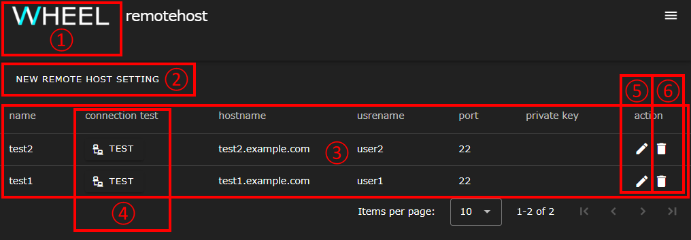
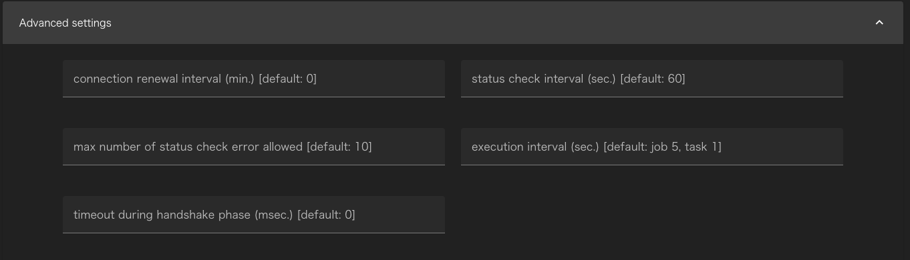
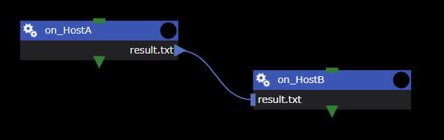
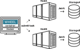
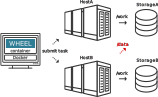

If a calculation environment (The following are remote hosts:) outside the WHEEL server is used in the workflow, SSH to the target remote host and perform processing.  
The remote host information to be used when creating a workflow and the user information to be used when making an SSH connection to a remote host are registered in the Remote Host Configuration window.

## Displaying the remote host setting screen
To display the Remote Host Settings screen, click the hamburger menu in the upper-right corner of the screen, and then click the __Remotehost editor__ link that appears.

## Remote host setting screen
The following shows the configuration of the Remote Host Settings window.

|| Component | Description |
|----------|----------|---------------------------------|
|1| Title (WHEEL) button         | Go to the Home screen                                              |
|2|NEW REMOTE HOST SETTING button | Creates new connection information to the remote host.                          |
|3| Remote host list           | Displays a list of registered remote host information.                      |
|4|TEST button                    | Checks whether the remote host can be accessed using the configured connection information |
|5| Edit button                    | Edits entered connection information                                        |
|6| Delete button                    | Deletes the entered connection information                                        |

## Creating a New Remote Host Configuration
Click the __NEW REMOTE HOST SETTING__ button to open the New Remote Host Setup window.

Each part of the form must have the following information:

| Item | Setting |
|----------|---------------------------------|
|label| Unique string to distinguish connection information |
|Hostname| Destination host name (can be an IP address) |
|Port number| Destination port number|
|User ID|Username to use for login |
|Host work dir| Top-level path of the directory used to execute Tasks and submit jobs at the destination |
|private key path| Private key file path   (Displayed when the use public key authentication switch is enabled) |
|job scheduler| Type of batch system used on the remote host |
|max number of jobs| Maximum number of jobs to be input simultaneously |
|available queues| Name of the queues available on the remote host, separated by commas |
|use bulkjob| (Fujitsu TCS sites only) Indicates whether the site can use bulk jobs |
|use stepjob| (Fujitsu TCS sites only) Whether the site can use step jobs |
|shared host| Label for other remote hosts sharing storage  For more information, see [How to use the shared host](#how-to-use-the-shared-host). |
|shared path on shared host| Path to access Host work dir on shared host|

Click ▽ to the right of `Advanced settings` to open an advanced settings entry form.

| Item | Setting |
|----------|---------------------------------|
| connection renewal interval (min.) | Idle time until ssh connection is disconnected [minutes]   Do not disconnect when 0 is set (default value 0) |
| status check interval (sec.) | Interval for checking status after job submission [seconds] (default value 60) |
| max number of status check error allowed | How many status check failures are allowed (default value 10) |
| execution interval (sec.) | Wait time until the next job is executed after one job has been executed [seconds] (default value 5 for jobs, 1 for tasks) |
| timeout during handshake phase (msec.) | ssh handshake latency [millisecond] (default value 0) |

Enter the required information and click the __OK__ button to save the remote host connection settings.

## How to use the shared host
This section describes how to use __shared host__ in the remote host configuration.

When running a workflow using multiple remote hosts, you may be able to reduce file transfer time by using a __shared host__.

The workflow example is described in detail below.
- The task __on_HostA__ is a task that runs on HostA.
- The task __on_HostB__ is a task that runs on HostB.
- There is a file transfer from HostA to HostB.

Also assume that the execution environment is:

When this workflow is executed, the file (result.txt) is transferred along the route __HostA → WHEEL Server → HostB__.
Large files or large numbers can increase transfer time and network load.

### If shared storage exists
If you have shared storage (StorageA) that can be accessed from HostA and HostB as shown in the following figure, you can use the remote host setting __shared host__ to reduce file transfer time.

Using __shared host__, the file transfer during the execution of the above workflow is as follows:
- Task __on_HostB__ retrieves files directly from HostA (shared storage (StorageA) with).
- The file transfer path will be __HostA → HostB__ and will not go through the WHEEL server. This reduces the time load on file transfers.

The following items should be defined as the remote host settings for HostA and HostB:

|項目|Remote host settings for HostA|Remote host settings for HostB|
|-----|-----|-----|
|label|HostA|HostB|
|Host work dir|/work|/work
|shared host||HostA|
|shared path on shared host||/data|

--------
[Return to Reference Manual home page]({{site.baseurl}}/reference/)
