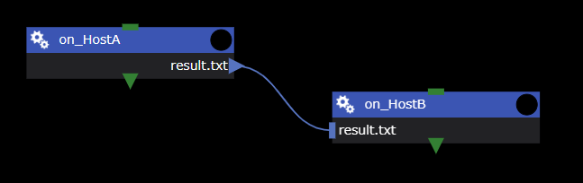
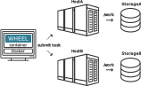
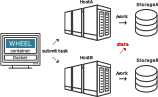

ワークフロー内でWHEELサーバ外の計算環境（以下、リモートホスト）を用いる場合、対象とするリモートホストにSSH接続し処理を実行します。
ワークフロー作成時に使用するリモートホスト情報、およびリモートホストにSSH接続時に使用するユーザ情報は、リモートホスト設定画面にて登録します。

## リモートホスト設定画面の表示
リモートホスト設定画面は、画面右上のハンバーガーメニューをクリックし、表示された __Remotehost editor__ リンクをクリックして表示します。

## リモートホスト設定画面
リモートホスト設定画面の構成は、以下のとおりです。

||構成要素|説明|
|----------|----------|---------------------------------|
|1|タイトル(WHEEL) ボタン         | ホーム画面へ遷移します                                              |
|2|NEW REMOTE HOST SETTING ボタン | リモートホストへの接続情報を新規作成します                          |
|3|リモートホストリスト           | 登録済みリモートホスト情報がリスト表示されます                      |
|4|TEST ボタン                    | 設定した接続情報でリモートホストにアクセスできるかどうかを確認します|
|5|編集 ボタン                    | 入力済の接続情報を編集します                                        |
|6|削除 ボタン                    | 入力済の接続情報を削除します                                        |

## 新規リモートホスト設定の作成
__NEW REMOTE HOST SETTING__ ボタンをクリックすると、新規リモートホスト設定画面が表示されます。

フォームの各部には次の情報を設定してください。

|項目|設定する内容|
|----------|---------------------------------|
|label| 接続情報を区別するための一意な文字列|
|Hostname| 接続先のホスト名(IPアドレスでも可)|
|Port number| 接続先のポート番号|
|User ID| ログインに使用するユーザ名|
|Host work dir| 接続先で、Taskの実行やジョブ投入に使うディレクトリの最上位のパス|
|private key path|秘密鍵のファイルパス (use public key authentication スイッチが有効のときに表示) |
|job scheduler|リモートホストで使われているバッチシステムの種類|
|max number of jobs|同時に投入するジョブ数の最大値|
|available queues|リモートホスト上で利用可能なキューの名前(カンマ区切りで指定)|
|use bulkjob|(富士通TCS使用サイトのみ)バルクジョブを使えるサイトかどうか|
|use stepjob|(富士通TCS使用サイトのみ)ステップジョブを使えるサイトかどうか|
|shared host|ストレージを共用している他のリモートホストのラベル 詳細は [shared hostの使用方法](#shared-hostの使用方法) をご参照ください。|
|shared path on shared host|shared host上でHost work dirへアクセスするためのパス|

`Advanced settings`の右にある▽をクリックすると、詳細設定の入力フォームが開きます。

|項目|設定する内容|
|----------|---------------------------------|
| connection renewal interval (min.) | ssh接続を切断するまでのアイドル時間 [分]  0の時は切断しない（デフォルト値 0）|
| status check interval (sec.) | ジョブ投入後のステータス確認を行う間隔 [秒]（デフォルト値 60）|
| max number of status check error allowed | ステータス確認の失敗を何回まで許容するか（デフォルト値 10）|
| execution interval (sec.) | 1つのジョブ実行が終わった後、次のジョブを実行するまでの待ち時間 [秒] （デフォルト値 ジョブでは5、タスクでは1）|
| timeout during handshake phase (msec.) | sshのハンドシェイク時の待ち時間 [ミリ秒] （デフォルト値 0）|

必要な情報を入力し、__OK__ ボタンをクリックするとリモートホスト接続設定が保存されます。

## shared hostの使用方法
リモートホスト設定の __shared host__ の使用方法について説明します。

複数のリモートホストを使用してワークフローを実行する際、 __shared host__ を使用することでファイル転送時間を短縮できるケースがあります。

例として挙げるワークフローの詳細は以下のとおりです。
- __on_HostA__ のタスクは、HostA上で実行されるタスクです。
- __on_HostB__ のタスクは、HostB上で実行されるタスクです。
- HostAからHostBへのファイル転送があります。

また、実行環境は以下と仮定します。

このワークフローが実行されるとき、ファイル（result.txt）は __HostA → WHEELサーバ → HostB__ の経路で転送されます。
ファイルのサイズが大きかったり、数が多かったりする場合は、転送時間やネットワーク負荷が増大してしまいます。

### 共有ストレージが存在する場合
実行環境として下図のようにHostAおよびHostBからアクセス可能な共有ストレージ（StorageA）が存在する場合は、リモートホスト設定の __shared host__ を使用することで、ファイルの転送時間を短縮することができます。

__shared host__ を使用すると、例としてあげたワークフロー実行時のファイル転送は以下のとおりとなります。
- __on_HostB__ のタスクが、HostA（との共有ストレージ（StorageA））から直接ファイルを取得します。
- ファイルの転送経路は、__HostA → HostB__ となり、WHEELサーバを経由しなくなります。そのため、ファイル転送の時間負荷を軽減できます。

このとき、HostAとHostBのリモートホスト設定として定義すべき項目はそれぞれ以下のとおりです。

|項目|HostAのリモートホスト設定|HostBのリモートホスト設定|
|-----|-----|-----|
|label|HostA|HostB|
|Host work dir|/work|/work
|shared host||HostA|
|shared path on shared host||/data|

--------
[リファレンスマニュアルのトップページに戻る]({{ site.baseurl }}/reference/)
