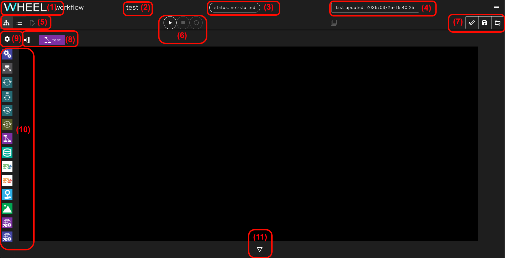
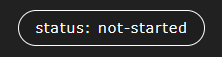
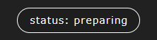
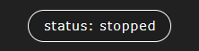
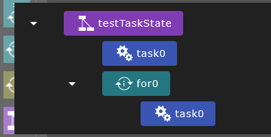
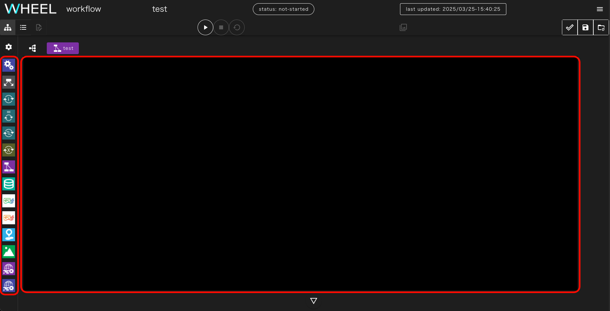
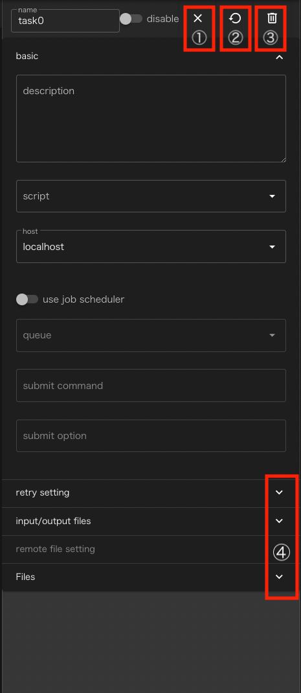

This chapter describes the functions of the graph view screen.

For specific examples of how to create and execute workflows, see [Tutorial]({{site.baseurl}}/tutorial/).

The graph view screen is organized as follows.

|| Component | Description |
|----------|----------|---------------------------------|
| 1| Title (WHEEL) button　　　| Go to the Home screen　　　　　　　　　　　　　　　　　　　　　　　　|
| 2| Project Name Area　　| Displays the name of the project being edited in the workflow.　　　　　　　　　　　|
| 3| Status display area　　　　　　　| Displays the STATUS (execution status) of the project.　　　　　　　　　　　　　|
| 4| Edit date and time display area　　　　　| Displays the date and time the project was created and updated.　　　　　　　　　　　　　　|
| 5| Workflow Screen Switching Button Area | Displays buttons for switching the workflow screen to Graph View, List View, or Text Editor |
| 6| Project Operation Buttons Area | Displays the Run, Stop, and Clean Project buttons.　　　　　　　　|
| 7| Save button area           | The Save Project, Discard Changes button appears.　　　　　　　　　　|
| 8| Hierarchy display/transition button　　　　| Displays the hierarchy of the currently displayed component　　　　　　　|
| 9| Environment variable editor display button | Environment variable setting screen is displayed.　　　　　　　　　　　　　　　　　　　　|
|10| Component Library　　| Palette for adding components that are components of a workflow |
|11| Log display button　　　　　　　| Displays logs about the creation and execution of the workflow.　　　　　　　　　　|

The following describes each area and button in detail.

### Status display area
The status display area shows the following statuses depending on the execution status of the entire project:

1. not-started: Before project execution  
  
1. preparing  : Preparing for Project Execution  
  
2. running    : Project running  
  
1. stopped    : Project execution stopped  
  
1. finished   : Project Finish (Normal Finish)  
  
1. failed     : End Project (Error occurs)  
  
1. holding     : Confirming submitted jobs  
  
1. unknown     : Project status unknown  

### Project Operation Button Area
This area displays the buttons involved in running the project.

|| Component | Description |
|----------|----------|---------------------------------|
|1|run project button      | Start running the project |
|2|stop project button     | Stops project execution and returns to its previous state |
|3|cleanup project button  | Deletes files generated during project execution and restores them to their original state before execution started |

### Save button area
This area contains buttons for saving edited projects.

|| Component | Description |
|----------|----------|---------------------------------|
|1|save project button  | Save project |
|2|revert project button | Revert project to previous save state |

__About save project button/revert project button behavior__  
WHEEL uses git for file history management.  
Edits on the graph view screen are immediately reflected in the server-side file.
It is not registered in the git repository until you click the save project button.
Click the revert project button to discard all changes made since the last commit.
Restores the repository to the state it was in when it was last committed.   
For more information about git operations, see the developer documentation [detailed design document](https://github.com/{{site.repository}}/blob/master/documentMD/design/design.md).
{: .notice--info}

### Workflow screen changeover button area
This area displays buttons that switch the workflow screen between graph view, list view, and text editor.

|| Component | Description |
|----------|----------|---------------------------------|
|1|graph view button   | Switches to the graph view screen. The graph view screen is the initial screen |
|2|list view button    | Switch to the list view screen |
|3|text editor button  | Switch to the text editor screen |

__About Transitions to Text Editor Screens__  
Transitions to the text editor screen are limited by the selected state of the file or the selected state of the project.  
If the transition cannot be made, the text editor button is displayed in a state that cannot be clicked.
{: .notice--info}

### Hierarchy display/transition buttons
A workflow has a hierarchical structure of components.
Only components in the same hierarchy can be displayed simultaneously on the graph view screen.

The hierarchy displays the currently displayed component from the root component of the project.
Displays the position from which it is descended.

You can also click the tree view button at the left end of the hierarchy display.
Displays the hierarchical structure of the entire project.

In both views, clicking a component switches the view to the displayed component.

### Environment Variable Editor Display Button
When you click this button,
environment variables that can be used, for example, in shell scripts that run in a project
The setting screen is displayed.

 - Create environment variables  
You can add a new environment variable by entering the environment variable name in __name__ and the value in __value__ and clicking the __+__ button.
 - Edit environment variables  
You can change it by clicking the __environment variable name__ or __value__ in the environment variable row you want to edit.
 - Delete environment variable  
You can delete a previously set environment variable by clicking the trash can icon at the right end of the environment variable row that you want to delete.

After changing the settings, clicking the __save__ button will actually take effect.
Click the __cancel__ button to discard your changes and exit.

### Workflow Creation Area
Displays the child components of the currently displayed component.
Initially, the child components directly under the root component of the project are visible.

In this area, drag and drop components from the component library to add them to your project.

Double-click the displayed component to display the
Switches to display the subcomponents of that component.

To switch to a higher component, use the hierarchical display or component tree described above.

<!--
When you single-click a displayed component,
Displays an area where you can edit the settings (properties) for the component.

|| Component | Description |
|----------|----------|---------------------------------|
|1|close button   | Closes the property display |
|2|clean button   | Rewind the state of the component (and any subcomponents) to the most recent saved state |
|3|delete button  | Remove component |
|4| Details button | Shows or hides property settings for each group |

The contents of this area differ for each type of component.
For information about setting properties, see the ({{site.baseurl}}/reference/4_component /) chapter.
-->

### Log display button
Displays the log that is output when a workflow is created or executed.

When you click the Log button, the following log display area appears:

The log display is output to multiple tabs depending on the contents.

|| Component | Description |
|----------|----------|---------------------------------|
|1|info tab | Displays critical information such as errors, warnings, and general information about project execution and operations |
|2|stdout tab | Displays the standard output of tasks executed on the local host |
|3|stderr tab | Displays standard error output for tasks executed on the local host |
|4|output(SSH) tab | Displays standard output and standard error output for tasks executed on the remote host |

The label colors indicate the following meanings:
- Green: New information, not displayed
- White: No new information, displayed

Click the __clear all log__ button to clear all previously displayed logs.

Click the △ button at the top to collapse the log display area to the bottom.

--------
[Return to Reference Manual home page]({{site.baseurl}}/reference/)
