本章では、グラフビュー画面の機能について説明します。

ワークフローの作成・実行方法の具体例は、[チュートリアル]({{ site.baseurl }}/tutorial/)をご参照ください。

グラフビュー画面は以下のように構成されています。

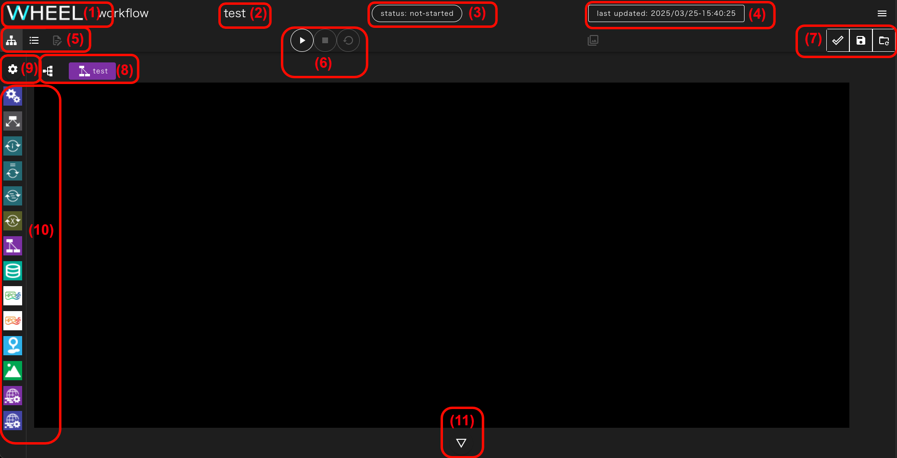

||構成要素|説明|
|----------|----------|---------------------------------|
| 1|タイトル(WHEEL) ボタン　　　|ホーム画面へ遷移します　　　　　　　　　　　　　　　　　　　　　　　　|
| 2|プロジェクト名表示エリア　　|ワークフロー編集中のプロジェクト名が表示されます　　　　　　　　　　　|
| 3|状態表示エリア　　　　　　　|プロジェクトのSTATUS（実行状態）が表示されます　　　　　　　　　　　　　|
| 4|編集日時表示エリア　　　　　|プロジェクトの作成、更新日時が表示されます　　　　　　　　　　　　　　|
| 5|ワークフロー画面切替ボタンエリア　|ワークフロー画面をグラフビュー、リストビュー、テキストエディタに切り替えるボタンが表示されます|
| 6|プロジェクト操作ボタンエリア|プロジェクトの実行、停止、クリーンボタンが表示されます　　　　　　　　|
| 7|保存ボタンエリア           |プロジェクトの保存、変更の破棄ボタンが表示されます　　　　　　　　　　|
| 8|階層表示・遷移ボタン　　　　|現在表示中のコンポーネントの階層が表示されます　　　　　　　|
| 9|環境変数エディタ表示ボタン　|環境変数設定画面が表示されます　　　　　　　　　　　　　　　　　　　　|
|10|コンポーネントライブラリ　　|ワークフローの構成要素であるコンポーネントを追加するためのパレットです|
|11|ログ表示ボタン　　　　　　　|ワークフローの作成、実行に関するログが表示されます　　　　　　　　　　|

次に各エリア、ボタンの詳細について説明します。

### 状態表示エリア
状態表示エリアは、プロジェクト全体の実行状態によって以下の状態を示します。

1. not-started：プロジェクト実行前  
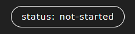  
1. preparing  ： プロジェクト実行準備中  
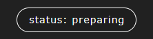  
1. running    ：プロジェクト実行中  
  
1. stopped    ： プロジェクト実行停止中  
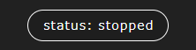  
1. finished   ：プロジェクト終了(正常終了)  
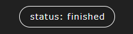  
1. failed     ：プロジェクト終了(エラー発生)  
  
1. holding    ： 実行状態不明のジョブ確認中  
  
1. unknown    ： 実行状態不明のジョブ発生  

__holding について__  
プロジェクト実行中に、WHEELのプロセスの再起動などにより投入したジョブの実行状態確認が中断された後、当該プロジェクトを開いたときにまとめてジョブの実行状況を確認している状態です。  
この状態では、プロジェクトの操作は受け付けませんが、ジョブの状況確認が終わり次第、stopped / finished / failed / unknonwなど他の状態に遷移します。
{: .notice--info}

__unknown について__  
WHEELから投入されたジョブの実行状態確認時に、規定の回数以上エラーが発生したときにunknown状態に遷移します。  
ルートワークフローから順に下位コンポーネントへと移動して、unknown状態となっているタスクコンポーネントを探し、当該ジョブの実行状態がワークフロー全体の実行の成否に影響が無いかを確認してください。
{: .notice--info}

### プロジェクト操作ボタンエリア
このエリアには、プロジェクトの実行に関わるボタンが表示されます。

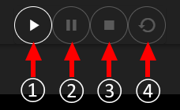

||構成要素|説明|
|----------|----------|---------------------------------|
|1|run project ボタン      |プロジェクトを実行開始します|
|2|stop project ボタン     |プロジェクトの実行を停止し実行前の状態に戻します|
|3|cleanup project ボタン  |プロジェクトの実行中に生成されたファイルなどを削除し、実行開始前の状態に戻します|

### 保存ボタンエリア
このエリアには、編集したプロジェクトの保存に関わるボタンが表示されます。

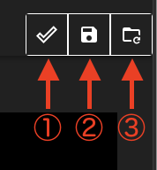

||構成要素|説明|
|----------|----------|---------------------------------|
|1|save projct ボタン  |プロジェクトを保存します|
|2|revert projct ボタン|プロジェクトを直前の保存状態に戻します|

__save projct ボタン / revert projct ボタンの動作について__  
WHEELでは、gitを用いたファイル履歴管理を行っております。  
グラフビュー画面上での編集内容はサーバサイドのファイルにすぐに反映されますが、save projct ボタンをクリックするまではgitリポジトリには登録されません。
revert projct ボタンをクリックすると、最後にコミットしてから後に行なった変更を全て破棄してリポジトリを最後にコミットした時の状態に戻します。  
git操作の詳細については開発者向けドキュメント[詳細設計書](https://github.com/{{ site.repository }}/blob/master/documentMD/design/design.md)をご確認ください。
{: .notice--info}

### ワークフロー画面切替ボタンエリア
このエリアには、ワークフロー画面をグラフビュー、リストビュー、テキストエディタに切り替えるボタンが表示されます。

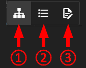

||構成要素|説明|
|----------|----------|---------------------------------|
|1|graph view ボタン   |グラフビュー画面に切り替えます。グラフビュー画面は初期表示される画面です|
|2|list view ボタン    |リストビュー画面に切り替えます|
|3|text editor ボタン  |テキストエディタ画面に切り替えます|

__テキストエディタ画面への遷移について__  
テキストエディタ画面への遷移は、ファイルの選択状態やプロジェクトの選択状態によって制限されています。  
遷移できないときは、text editor ボタンがクリックできない状態で表示されます。
{: .notice--info}

### 階層表示・遷移ボタン
ワークフローはコンポーネントの階層構造を持ちますが、グラフビュー画面では同一階層のコンポーネントしか同時に表示できません。

階層表示部には現在表示中のコンポーネントが、プロジェクトのルートコンポーネントからどのような階層を降りてきた位置に存在するのか表示します。

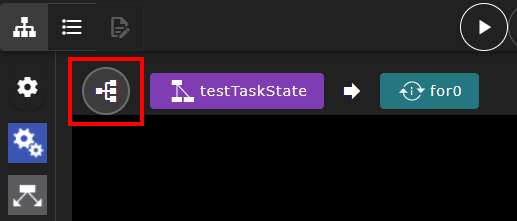

また、階層表示部の左端にある、ツリー表示ボタンをクリックするとプロジェクト全体の階層構造が表示されます。

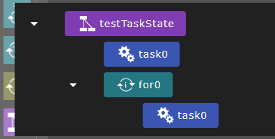

どちらの表示でも、コンポーネントをクリックすると、表示されているコンポーネントに表示が切り替わります。

### 環境変数エディタ表示ボタン
このボタンをクリックすると、プロジェクト内で実行されるシェルスクリプトなどで使える環境変数を設定するための画面が表示されます。

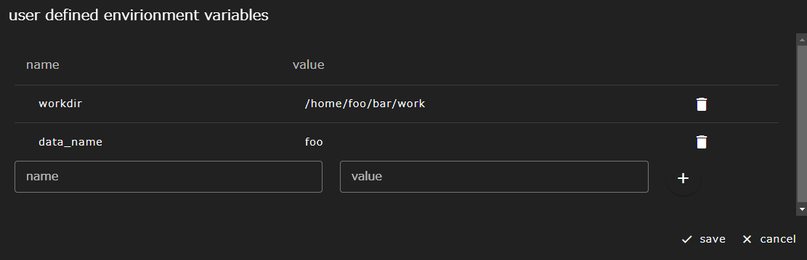

 - 環境変数の作成  
__name__ に環境変数名、__value__ に値を入力して、__+__ ボタンをクリックすると、新しく環境変数を追加することができます。
 - 環境変数の編集  
編集したい環境変数行の __環境変数名__ もしくは __value__ をクリックすることで、変更することができます。
 - 環境変数の削除  
削除したい環境変数行の右端に表示されているゴミ箱アイコンをクリックすることで、設定済の環境変数を削除できます。

設定を変更した後は、__save__ ボタンをクリックすることで変更内容が実際に反映されます。
変更を破棄して終了する場合は、__cancel__ ボタンをクリックしてください。

### ワークフロー作成用エリア
現在表示中のコンポーネントが持つ子コンポーネントが表示されています。
初期状態では、プロジェクトのルートコンポーネント直下の子コンポーネントが表示されています。

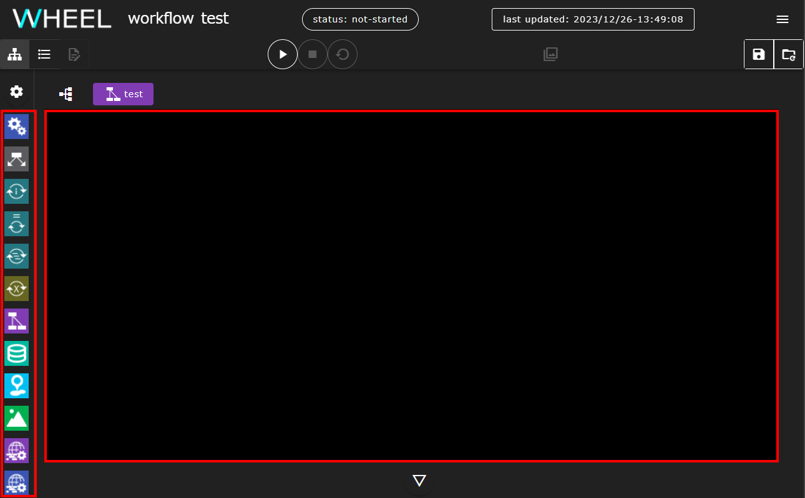

この領域に、コンポーネントライブラリから、ドラッグ&ドロップすることでプロジェクトにコンポーネントを追加します。

表示されているコンポーネントをダブルクリックすることで、そのコンポーネントの下位コンポーネントを表示するように切り替わります。

上位コンポーネントへの切り替えは、前述の階層表示部またはコンポーネントツリーを使ってください。

### ログ表示ボタン
ワークフローの作成時や実行時等に出力されるログを表示します。

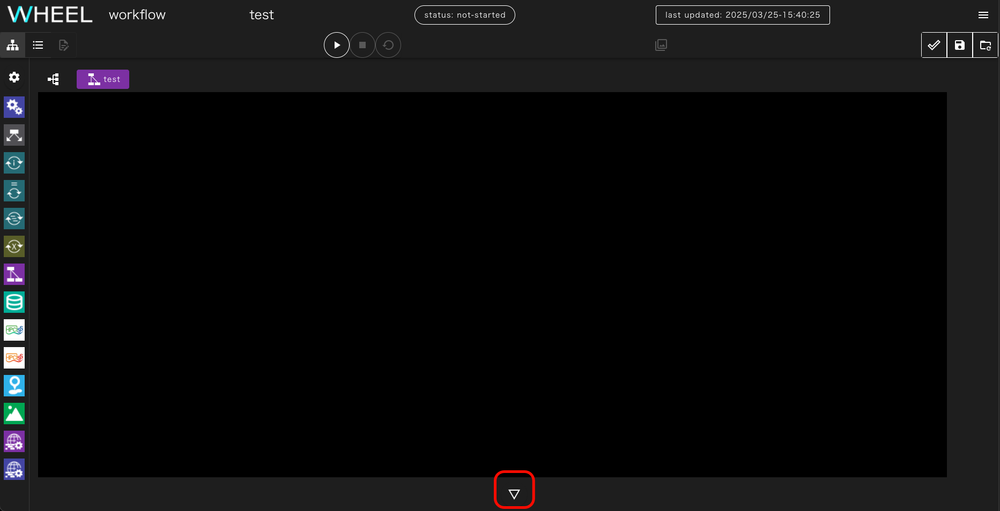

ボタンをクリックすると、次のようなログ表示エリアが表れます。

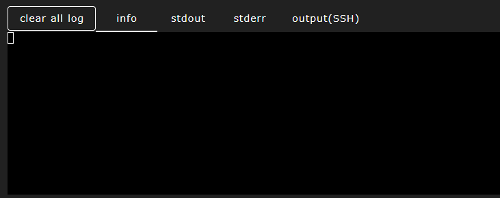

ログ表示は内容に応じて複数のタブにそれぞれ出力されます。

||構成要素|説明|
|----------|----------|---------------------------------|
|1|info タブ|エラー、ワーニングなどの重大な情報と、プロジェクトの実行状況や操作に関する一般的な情報が表示されます|
|2|stdout タブ|ローカルホストで実行されたタスクの標準出力が表示されます|
|3|stderr タブ|ローカルホストで実行されたタスクの標準エラー出力が表示されます|
|4|output(SSH) タブ|リモートホストで実行されたタスクの標準出力および標準エラー出力が表示されます|

ラベルの色は次の意味を表します。
- 緑: 新規情報あり、未表示
- 白: 新規情報なし、表示済み

__clear all log__ ボタンをクリックすると、それまでに表示された全てのログが消去されます。

最上部の△ボタンをクリックすると、ログ表示エリアが下部に折り畳まれます。

--------
[リファレンスマニュアルのトップページに戻る]({{ site.baseurl }}/reference/)
