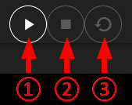
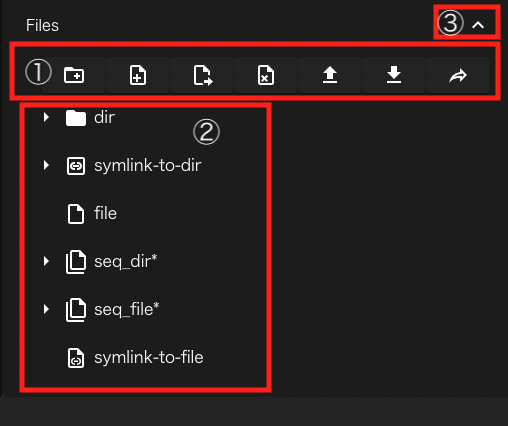

本章では、グラフビュー画面の機能について説明します。

ワークフローの作成・実行方法の具体例は、[チュートリアル]({{ site.baseurl }}/tutorial/)をご参照ください。

グラフビュー画面は以下のように構成されています。

||構成要素|説明|
|----------|----------|---------------------------------|
| 1|タイトル(WHEEL) ボタン　　　|ホーム画面へ遷移します　　　　　　　　　　　　　　　　　　　　　　　　|
| 2|プロジェクト名表示エリア　　|ワークフロー編集中のプロジェクト名が表示されます　　　　　　　　　　　|
| 3|状態表示エリア　　　　　　　|プロジェクトのSTATUS（実行状態）が表示されます　　　　　　　　　　　　　|
| 4|編集日時表示エリア　　　　　|プロジェクトの作成、更新日時が表示されます　　　　　　　　　　　　　　|
| 5|ワークフロー画面切替ボタンエリア　|ワークフロー画面をグラフビュー、リストビュー、テキストエディタに切り替えるボタンが表示されます|
| 6|プロジェクト操作ボタンエリア|プロジェクトの実行、停止、クリーンボタンが表示されます　　　　　　　　|
| 7|保存ボタンエリア           |プロジェクトの保存、変更の破棄ボタンが表示されます　　　　　　　　　　|
| 8|階層表示・遷移ボタン　　　　|現在表示中のプロジェクトディレクトリの階層が表示されます　　　　　　　|
| 9|環境変数エディタ表示ボタン　|環境変数設定画面が表示されます　　　　　　　　　　　　　　　　　　　　|
|10|コンポーネントライブラリ　　|ワークフローの構成要素であるコンポーネントを追加するためのパレットです|
|11|ログ表示ボタン　　　　　　　|ワークフローの作成、実行に関するログが表示されます　　　　　　　　　　|

次に各エリア、ボタンの詳細について説明します。

### 状態表示エリア
状態表示エリアは、プロジェクト全体の実行状態によって以下の状態を示します。

1. NOT-STARTED：プロジェクト実行前  
  
2. RUNNING    ：プロジェクト実行中  
  
3. FINISHED   ：プロジェクト終了(正常終了)  
  
4. FAILED     ：プロジェクト終了(エラー発生)  
  
5. HOLDING     : 投入済ジョブ確認中  
  
6. UNKNOWN     : プロジェクトの状態不明  

### プロジェクト操作ボタンエリア
このエリアには、プロジェクトの実行に関わるボタンが表示されます。

||構成要素|説明|
|----------|----------|---------------------------------|
|1|run project ボタン             |プロジェクトを実行開始します|
|2|stop project ボタン            |プロジェクトの実行を停止し実行前の状態に戻します|
|3|stop and cleanup project ボタン|プロジェクトの実行中に生成されたファイルなどを削除し、実行開始前の状態に戻します|

### 保存ボタンエリア
このエリアには、編集したプロジェクトの保存に関わるボタンが表示されます。

||構成要素|説明|
|----------|----------|---------------------------------|
|1|save projct ボタン  |プロジェクトを保存します|
|2|revert projct ボタン|プロジェクトを直前の保存状態に戻します|

WHEELでは、gitを用いたファイル管理を行っております。
グラフビュー画面上での編集内容はサーバサイドのファイルにすぐに反映されますが、
save projct ボタンをクリックするまではgitリポジトリには登録されません。
revert projct ボタンをクリックすると、最後にコミットしてから後に行なった変更を全て破棄して
リポジトリを最後にコミットした時の状態に戻します。

git操作の詳細については開発者向けドキュメント[詳細設計書](https://github.com/{{ site.repository }}/blob/master/documentMD/design/design.md)をご確認ください。

### ワークフロー画面切替ボタンエリア
このエリアには、ワークフロー画面をグラフビュー、リストビュー、テキストエディタに切り替えるボタンが表示されます。

||構成要素|説明|
|----------|----------|---------------------------------|
|1|graph view ボタン   |グラフビュー画面に切り替えます。グラフビュー画面は初期表示される画面です|
|2|list view ボタン    |リストビュー画面に切り替えます|
|3|text editor ボタン  |テキストエディタ画面に切り替えます|

__テキストエディタ画面への遷移について__  
テキストエディタ画面への遷移は、ファイルの選択状態やプロジェクトの選択状態によって制限されています。  
遷移できないときは、text editor ボタンがクリックできない状態で表示されます。
{: .notice--info}

### 階層表示・遷移ボタン
ワークフローはコンポーネントの階層構造を持ちますが、
グラフビュー画面では同一階層のコンポーネントしか同時に表示できません。

階層表示部には現在表示中のコンポーネントが、プロジェクトのルートコンポーネントから
どのような階層を降りてきた位置に存在するのか表示します。

また、階層表示部の左端にある、ツリー表示ボタンをクリックすると
プロジェクト全体の階層構造が表示されます。

どちらの表示でも、コンポーネントをクリックすると、表示されているコンポーネントに表示が切り替わります。

### 環境変数エディタ表示ボタン
このボタンをクリックすると、
プロジェクト内で実行されるシェルスクリプトなどで使える環境変数を
設定するための画面が表示されます。

 - 環境変数の作成  
__name__ に環境変数名、__value__ に値を入力して、__+__ ボタンをクリックすると、新しく環境変数を追加することができます。
 - 環境変数の編集  
編集したい環境変数行の__環境変数名__ もしくは __value__をクリックすることで、変更することができます。
 - 環境変数の削除  
削除したい環境変数行の右端に表示されているゴミ箱アイコンをクリックすることで、設定済の環境変数を削除できます。

設定を変更した後は、__SAVE__ ボタンをクリックすることで変更内容が実際に反映されます。
変更を破棄して終了する場合は、__CANCEL__ ボタンをクリックしてください。

### ワークフロー作成用エリア
現在表示中のコンポーネントが持つ子コンポーネントが表示されています。
初期状態では、プロジェクトのルートコンポーネント直下の子コンポーネントが表示されています。

この領域に、コンポーネントライブラリから、ドラッグ&ドロップすることでプロジェクトにコンポーネントを追加します。

表示されているコンポーネントをダブルクリックすることで、
そのコンポーネントの下位コンポーネントを表示するように切り替わります。

上位コンポーネントへの切り替えは、前述の階層表示部またはコンポーネントツリーを使ってください。

表示されているコンポーネントをシングルクリックすると、
そのコンポーネントの設定値(プロパティ)を編集する領域が表示されます。

||構成要素|説明|
|----------|----------|---------------------------------|
|1|close ボタン   |プロパティ表示を閉じます|
|2|clean ボタン   |コンポーネント(もしあれば下位コンポーネントも)の状態を最新の保存状態に巻き戻します|
|3|delete ボタン  |コンポーネントを削除します|
|4|詳細表示 ボタン|プロパティの設定項目の表示/非表示をグループ毎に切り替えます|

コンポーネントの種類毎にこの領域に表示される内容は異なります。
プロパティへの設定内容は、[コンポーネントの詳細]({{ site.baseurl }}/reference/4_component/)の章をご参照ください。

### ファイル操作エリア
コンポーネントのプロパティを表示した状態で、Filesグループの __∨（詳細表示）__ ボタンを
クリックすると、ファイル操作エリアが表示されます。

||構成要素|説明|
|----------|----------|---------------------------------|
|1|ファイル操作ボタンエリア|コンポーネント内のファイル、ディレクトリを操作するボタンが表示されます。詳細は、後述（[ファイル操作ボタンエリア](#ファイル操作ボタンエリア)）|
|2|ファイル表示エリア      |コンポーネント内のファイル、ディレクトリをツリー形式で表示します|
|3|closeボタン            |ファイル操作エリアの表示/非表示を切り替えます|

ファイル表示エリアには、選択中のコンポーネントディレクトリ以下に存在するファイル、ディレクトリのうち、wheelが使うメタデータファイルや、下位コンポーネントのディレクトリ以外のものが表示されます。

ディレクトリおよびディレクトリへのシンボリックリンクの左側に表示されている▶アイコンをクリックすることで、さらにそのディレクトリ内のファイル等を表示することができます。

__連番を持つファイルやディレクトリの表示について__  
ファイルやディレクトリのうち、連番で構成されるもの(例えば、file1, file2, file3といったもの)が
表示対象に含まれている時は、図中の`seq_dir*`や`seq_file*`のような形で1行にまとめて表示されます。  
ただし、後述の新規ファイル、ディレクトリ作成機能を用いて連番となるファイル、ディレクトリを作成した場合は1回プロパティ画面を閉じるか、リロードするまで
連番表示ではなく、個別にファイル、ディレクトリが表示されます。
既に連番表示されているファイル、ディレクトリと同じ形式の名前のファイル、ディレクトリを新規に作成した場合も同様です。  
これらの行の左側に表示されている▶アイコンをクリックすると、ディレクトリと同じような形で元の連番ファイル/ディレクトリが個々に表示されます。
{: .notice--info}

ファイル表示エリアにファイルをドロップすると、コンポーネントディレクトリの直下にファイルをアップロードすることができます。

#### ファイル操作ボタンエリア
ファイル操作エリア上部には、ファイルの操作を行うためのボタンが並んで表示されています。

||構成要素|説明|
|----------|----------|---------------------------------|
|1|new folder ボタン|表示されている階層に新規ディレクトリを作成します|
|2|new file ボタン|表示されている階層に新規の空ファイルを作成します|
|3|rename ボタン|選択中のファイル、ディレクトリ等をリネームします|
|4|delete ボタン|選択中のファイル、ディレクトリ等を削除します|
|5|upload file ボタン|表示されている階層にファイルをアップロードします|
|6|download ボタン|選択中のファイル、ディレクトリをダウンロードします|
|7|share file ボタン|選択中のファイル、ディレクトリのパスを表示します|

__選択中のファイル、ディレクトリを操作対象とするボタンについて__  
選択中のファイル、ディレクトリを操作対象とする操作は、非対応の時はボタンが無効化されます。  
そのため、クリックしても動作しません。
{: .notice--info}

共有ボタンをクリックすると、次のようなダイアログが表示されます。

表示されているパスの右にあるアイコンをクリックすると、クリップボードにコピーされるので
別のアプリへファイルを渡す時などにお使いください。

例えば、jupyterlabであれば、`http(s)://<server:port>/<lab-location>/lab/tree/path/to/notebook.ipynb` といった形式で指定したipynbファイルを開くことができます。ただし、WHEELからコピーされるファイルは絶対パスですが、ここで指定するパス(`path/to/notebook.ipynb`)はワークスペースのrootからの相対パスである必要があります。
詳細は、jupyterlabのドキュメントをご参照ください。

[File Navigation with tree](https://jupyterlab.readthedocs.io/en/stable/user/urls.html)

### ログ表示ボタン
ワークフローの作成時や実行時等に出力されるログを表示します。

ボタンをクリックすると、次のようなログ表示エリアが表れます。

ログ表示は内容に応じて複数のタブにそれぞれ出力されます。

||構成要素|説明|
|----------|----------|---------------------------------|
|1|INFO タブ|エラー、ワーニングなどの重大な情報と、プロジェクトの実行状況や操作に関する一般的な情報が表示されます|
|2|STDOUT タブ|ローカルホストで実行されたタスクの標準出力が表示されます|
|3|STDERR タブ|ローカルホストで実行されたタスクの標準エラー出力が表示されます|
|4|STDOUT(SSH) タブ|リモートホストで実行されたタスクの標準出力が表示されます|
|5|STDERR(SSH) タブ|リモートホストで実行されたタスクの標準エラー出力が表示されます|

ラベルの色は次の意味を表します。
- 青: 現在表示中
- 緑: 新規情報があり、未表示
- 灰: 非表示中

__CLEAR ALL LOG__ ボタンをクリックすると、それまでに表示された全てのログが消去されます。

最上部の△ボタンをクリックすると、ログ表示エリアが下部に折り畳まれます。

--------
[リファレンスマニュアルのトップページに戻る]({{ site.baseurl }}/reference/)
