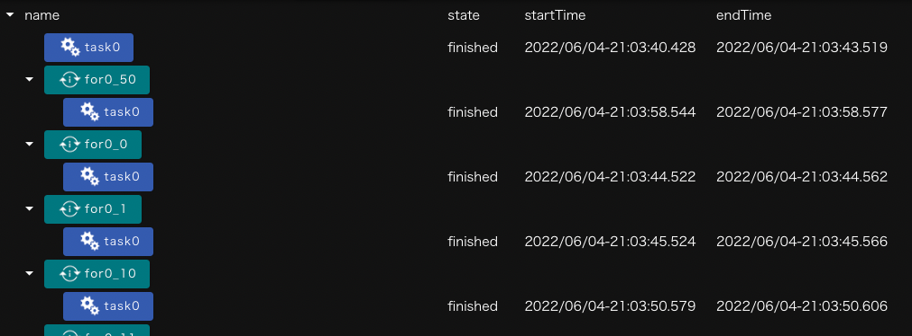

This chapter describes the functions of the list view screen.

The list view displays the execution status of Task components in a project in a tree format.
This is displayed by clicking the __list view__ button.

The contents of the display are as follows.

| Component | Description |
|----------|---------------------------------|
|name| Displays the component name|
|state| Displays component processing progress |
|startTime| Displays the component processing execution time |
|endTime| Displays the component processing completion time |

state is categorized and displayed as follows:

| State name | State description |
|----|----|
| not-started | Initial state |
| stage-in | Indicates that the required file is being transferred to the remote server |
| waiting | Indicates wait status due to the limit on the number of concurrent Task components |
| running | Indicates that the process is running |
| queued | Indicates that the job has been submitted to the batch system and is waiting to start execution |
| stage-out | Indicates that the remote server has finished processing and is transferring the required files |
| finished | Indicates that processing has completed |
| unknown | Indicates a status check that could not be determined whether a Task submitted through the batch system terminated normally or abnormally, for example   |
| failed | Indicates an abnormal end of processing |

__About Viewing Components__  
Components that run multiple times during a single project run, such as the For component, are displayed by the number of times they are run (see above).  
Task components, which are subcomponents of other components, also appear nested in the upstream component tree.
{: .notice--info}

--------
[Return to Reference Manual home page]({{site.baseurl}}/reference/)
