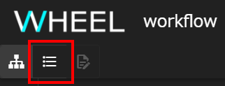
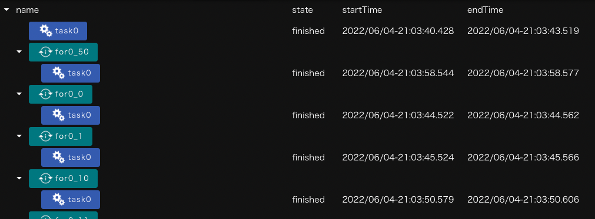

本章では、リストビュー画面の機能について説明します。

リストビュー画面は、プロジェクトに含まれるTaskコンポーネントの実行状況をツリー形式で表示する画面です。
__list view__ ボタンをクリックすることで表示されます。

表示内容は以下のように構成されています。

|構成要素|説明|
|----------|---------------------------------|
|name|コンポーネント名が表示されます|
|state|コンポーネント処理進行状況が表示されます|
|startTime|コンポーネント処理実行時刻が表示されます|
|endTime|コンポーネント処理完了時刻が表示されます|

stateは、以下のように分類され、表示されます。

| State名 | State説明 |
|----|----|
| not-started | 初期状態です |
| stage-in | リモートサーバへ必要なファイルを転送している状態を示します |
| waiting | Taskコンポーネントの同時実行本数の制限による待ち状態を示します |
| running | 処理が実行されている状態を示します |
| queued | ジョブをバッチシステムに投入し実行開始を待っている状態を示します |
| stage-out | リモートサーバでの処理が終了し必要なファイルを転送している状態を示します |
| finished | 処理が完了した状態を示します |
| unknown | バッチシステム経由で投入したTaskの処理がステータスチェックに失敗するなど 正常終了か異常終了か判定できなかった状態を示します |
| failed | 処理が異常終了した状態を示します |

__コンポーネントの表示について__  
Forコンポーネントのような1回のプロジェクト実行中に複数回実行されるコンポーネントは、実行された回数分分けて表示されます（上図参照）。  
また、他のコンポーネントの下位コンポーネントであるTaskコンポーネントは、上流のコンポーネントツリーの中にネストして表示されます。
{: .notice--info}

--------
[リファレンスマニュアルのトップページに戻る]({{ site.baseurl }}/reference/)
