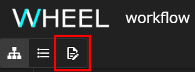
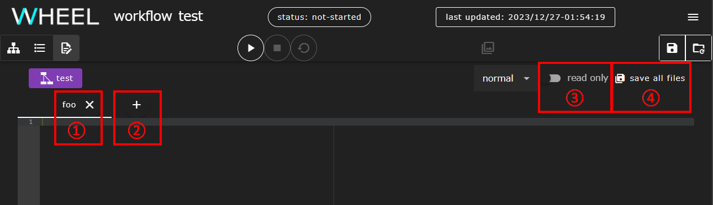
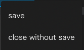
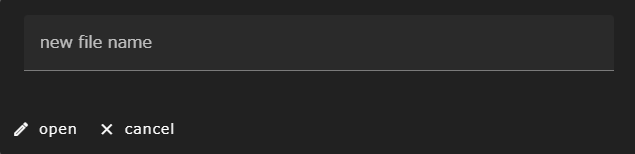

This chapter describes the functions of the text editor screen.
<!-- start -->
The text editor screen is displayed by clicking the __text editor__ button.

__About Transitions to Text Editor Screens__  
Transitions to the text editor screen are limited by the selected state of the file or the selected state of the project.  
If the transition cannot be made, the text editor button is displayed in a state that cannot be clicked.
{: .notice--info}
<!-- end -->

The text editor screen has three modes:
- ormal mode
- PS-config mode
- jobScriptEditor mode

You can switch between these modes in the drop-down list at the top of the screen.

__About Mode Switching__  
Some modes cannot be migrated depending on the component selected in the graph view screen before the transition to the text editor screen.
{: .notice--info}

### normal mode
This section describes the functions common to normal mode and all modes.

When a text editor screen is opened, it normally starts in normal mode. This mode is a tab editor that starts with the file selected on the graph view screen loaded into the first tab.

|| Component |
|----------|----------|
|1| File tab |
|2| New file open button |
|3|read only switch |
|4|save all files button |

#### File tab
Displays the file name of the opened file. The currently displayed tab is shown in blue.
When you click a file name on the Files tab, two menus appear: __save__ or __close without save__.

Click __save__ to save your edits. However, the project itself is not saved in this state, so clicking the revert project button at the top of the screen discards the edits.

Click __close without save__ to discard your edits and close the tab.

#### New File Open Button
Click the New File Open (+) button to open a window for creating a new file.

Enter a valid file name and click the __open__ button to create a blank file that is tabbed.
Add the contents of the file and save it.

#### read only switch
When the read only switch is enabled, the displayed text is read-only and cannot be changed.  
Use this function to check the contents of a text file.

#### save all files button
Click the save all files button to save all currently open tabs as well as all parameter study settings currently configured in the [PS-config mode](#ps-config-mode) described below.  
As with the __save__ menu on the Files tab, in this state you have not yet committed to the git repository, so clicking the revert project button at the top of the screen discards your edits.

### PS-config mode
This section describes the features of PS-config mode.

The parameter study function itself is described in [PS Components]({{site.baseurl}}/reference/4_component/06_PS.html).

|| Component | Description |
|----------|----------|---------------------------------|
|1|targetFiles input area | Sets the file from which to overwrite content with parameter values when running a parameter study |
|2|parameters input area | Defines the parameter space used when running a parameter study |
|3|scatter settings input area | Configure the files that will be distributed to each subcomponent separately before running the parameter study |
|4|gather settings input area | Set the files to be collected from each sub-component after completing the parameter study |

### jobScriptEditor mode
This section describes the features of jobScriptEditor mode.

In jobScriptEditor mode, for the text file you are editing,
Describe in the beginning of the job script to be input to the batch system
Provides the ability to interactively generate and edit option lines.

Immediately after startup, in the right area of the tab editor, which is the same as the normal mode
The __HPC center__ drop-down list appears.

|| Component | Description |
|----------|----------|---------------------------------|
|1|HPC center drop-down list | Select the supercomputer on which to submit the job |

From the HPC center drop-down list, select the system on which you want to submit the job.
A form is displayed to fill in the options used by the batch system.

|| Component |
|----------|----------|
|1|insert button |
|2|remove button |
|3|clear button |
|4|load button |
|5|register button |
|6| Option input form |

#### insert button
Click the __insert__ button to set the option value in the __option input form__.
Use a format suitable for job scripts and insert it at the beginning of the file open in the tab editor.

Also, if an option value has already been inserted into a file that is open on the tab editor side, the __insert__ button's label display switches to __update__.
If you click the __update__ button, the current settings will replace what you have already entered.

#### remove button
Click the __remove__ button to remove text inserted with the __insert__ button.

#### clear button
Click the __clear__ button to reset the contents of the __option input form__ to the default values.
At this time, the contents already inserted in the file on the tab editor side remain.

#### load button
Click the __load__ button to load the option settings saved with the __register__ button into the __option input form__.

#### register button
Click the __register__ button to name and save the settings entered in the __option input form__.
You can easily enter the same settings in multiple scripts by loading the saved content with the __load__ button.

The settings you enter with the __register__ button are stored in a different location than the project file, so you can recall settings you used in other projects.

To delete saved content, click the trash can icon at the far right of the list that appears when you click the __load__ button.

__About Input Values in the Options Input Form__  
The input values are not validated in the form in jobScriptEditor mode.   
For example, if you set an option in a format different from the one you can specify,
You may have entered an option that requires more resources than are allowed.
The job script is generated.  
Therefore, check the documentation of the system to be used by the user himself, and input the valid setting value.
{: .notice--warning}

--------
[Return to Reference Manual home page]({{site.baseurl}}/reference/)
