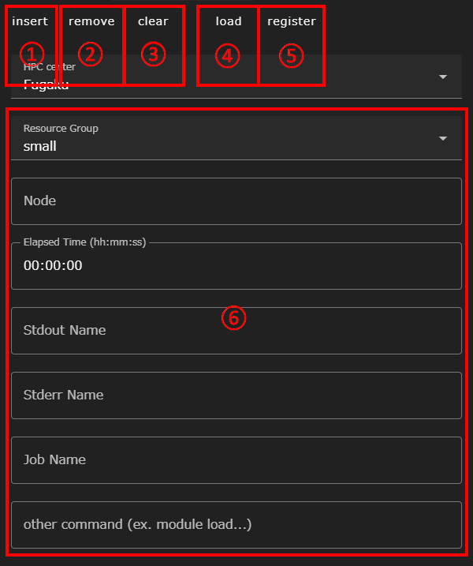

本章では、テキストエディタ画面の機能について説明します。

テキストエディタ画面には、次の3つのモードが存在します。
- normalモード
- PS-configモード
- jobScriptEditorモード

これらのモードの切り替えは画面上部のドロップダウンリストで行ないます。

__モード切り替えについて__  
テキストエディタ画面に遷移する前に、グラフビュー画面で選択したコンポーネントによっては移行できないモードがあります。
{: .notice--info}

### normalモード
本節では、normalモードおよび全モード共通の機能について説明します。

テキストエディタ画面を開いた時、通常はnormalモードとして起動します。このモードは、タブエディタとなっており、グラフビュー画面で選択していたファイルが1番目のタブに読み込まれた状態で起動します。

||構成要素|
|----------|----------|
|1|ファイルタブ|
|2|新規ファイルOpen ボタン|
|3|read only スイッチ|
|4|SAVE ALL FILES ボタン|

#### ファイルタブ
開いたファイルのファイル名が表示されます。現在表示中のタブは、青色で示されます。
ファイルタブのファイル名をクリックすると、__save__ または __close without save__ の2つのメニューが表示されます。

__save__ をクリックすると編集した内容が保存されます。ただし、この状態ではプロジェクト自体は未保存のため、画面上部のrevert projectボタンをクリックすると編集内容は破棄されます。

__close without save__ をクリックすると、編集内容を破棄してそのタブを閉じます。

#### 新規ファイルOpenボタン
新規ファイルOpen（＋）ボタンをクリックすると、新規ファイルを作成するための画面が開きます。

有効なファイル名を入力し、 __OPEN__ ボタンをクリックすると空ファイルが作成され、タブ表示されます。
ファイルの内容を追加して保存してください。

#### read onlyスイッチ
read onlyスイッチを有効にすると、表示されたテキストが読み取り専用となり、変更できなくなります。  
テキストファイルの内容を確認するときなどにご活用ください。

#### SAVE ALL FILES ボタン
SAVE ALL FILES ボタンをクリックすると、現在開いている全てのタブと、後述の[PS-configモード](#ps-configモード)で設定中のパラメータスタディ設定が全て保存されます。  
ファイルタブの __save__ メニューと同じく、この状態ではまだgitリポジトリにはコミットされていないため、画面上部のrevert projectボタンをクリックすると編集内容は破棄されます。

### PS-configモード
本節では、PS-configモードの機能を説明します。

パラメータスタディ機能自体は、[PSコンポーネント]({{ site.baseurl }}/reference/4_component/06_PS.html)に解説されているので、そちらも合わせてご確認ください。

||構成要素|説明|
|----------|----------|---------------------------------|
|1|targetFiles入力エリア|パラスタ実行時に、パラメータ値で内容を上書きする元になるファイルを設定します|
|2|parameters入力エリア|パラスタ実行時に使われるパラメータ空間の定義を行ないます|
|3|scatter設定入力エリア|パラスタ実行前に、各サブコンポーネントに個別に配布されるファイルの設定を行ないます|
|4|gather設定入力エリア|パラスタ完了後に、各サブコンポーネントから回収するファイルの設定を行ないます|

### jobScriptEditorモード
本節では、jobScriptEditorモードの機能を説明します。

jobScriptEditorモードでは、編集中のテキストファイルに対して、
バッチシステムに投入するジョブスクリプトの冒頭部分に記載する
オプション行を対話的に生成、編集する機能を提供します。

起動直後は、normalモードと同じタブエディタの右側の領域に
__HPC center__ ドロップダウンリストが表示されます。

||構成要素|説明|
|----------|----------|---------------------------------|
|1|HPC center ドロップダウンリスト|ジョブを投入する対象のスパコンを選択します|

HPC center ドロップダウンリストから、ジョブを投入する対象のシステムを選択すると、
そのバッチシステムで使われるオプション内容を入力するフォームが表示されます。

||構成要素|
|----------|----------|
|1|LOAD ボタン|
|2|INSERT ボタン|
|3|CLEAR ボタン|
|4|REGISTER ボタン|
|5|オプション入力フォーム|

#### LOADボタン
__LOAD__ ボタンをクリックすると、__REGISTER__ ボタンで保存したオプション設定を __オプション入力フォーム__ に読み込みます。

#### INSERTボタン
__INDERT__ ボタンをクリックすると、__オプション入力フォーム__ のオプション値を、
ジョブスクリプトに適した形式にして、タブエディタ側で開いているファイルの先頭部分に挿入します。

また、タブエディタ側で開いているファイルに既にオプション値が挿入されていた場合、__INSERT__ ボタンのラベル表示は __UPDATE__ に切り替わります。
__UPDATE__ ボタンをクリックすると、既に入力された内容が現在の設定値に置き換えられます。

#### CLEARボタン
__CLEAR__ ボタンをクリックすると、__オプション入力フォーム__ に入力済みの内容を初期値に戻します。
このとき、タブエディタ側のファイルに既に挿入された内容はそのまま残ります。

#### REGISTERボタン
__REGISTER__ ボタンをクリックすると、__オプション入力フォーム__ に入力された設定値に名前を付けて保存することができます。
保存した内容を __LOAD__ ボタンで読み込むことで、複数のスクリプトに同じ設定を容易に入力することができます。

__REGISTER__ ボタンで入力した内容はプロジェクトのファイルとは別の場所に保存されているため、他のプロジェクトで用いた設定値を呼び出すことも可能です。

保存済の内容を削除する時は、__LOAD__ ボタンをクリックしたときに表示されるリストの右端にあるゴミ箱アイコンをクリックしてください。

__オプション入力フォームの入力値について__  
jobScriptEditorモードのフォームでは入力された値のバリデーションは行なっていません。  
例えば、指定可能な書式とは異なる形式でオプションを設定していたり、
認められているリソース以上のリソースを要求するようなオプションを入力していたりしても、
ジョブスクリプトは生成されます。  
そのためユーザ自身で利用するシステムのドキュメント等を確認して有効な設定値を入力してください。
{: .notice--warning}

--------
[リファレンスマニュアルのトップページに戻る]({{ site.baseurl }}/reference/)
