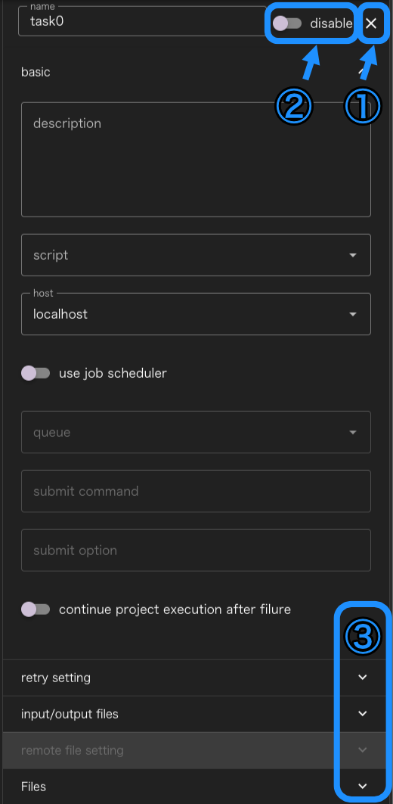
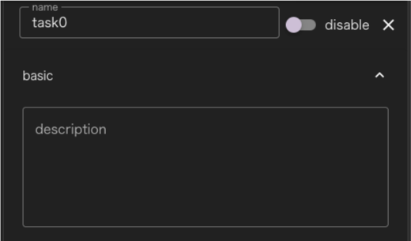
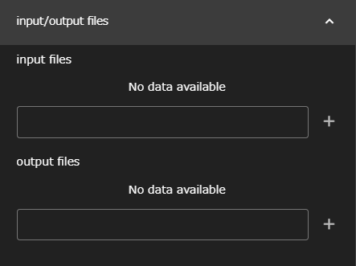
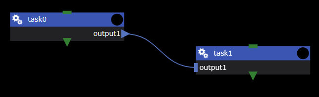
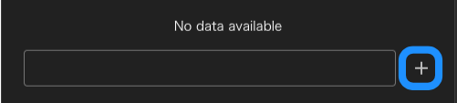
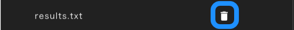
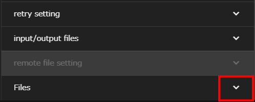
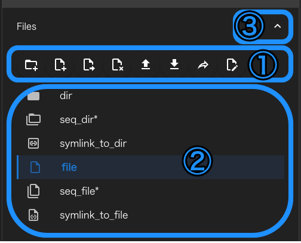
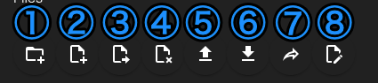
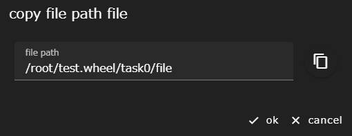

This section describes the specifications common to all components.

## Viewing Properties
When you single-click a component displayed in the workflow creation area, an area for editing the settings (properties) of that component appears.

The contents of this area differ for each type of component.

|| Component | Description |
|----------|----------|---------------------------------|
|1|close button   | Closes the property display |
|2|clean button   | Rewind the state of the component (and any subcomponents) to the most recent saved state |
|3| Details button | Shows or hides property settings for each group |

### Component Right-Click Menu
Right-clicking a component displays a context menu with the following operations:

- __Copy__: Copies the component
- __Cut__: Cuts the component
- __Delete__: Deletes the component (a confirmation dialog will be displayed)
- __Export__: Exports the component and its subcomponents as an archive file (.tgz)
- __Clean__: Rewind the component state to the most recent saved state

## Component Import and Export

WHEEL provides the ability to export individual components (and their subcomponents) as archive files and import them into other workflows. This feature is useful for:

- Reusing component configurations across different projects
- Sharing workflow components with other users
- Creating a library of commonly used component patterns
- Backing up specific workflow sections

### Exporting a Component

To export a component:

1. Right-click on the component you want to export in the workflow creation area
2. Select __Export__ from the context menu
3. A `.tgz` archive file will be automatically downloaded to your browser's download folder
   - The file will be named `WHEEL_component_<componentID>.tgz`
   - The archive contains the component and all its descendant components

__What is Exported__
- Component configuration (component.json files)
- All files and directories within the component
- All descendant (child) components recursively
- Component states are reset to "not-started"
- Component links (connections) are removed to ensure the component can be imported into any workflow
{: .notice--info}

__What is NOT Exported__
- Git metadata (.git directory)
- Uncommitted changes (only committed files are included)
- Link connections to other components
- Parent-child relationships (these are recreated on import)
{: .notice--info}

### Importing a Component

To import a component:

1. Open the workflow where you want to import the component
2. Navigate to the hierarchy level where you want to place the component
3. Right-click on the background of the workflow creation area (not on a component)
4. Select __Import__ from the context menu
5. In the Import Component dialog, select or drop the component archive file (.tgz)
6. Click __ok__ to import the component

The imported component will be placed at the position where you right-clicked.

__Import Behavior__
- A new unique ID is generated for the imported component and all its descendants
- If a component with the same name already exists in the target location, a suffix (_imported, _imported2, etc.) is automatically added to avoid conflicts
- The component is placed as a child of the currently displayed component
- Component states are reset to "not-started"
- You can specify the position of the imported component by the location of the right-click
- Changes are staged in git but not committed (you need to save the project to commit)
{: .notice--info}

__Component Name Conflicts__
When importing a component, if a component with the same name already exists in the target hierarchy, WHEEL automatically renames the imported component by appending a suffix:
- First conflict: `componentName_imported`
- Second conflict: `componentName_imported2`
- Third conflict: `componentName_imported3`, and so on

This ensures that each component has a unique name within its hierarchy.
{: .notice--info}

## name, description
All components have the __name__ and __description__ properties in common.

### name
For name, enter a name for the component.
Because the name value is treated as the directory name that contains the files required by the component, you cannot create components with the same name in the same hierarchy.

__About Available Characters__
The only characters allowed for name are alphanumeric characters, `-` (hyphen), and `_` (underscore).
{: .notice--info}

### description
The description has no restrictions like name and can be written freely.
You can distinguish components that are difficult to identify by name alone, or you can use comments (in scripts or source code) to describe what the component does.

## input files, output files
WHEEL provides the ability to transfer files within a component for use by another component.
This feature uses the input files and output files properties.

### How to transfer files
Connect the file specified in the output files of one component to the file specified in the input files of another component on the screen.
Then, the succeeding component first creates a symbolic link to the required file in the preceding component's directory with the file name specified in input files and executes the script.
Therefore, scripts in the successor component can access the files of the predecessor component.
In addition, in components inside for, foreach, and while components, the actual files are copied, including the symbolic links created at the time of the next loop processing. For this reason, what these components receive as inputFile will be the copied files and directories, not symbolic links, in the second and subsequent loops.

Depending on how you specify input files and output files, the following behavior is shown:

#### When output files is a normal path and input files is blank
A symbolic link to the file or directory specified in output files is created in the top-level directory of the succeeding component.

#### when output files is a normal path and input files is a non-'/'terminated string
A symbolic link to the file or directory specified in output files is created in the subsequent component's directory.
The symbolic link name is the name specified in input files.

#### if output files is a path containing glob (\* or\? etc.) and input files is a non-'/'terminated string
A directory with the string specified in input files is created in the subsequent component's directory.
It creates symbolic links to files and directories that match the globs specified in output files.

#### if input files is a string ending in '/'
A directory with the string specified in input files is created in the subsequent component's directory.
In it, a symbolic link to the file or directory specified in output files is created.

### Setting the files and folders to be transferred
The input files and output files have the same method for setting the files and folders to be transferred.

#### How to Add
To add a file or folder to be transferred, type a file or directory name in the text box, and then click the __+__ button.

#### How to Delete
To delete the specified file or folder, click the __Trash__ button displayed to the right of the file or directory name.

## File Operation Area
Click the __∨ (Details)__ button in the Files group to display the file operation area.

|| Component | Description |
|----------|----------|---------------------------------|
|1| File Operation Buttons Area | Displays buttons for manipulating files and directories within a component. For details, see [File Operation Buttons Area](#file-operation-buttons-area) |
|2| File display area      | Displays the files and directories in the component in a tree format |
|3|close button            | Shows or hides the file manipulation area |

The file display area displays the files and directories under the currently selected component directory, other than the metadata files used by WHEEL and the directories of subordinate components.

By clicking the ▶ icon displayed to the left of the directory and the symbolic link to the directory, you can further view the files and other information in that directory.

__About Viewing Files and Directories with Sequential Numbers__
If files and directories that consist of sequential numbers (For example, file1, file2, file3) are included in the display, they are displayed together on a single line, such as `seq_dir*` and `seq_file*` in the figure.  
However, if you use the new file and directory creation function described below to create a sequentially numbered file or directory, the files and directories will be displayed individually instead of sequentially until you close or reload the property screen once.
This also applies to files that are already sequentially numbered, files with the same name as the directory, and new directories that have been created.   
Click the ▶ icon to the left of these lines to view the original sequential files and directories individually, similar to the directories.
{: .notice--info}

You can upload a file directly under the component directory by dropping the client PC file in the file display area.

### File Operation Buttons Area
At the top of the file operation area are buttons for file operations.

|| Component | Description |
|----------|----------|---------------------------------|
|1|new folder button | Creates a new directory in the displayed hierarchy |
|2|new file button | Creates a new empty file in the displayed hierarchy |
|3|rename button | Rename the currently selected file, directory, etc. |
|4| Delete button | Deletes the currently selected file, directory, etc. |
|5|upload file button | Uploads a file to the displayed hierarchy |
|6| Download button | Downloads the selected file or directory |
|7|share file button | Displays the path of the currently selected file or directory |

__About buttons for working with files and directories during selection__
If the selected file or directory is not supported, the button is disabled.
Therefore, clicking does not work.
{: .notice--info}

Clicking the Share button displays a dialog similar to the following:

If you click the icon to the right of the displayed path, it will be copied to the clipboard, so you can use it to pass files to another application.

For example, jupyterlab can open an ipynb file of the form `http(s)://<server:port>/<lab-location>/lab/tree/path/to/notebook.ipynb`.
However, while the file copied from WHEEL is an absolute path, the path specified here (`path/to/notebook.ipynb`) must be relative to the root of the workspace.
For more information, see the jupyterlab documentation.

[File Navigation with tree](https://jupyterlab.readthedocs.io/en/stable/user/urls.html)

--------
[Return to Component Details]({{site.baseurl}}/reference/4_component/)
