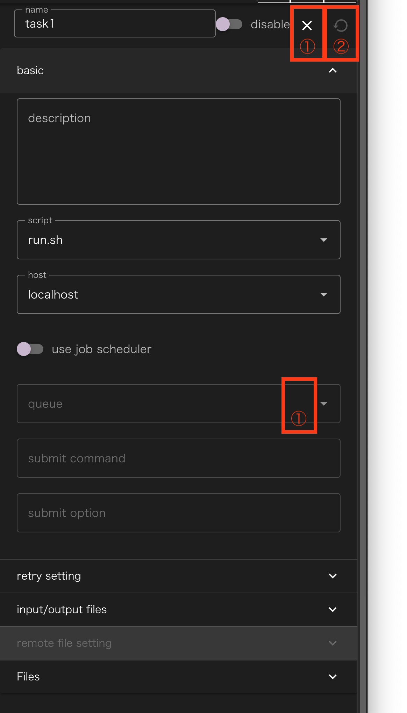
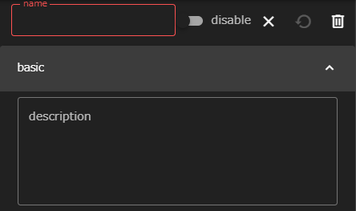
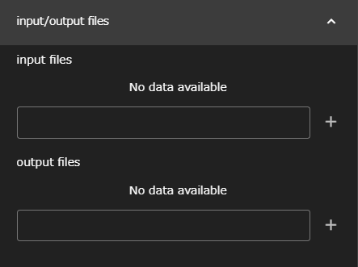
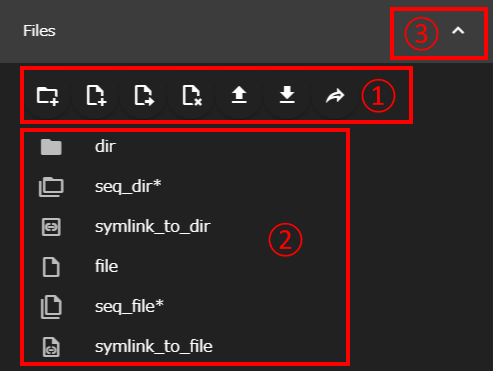
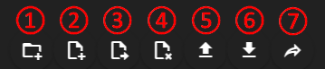
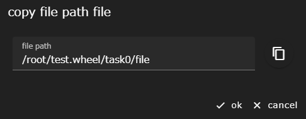

This section describes the specifications common to all components.

## Viewing Properties
When you single-click a component displayed in the workflow creation area,
Displays an area where you can edit the settings (properties) for the component.

|| Component | Description |
|----------|----------|---------------------------------|
|1|close button   | Closes the property display |
|2|clean button   | Rewind the state of the component (and any subcomponents) to the most recent saved state |
|3|delete button  | Remove component |
|4| Details button | Shows or hides property settings for each group |

The contents of this area differ for each type of component.

## name, description
All components have the __name__ and __description__ properties in common.

### name
For name, enter a name for the component.  
Because the name value is treated as the directory name that contains the files required by the component, you cannot create components with the same name in the same hierarchy.

__ About Available Characters __  
The only characters allowed for name are alphanumeric characters, `-` (hyphen), and `_` (underscore).
{: .notice--info}

### description
The description has no restrictions like name and can be written freely.
distinguishes components that are difficult to identify by name alone,
It can be used like a comment (in a script or source code) describing what a component does.

## input files, output files
WHEEL specifies that the files in the component 
 There is a function to transfer it for use by another component.
This feature uses the input files and output files properties.

### How to transfer files
Connect the file specified in the output files of one component to the file specified in the input files of another component on the screen.
Then, before the subsequent component is executed, the
A symbolic link is created for the required file.
Therefore, scripts in the successor component can access the files of the predecessor component.

Depending on how you specify input files and output files, the following behavior is shown:

<! -- #### if input files is blank and output files has a normal path -->
#### When output files is a normal path and input files is blank
If the symbolic link to the file or directory specified in output files is
It is created in the top-level directory of the successor component.

<! -- #### if input files is a string that does not end with '/' and output files has a normal path -->
#### when output files is a normal path and input files is a non-'/'terminated string
In the following component directory:
Creates a symbolic link to the file or directory specified in output files.
The symbolic link name is the name specified in input files.

<! --#### if inputFile is a non-'/'string and the path specified in outputFile contains glob (\* or\? etc.) -->
#### if output files is a path containing glob (\* or\? etc.) and input files is a non-'/'terminated string
A directory with the string specified in input files is created in the subsequent component's directory.
It creates symbolic links to files and directories that match the globs specified in output files.

<! --### inputFile contains a string ending in '/' -->
#### if input files is a string ending in '/'
A directory with the string specified in input files is created in the subsequent component's directory.
In it, a symbolic link to the file or directory specified in output files is created.

## File Operation Area
Click the __ d (Details) __ button in the Files group to display the file operation area.

|| Component | Description |
|----------|----------|---------------------------------|
|1| File Operation Buttons Area | Displays buttons for manipulating files and directories within a component. For details, see [File Operation Buttons Area] |
|2| File display area      | Displays the files and directories in the component in a tree format |
|3|close button            | Shows or hides the file manipulation area |

The file display area displays the files and directories under the currently selected component directory, other than the metadata files used by WHEEL and the directories of subordinate components.

By clicking the ▶ icon displayed to the left of the directory and the symbolic link to the directory, you can further view the files and other information in that directory.

__ About Viewing Files and Directories with Sequential Numbers __  
If files and directories that consist of sequential numbers (For example, file1, file2, file3) are included in the display,
They are displayed in a single line, such as `seq_dir* `and `seq_file*` in the figure.   
However, if you use the new file and directory creation function described below to create a file or directory that is a serial number,
Files and directories are displayed individually, not sequentially, until you close or reload the property screen once.
This also applies to files that are already sequentially numbered, files with the same name as the directory, and new directories that have been created.   
Click the ▶ icon to the left of these lines to view the original sequential files and directories individually, similar to the directories.
{: .notice--info}

You can upload files directly under the component directory by dropping them in the file display area.

### File Operation Buttons Area
At the top of the file operation area are buttons for file operations.

|| Component | Description |
|----------|----------|---------------------------------|
|1|new folder button | Creates a new directory in the displayed hierarchy |
|2|new file button | Creates a new empty file in the displayed hierarchy |
|3|rename button | Rename the currently selected file, directory, etc. |
|4| Delete button | Deletes the currently selected file, directory, etc. |
|5|upload file button | Uploads a file to the displayed hierarchy |
|6| Download button | Downloads the selected file or directory |
|7|share file button | Displays the path of the currently selected file or directory |

__ About buttons for working with files and directories during selection __  
If the selected file or directory is not supported, the button is disabled.  
Therefore, clicking does not work.
{: .notice--info}

Clicking the Share button displays a dialog similar to the following:

Click the icon to the right of the displayed path to copy it to the clipboard.
Use this to pass files to another application.

For example, jupyterlab can open an ipynb file of the form `http (s) :// <server: port>/<lab-location>/lab/tree/path/to/notebook.ipynb`. However, while the file copied from WHEEL is an absolute path, the path specified here (`path/to/notebook.ipynb`) must be relative to the root of the workspace.
For more information, see the jupyterlab documentation.

[File Navigation with tree](https://jupyterlab.readthedocs.io/en/stable/user/urls.html)

--------
Return to Component Details ({{site.baseurl}}/reference/4_component /)
