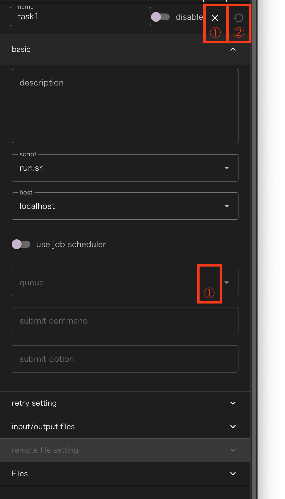
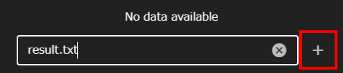
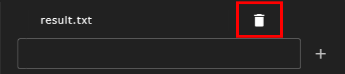
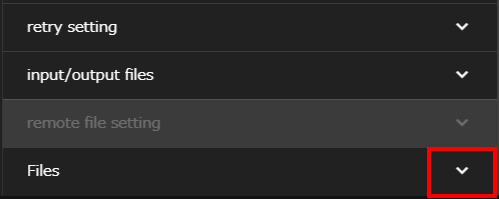
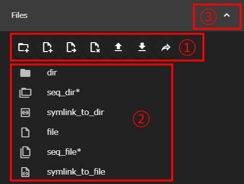
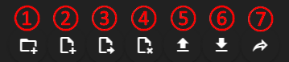
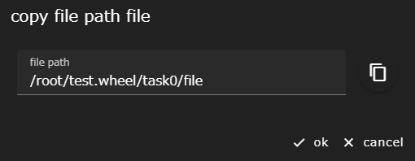

本節では、全コンポーネントに共通する仕様について説明します。

## プロパティの表示
ワークフロー作成用エリアに表示されているコンポーネントをシングルクリックすると、
そのコンポーネントの設定値(プロパティ)を編集する領域が表示されます。

コンポーネントの種類毎にこの領域に表示される内容は異なります。

||構成要素|説明|
|----------|----------|---------------------------------|
|1|close ボタン   |プロパティ表示を閉じます|
|2|clean ボタン   |コンポーネント(もしあれば下位コンポーネントも)の状態を最新の保存状態に巻き戻します|
|3|delete ボタン  |コンポーネントを削除します|
|4|詳細表示 ボタン|プロパティの設定項目の表示/非表示をグループ毎に切り替えます|

## name, description
全てのコンポーネントは共通して、__name__ プロパティと __description__ プロパティを持ちます。

### name
nameには、コンポーネントの名前を入力します。  
name値は、そのコンポーネントに必要なファイルを格納するディレクトリ名として扱われるため、同一階層に同じ名前のコンポーネントを作成することはできません。

__使用できる文字について__  
nameとして使用できる文字は、英数字、`-`(ハイフン)、および`_`(アンダーバー)のみです。
{: .notice--info}

### description
descriptionにはnameのような制約が無く、自由に内容を記述することができます。
nameのみでは識別し難いコンポーネントを区別したり、
コンポーネントの処理内容を説明する(スクリプトやソースコードにおける)コメントのような使い方をしたりすることができます。

## input files, output files
WHEELには、コンポーネント内のファイルを 
 別のコンポーネントで使うために転送する機能があります。
この機能には、input filesプロパティとoutput filesプロパティを用います。

### 追加方法
テキストボックスにファイル名またはディレクトリ名を入力し、__+__ ボタンをクリックします。

### 削除方法
ファイル名またはディレクトリ名の右に表示された __ゴミ箱__ ボタンをクリックします。

### ファイルの転送方法
あるコンポーネントのoutput filesに指定したファイルと、別のコンポーネントのinput filesに指定したファイルを画面上で接続します。
すると、後続コンポーネントにおいて、まず先行コンポーネントのディレクトリ内の必要なファイルに対してシンボリックリンクがinput filesで指定されたファイル名で作成され、
スクリプトが実行されます。
そのため、後続コンポーネント内のスクリプトからも、先行コンポーネントのファイルにアクセス可能となります。

input filesとoutput filesの指定方法によって、それぞれ次のような挙動を示します。

<!-- #### input filesが空白で、output filesに通常のパスが指定されたとき -->
#### output filesが通常のパスで、input filesが空白のとき
output filesに指定されたファイルまたはディレクトリへのシンボリックリンクが、
後続コンポーネントの最上位ディレクトリに作成されます。

<!-- #### input filesが'/'で終わらない文字列で、output filesに通常のパスが指定されたとき -->
#### output filesが通常のパスで、input filesが'/'で終わらない文字列のとき
後続コンポーネントのディレクトリ内に、
output filesで指定されたファイルまたはディレクトリへのシンボリックリンクが作成されます。
シンボリックリンク名は、input filesに指定された名前です。

<!--#### inputFileが'/'で終わらない文字列で、outputFileに指定されたパスがglob(\*や\?など)を含む時-->
#### output filesがglob(\*や\?など)を含むパスで、input filesが'/'で終わらない文字列のとき
後続コンポーネントのディレクトリ内に、input filesに指定された文字列のディレクトリが作成されます。
その中に、output filesで指定されたglobと一致するファイルやディレクトリへのシンボリックリンクが作成されます。

<!--### inputFileに'/'で終わる文字列が指定された時-->
#### input filesが'/'で終わる文字列のとき
後続コンポーネントのディレクトリ内に、input filesに指定された文字列のディレクトリが作成されます。
その中に、output filesに指定されたファイルやディレクトリへのシンボリックリンクが作成されます。

## ファイル操作エリア
Filesグループの __∨（詳細表示）__ ボタンをクリックすると、ファイル操作エリアが表示されます。

||構成要素|説明|
|----------|----------|---------------------------------|
|1|ファイル操作ボタンエリア|コンポーネント内のファイル、ディレクトリを操作するボタンが表示されます。詳細は、後述（[ファイル操作ボタンエリア](#ファイル操作ボタンエリア)）|
|2|ファイル表示エリア      |コンポーネント内のファイル、ディレクトリをツリー形式で表示します|
|3|closeボタン            |ファイル操作エリアの表示/非表示を切り替えます|

ファイル表示エリアには、選択中のコンポーネントディレクトリ以下に存在するファイルやディレクトリのうち、WHEELが使うメタデータファイルや下位コンポーネントのディレクトリ以外のものが表示されます。

ディレクトリおよびディレクトリへのシンボリックリンクの左側に表示されている▶アイコンをクリックすることで、さらにそのディレクトリ内のファイル等を表示することができます。

__連番を持つファイルやディレクトリの表示について__  
ファイルやディレクトリのうち、連番で構成されるもの(例えば、file1, file2, file3)が表示対象に含まれているときは、
図中の`seq_dir*`や`seq_file*`のように1行でまとめて表示されます。  
ただし、後述の新規ファイル、ディレクトリ作成機能を用いて連番となるファイルやディレクトリを作成した場合は、
1回プロパティ画面を閉じるかリロードするまで、連番表示ではなく、個別にファイル、ディレクトリが表示されます。
既に連番表示されているファイル、ディレクトリと同じ形式の名前のファイル、ディレクトリを新規に作成した場合も同様です。  
これらの行の左側に表示されている▶アイコンをクリックすると、ディレクトリと同じような形で元の連番ファイルやディレクトリが個々に表示されます。
{: .notice--info}

ファイル表示エリアにクライアントPCのファイルをドロップすると、コンポーネントディレクトリの直下にファイルをアップロードすることができます。

### ファイル操作ボタンエリア
ファイル操作エリア上部には、ファイルの操作を行うためのボタンが並んで表示されています。

||構成要素|説明|
|----------|----------|---------------------------------|
|1|new folder ボタン|表示されている階層に新規ディレクトリを作成します|
|2|new file ボタン|表示されている階層に新規の空ファイルを作成します|
|3|rename ボタン|選択中のファイル、ディレクトリ等をリネームします|
|4|delete ボタン|選択中のファイル、ディレクトリ等を削除します|
|5|upload file ボタン|表示されている階層にファイルをアップロードします|
|6|download ボタン|選択中のファイル、ディレクトリをダウンロードします|
|7|share file ボタン|選択中のファイル、ディレクトリのパスを表示します|

__選択中のファイル、ディレクトリを操作対象とするボタンについて__  
選択中のファイル、ディレクトリを操作対象とする操作は、非対応の時はボタンが無効化されます。  
そのため、クリックしても動作しません。
{: .notice--info}

共有ボタンをクリックすると、次のようなダイアログが表示されます。

表示されているパスの右にあるアイコンをクリックすると、クリップボードにコピーされるので
別のアプリへファイルを渡す時などにお使いください。

例えば、jupyterlabであれば、`http(s)://<server:port>/<lab-location>/lab/tree/path/to/notebook.ipynb` といった形式で指定したipynbファイルを開くことができます。ただし、WHEELからコピーされるファイルは絶対パスですが、ここで指定するパス(`path/to/notebook.ipynb`)はワークスペースのrootからの相対パスである必要があります。
詳細は、jupyterlabのドキュメントをご参照ください。

[File Navigation with tree](https://jupyterlab.readthedocs.io/en/stable/user/urls.html)

--------
[コンポーネントの詳細に戻る]({{ site.baseurl }}/reference/4_component/)
