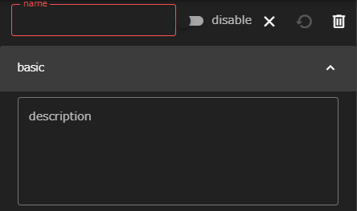
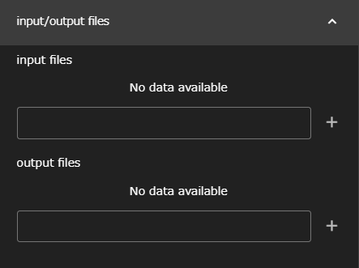
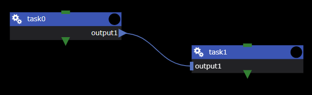

本節では、全コンポーネントに共通する仕様について説明します。

## name, description
全てのコンポーネントは共通して、__name__ プロパティと __description__ プロパティを持ちます。

### name
nameには、コンポーネントの名前を入力します。  
name値は、そのコンポーネントに必要なファイルを格納するディレクトリ名として扱われるため、同一階層に同じ名前のコンポーネントを作成することはできません。

__使用できる文字について__  
nameとして使用できる文字は、英数字、`-`(ハイフン)、および`_`(アンダーバー)のみです。
{: .notice--info}

### description
descriptionにはnameのような制約が無く、自由に内容を記述することができます。
nameのみでは識別し難いコンポーネントを区別したり、
コンポーネントの処理内容を説明する(スクリプトやソースコードにおける)コメントのような使い方をしたりすることができます。

## input files, output files
WHEELには、コンポーネント内のファイルを 
 別のコンポーネントで使うために転送する機能があります。
この機能には、input filesプロパティとoutput filesプロパティを用います。

### ファイルの転送方法
あるコンポーネントのoutput filesに指定したファイルと、別のコンポーネントのinput filesに指定したファイルを画面上で接続します。
すると、後続コンポーネントの実行前に、先行コンポーネントのディレクトリ内の
必要なファイルに対してシンボリックリンクが作成されます。
そのため、後続コンポーネント内のスクリプトからも、先行コンポーネントのファイルにアクセス可能となります。

input filesとoutput filesの指定方法によって、それぞれ次のような挙動を示します。

<!-- #### input filesが空白で、output filesに通常のパスが指定されたとき -->
#### output filesが通常のパスで、input filesが空白のとき
output filesに指定されたファイルまたはディレクトリへのシンボリックリンクが、
後続コンポーネントの最上位ディレクトリに作成されます。

<!-- #### input filesが'/'で終わらない文字列で、output filesに通常のパスが指定されたとき -->
#### output filesが通常のパスで、input filesが'/'で終わらない文字列のとき
後続コンポーネントのディレクトリ内に、
output filesで指定されたファイルまたはディレクトリへのシンボリックリンクが作成されます。
シンボリックリンク名は、input filesに指定された名前です。

<!--#### inputFileが'/'で終わらない文字列で、outputFileに指定されたパスがglob(\*や\?など)を含む時-->
#### output filesがglob(\*や\?など)を含むパスで、input filesが'/'で終わらない文字列のとき
後続コンポーネントのディレクトリ内に、input filesに指定された文字列のディレクトリが作成されます。  
その中に、output filesで指定されたglobと一致するファイルやディレクトリへのシンボリックリンクが作成されます。

<!--### inputFileに'/'で終わる文字列が指定された時-->
#### input filesが'/'で終わる文字列のとき
後続コンポーネントのディレクトリ内に、input filesに指定された文字列のディレクトリが作成されます。
その中に、output filesに指定されたファイルやディレクトリへのシンボリックリンクが作成されます。

--------
[コンポーネントの詳細に戻る]({{ site.baseurl }}/reference/4_component/)
