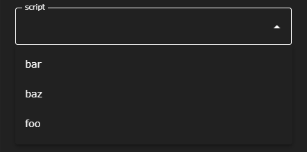
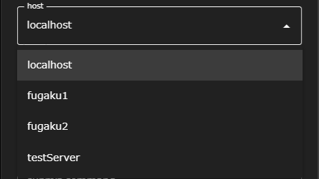
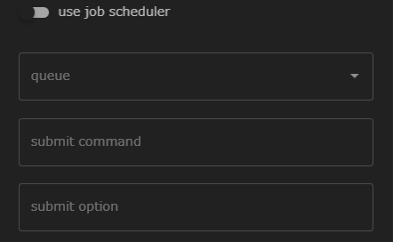
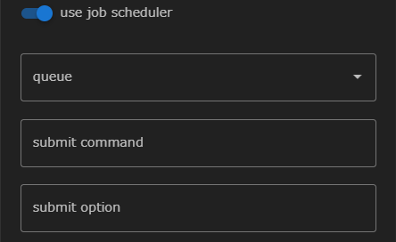
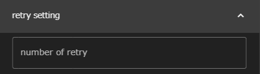
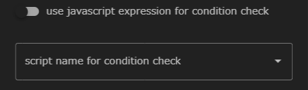
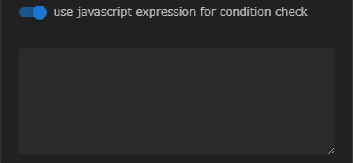
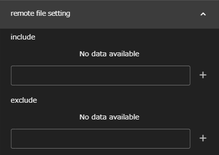
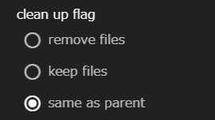

The Task component is the most basic and important component of WHEEL.  
Executes the script file set in the __script__ property according to the settings in the execution environment (host/useJobScheduler/queue property).

The following properties can be specified for a Task component:

### script
Sets the filename of the script to call when the Task component runs.

The script property is a select box.
You can choose from the files that exist in the Task component.

### host
Remote host set in Remote host settings ({{site.baseurl}}/how_to_boot/# Remote Host Configuration) as the script execution environment
or "localhost."

- When "localhost" is selected  
script is run on the machine running WHEEL.  
- When other than "localhost" is selected  
ssh transfers the entire directory to the remote host, and script runs on the remote host. (When useJobScheduler is set, described below, the job is submitted to the batch system.)

### useJobScheduler
Enables script execution when it is submitted to the batch system.  
The following queue, submit option properties can only be set when useJobScheduler is enabled:

- When invalid

- When enabled

### queue
Select the queue in which the job is to be submitted from the queue specified in the remote host settings.
If not specified, the job is submitted to the batch system default queue.

### submit command
Remote Host Settings ({{site.baseurl}}/how_to_boot/# Remote Host Configuration)
Displays the name of the command used to submit the job to the batch system specified in.
<! -- This column is not actually a property of the Task component. -->  
Therefore, it cannot be changed here.

### submit option
Sets additional options to be specified when the job is submitted.

### number of retry
Specifies the number of times the Task component automatically reruns if it fails to run.
If none is specified, the command is not re-executed.

### use javascript expression for condition check
To determine the success or failure of a Task component
Specifies whether to use a javascript expression or a shell script.

 - When invalid  
  
When disabled, a drop-down list appears to select a shell script.  
The shell script specified here is executed after the Task component has finished executing.
A return value of 0 indicates success, and a non-zero value indicates failure.   
If none is specified, the return code of the script specified in __script__ performs the same judgment.

 - When enabled  
 
When enabled, you can write javascript expressions.  
The expression entered here is evaluated after the Task component has finished executing.
If it returns a Truthy value, it succeeds.
A falsy value is considered a failure.

If both the script name and the javascript expression are not set and only the number of retry value is set,
Repeat until the script finishes successfully or reaches the number of times set for retry.

### include, exclude

The files generated when the Task component is run on a remote host, such as those specified in output files.
It remains intact on the remote host unless further processing requires it.

Therefore, you should check the files that are not required for the subsequent workflow processing (such as the log files output by the application during execution).
is specified in __include__.
When the Task component finishes executing, it is copied to the WHEEL server and can be viewed in the Files area.

__include__ can be a directory name, glob, etc.
You can also specify __exclude__ to exclude downloads.

For example, suppose you specify `* .txt` for __include__ and `foo.txt` for __exclude__, and foo.txt, bar.txt, baz.txt are generated at the end of execution.
In this case, only two files are actually downloaded: bar.txt, baz.txt.

### clean up flag
Specifies whether to delete files left on the remote host after execution on the remote host has finished.

__remove files__ to remove,
If __keep files__ is specified, the files are stored on the remote host.  
The default setting is __same as parent__ and behaves the same as the upper component setting.
Note that if __same as parent__ is specified for the top-level component, the behavior is the same as if __keep files__ is specified.

--------
Return to Component Details ({{site.baseurl}}/reference/4_component /)

