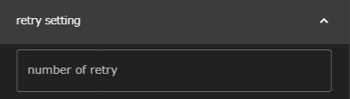
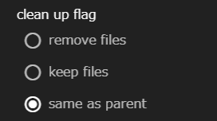

Taskコンポーネントは、WHEELのコンポーネントの中で最も基本的かつ重要なコンポーネントです。  
__script__ プロパティに設定されたスクリプトファイルを、実行環境(host/useJobScheduler/queueプロパティ)の設定に応じて実行します。

Taskコンポーネントに指定することのできるプロパティは以下のとおりです。

### script
Taskコンポーネントの実行時に呼ぶスクリプトのファイル名を設定します。

scriptプロパティはセレクトボックスになっており、
Taskコンポーネント内に存在するファイルの中から選ぶことができます。

### host
scriptの実行環境として、[リモートホスト設定]({{ site.baseurl }}/how_to_boot/#リモートホスト設定)にて設定されたリモートホスト
または"localhost"を選択します。

- "localhost"を選択したとき  
scriptがWHEELが動作しているマシン上で実行されます。  
- "localhost"以外を選択したとき  
sshでリモートホストへディレクトリ全体が転送され、scriptがリモートホスト上で実行されます。(後述のuseJobSchedulerが設定されているときは、バッチシステムにジョブが投入されます)

### useJobScheduler
scriptの実行をバッチシステムに投入する時に有効にします。  
useJobSchedulerを有効にしたときのみ、次のqueue, submit optionプロパティを設定することができます。

- 無効のとき

- 有効のとき

### queue
ジョブを投入するキューをリモートホスト設定で設定したキューの中から選びます。
無指定の場合はバッチシステムのデフォルトキューに対してジョブを投入します。

### submit command
[リモートホスト設定]({{ site.baseurl }}/how_to_boot/#リモートホスト設定)
で指定されたバッチシステムにジョブを投入するときのコマンド名が表示されます。
<!--この欄は実際にはTaskコンポーネントのプロパティではありません。-->  
そのため、ここでは変更することはできません。

### submit option
ジョブ投入時に追加で指定するオプションを設定します。

### number of retry
Taskコンポーネントの実行に失敗したときに、自動的に再実行する回数を指定します。
無指定時は再実行しません。

### use javascript expression for condition check
Taskコンポーネントの成功 / 失敗を判定するのに
javascript式を用いるか、シェルスクリプトを用いるかを指定します。

 - 無効のとき  
  
無効のときは、シェルスクリプトを選択するドロップダウンリストが表示されます。  
ここで指定されたシェルスクリプトが、Taskコンポーネント実行終了後に実行され、
戻り値が0であれば成功、0以外であれば失敗と判定されます。  
なお、無指定のときは __script__ に指定したスクリプトの戻り値で同様の判定が行われます。

 - 有効のとき  
 
有効のときは、javascript式を記述することができます。  
ここで入力した式が、Taskコンポーネントの実行終了後に評価され、
Truthyな値を返せば成功、
Falsyな値を返せば失敗と判定されます。

スクリプト名、javascript式ともに未設定で、number of retryの値のみを設定していた場合は、
スクリプトが正常終了するか、retryに設定した回数に達するまで再実行を繰り返します。

### include, exclude

Taskコンポーネントをリモートホストで実行した際に生成されたファイルは、output filesに指定されているなど、
その後の処理で必要にならない限り、リモートホスト上にそのままの状態で残されます。

そこで、その後のワークフローの処理には不要なものの確認はしたいファイル（実行時にアプリケーションが出力するログファイルなど）
は、__include__ に指定します。
すると、Taskコンポーネント実行終了時にWHEELサーバ上にコピーされ、Filesエリアで確認することができます。

__include__ には、ディレクトリ名やglobなどを指定することができますが、
さらに __exclude__ を指定すればダウンロード対象から除外することができます。

例えば、__include__ に`*.txt`、__exclude__ に`foo.txt`を指定して、実行終了時にfoo.txt, bar.txt, baz.txtが生成されていたとします。
このとき実際にダウンロードされるファイルは、bar.txt, baz.txtの2つのみとなります。

### clean up flag
リモートホストでの実行終了後に、リモートホスト上に残されたファイルを削除するかどうかを指定します。

__remove files__ を指定すれば削除、
__keep files__ を指定すればリモートホスト上に保存されます。  
デフォルト設定では __same as parent__ が指定されており、上位コンポーネントの設定と同じ動作をします。
なお、最上位コンポーネントで __same as parent__ を指定した場合は、__keep files__ を指定したときと同じ動作になります。

--------
[コンポーネントの詳細に戻る]({{ site.baseurl }}/reference/4_component/)

