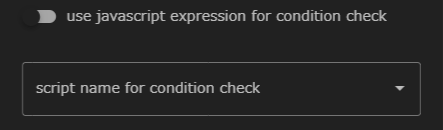
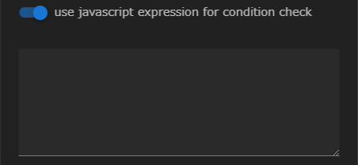

Ifコンポーネントは、__condition setting__ プロパティに設定したスクリプトまたはJavascript式によって
条件判定を行ない、その後のワークフローの処理を分岐させます。

真の場合は緑色の▼（if節）に指定されたコンポーネントが、偽の場合は紫色の▼（else節）に指定されたコンポーネントが
後続コンポーネントとして処理されます。

Ifコンポーネントに設定できるプロパティは以下のとおりです。

### condition setting
条件判定を行うための設定を行います。
<!--Taskコンポーネントのretry処理と同様です。-->

#### use javascript expression for condtion check
Taskコンポーネントのretry判定と同じく、真 / 偽を判定する条件式としてjavascript式を用いるか、シェルスクリプトを用いるかを指定します。

 - 無効のとき  
  
無効のときは、シェルスクリプトを選択するドロップダウンリストが表示されます。  
ここで指定されたシェルスクリプトを条件式として、真 / 偽が判定されます。

 - 有効のとき  
 
有効のときは、javascript式を記述することができます。  
ここで入力した式を条件式として、真 / 偽が判定されます。

--------
[コンポーネントの詳細に戻る]({{ site.baseurl }}/reference/4_component/)
