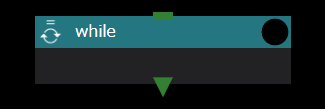

The While component, like the While loop in various programming languages,
The lower component is repeatedly executed while the specified condition judgment is true.

The properties you can set for the While component are:

### use javascript expression for condition check
As with the retry decision of the Task component,
Whether to use a shell script to determine whether to perform repeated execution
Specifies whether to use a javascript expression.

### script name for condition check
only when use javascript expression for condition check is invalid
From the drop-down list, select the shell script to be used for condition determination.

### jacascript expression
only when use javascript expression for condition check is enabled
Sets the javascript expression used for condition judgment.

### number of instances to keep
Specifies the maximum number of directories to keep for each index.
If unspecified, all directories are saved.

### While component runtime behavior
The While component behaves similarly to the For component.
Instead of an index value at the end of the directory name,
Use a number starting at 0 in increments of 1.

Also, the end judgment is not the calculation of the index value, but the return value of the set shell script.
Use the evaluation result of the javascript expression.

--------
Return to Component Details ({{site.baseurl}}/reference/4_component /)

