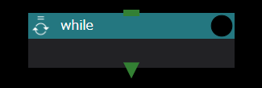

Whileコンポーネントは、各種プログラミング言語のWhileループと同様に、設定された条件判定が真の間、下位コンポーネントを繰り返し実行します。

Whileコンポーネントに設定できるプロパティは以下のとおりです。

### use javascript expression for condition check
Taskコンポーネントのretry判定と同じく、繰り返し実行を行うかどうかの判定にシェルスクリプトを用いるか、javascript式を用いるかを指定します。

### script name for condition check
use javascript expression for condition checkが無効の時のみ、条件判定に用いるシェルスクリプトをドロップダウンリストから選択します。

### jacascript expression
use javascript expression for condition checkが有効の時のみ、条件判定に用いるjavascript式を設定します。

__インデックス値の参照方法について__  
ループ実行中に下位コンポーネントから現在のインデックス値を利用する場合は、__$WHEEL_CURRENT_INDEX__ 環境変数で参照可能です。  
{: .notice--info}

### number of instances to keep
各インデックスで処理を行なった時のディレクトリを最大何個まで残すかを指定します。
無指定の時は、全てのディレクトリが保存されます。

詳しくは後述の[Whileコンポーネント実行時の挙動](#whileコンポーネント実行時の挙動)で説明します。

### skip copy

各イテレーション間のコピー操作から除外するファイル、ディレクトリ、または glob パターンのリストを設定します。

指定したパターンにマッチするファイル・ディレクトリは、WHEEL が前のイテレーションのディレクトリから新しいイテレーションディレクトリを作成する際にコピーされません。
前のイテレーションで生成された大容量の出力ファイルや一時ファイルを除外するのに便利です。

入力欄に任意のパターンを入力し、＋ボタンをクリックで追加します。
glob パターン（例：`*.log`、`output_*`、`results/`）も使用できます。

### Whileコンポーネント実行時の挙動
Whileコンポーネントも、Forコンポーネントと同様の挙動をしますがディレクトリ名の末尾にはインデックス値の代わりに、0から始まる数字を1刻みで使用します。

また終了判定もインデックス値の計算ではなく、設定されたシェルスクリプトの戻り値か、javascript式の評価結果を用います。

### 中断時のリスタート挙動

プロジェクトが `stopped`、`failed`、または `unknown` 状態で中断された後にリスタートすると、Whileコンポーネントは完了済みのイテレーション（`finished` 状態のインスタンスディレクトリ）をスキップし、中断された時点のインデックスから実行を再開します。

リスタート前に `save project` を行なった場合は、全コンポーネントの状態が `not-started` にリセットされ、最初のインデックス（0）から実行し直します。

--------
[コンポーネントの詳細に戻る]({{ site.baseurl }}/reference/4_component/)

