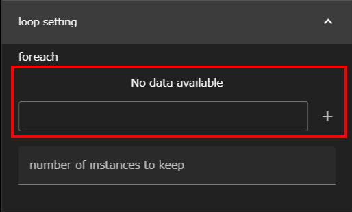

The Foreach component, like the for loop in a shell script,
Based on the list of indexes set
Repeats the subordinate component.

You can set the following properties for Foreach components:

### indexList

Sets the list of index values.  
Enter the desired index value in the input field and click the + button to add it. 

__About Referencing Index Values__  
To use the current index value from a subcomponent during a loop, it can be referenced in the __$WHEEL_CURRENT_INDEX__ environment variable.  
{: .notice--info}

### number of instances to keep
Specifies the maximum number of directories to keep for each index.
If unspecified, all directories are saved.

For details, see [Foreach Component Run-time Behavior](#foreach-component-run-time-behavior) below.

### Foreach Component Run-time Behavior
The Foreach component behaves like the For component,
The index value is not calculated;
The values set in indexList are used from the beginning of the list.
Terminates execution of the entire component when it reaches the end of the list.

--------
[Return to Component Details]({{site.baseurl}}/reference/4_component/)

