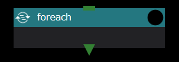
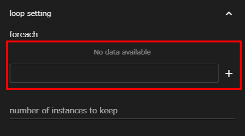

Foreachコンポーネントは、シェルスクリプトのforループのように
設定されたインデックスのリストをもとに
下位コンポーネントを繰り返し実行します。

Foreachコンポーネントに設定できるプロパティは以下のとおりです。

### indexList

インデックス値のリストを設定します。  
入力欄に任意のインデックス値を入力し、＋ボタンをクリックで追加します。  
ここで設定したインデックス値は、下位コンポーネントから __$WHEEL_CURRENT_INDEX__ で参照可能です。

### number of instances to keep
各インデックスで処理を行なった時のディレクトリを最大何個まで残すかを指定します。
無指定の時は、全てのディレクトリが保存されます。

### Foreachコンポーネント実行時の挙動
ForeachコンポーネントもForコンポーネントと同様の挙動をしますが
インデックス値は計算によって求められるのではなく、
indexListに設定された値がリストの先頭から順に使われます。
リストの終端まで実行されるとコンポーネント全体の実行を終了します。

--------
[コンポーネントの詳細に戻る]({{ site.baseurl }}/reference/4_component/)

