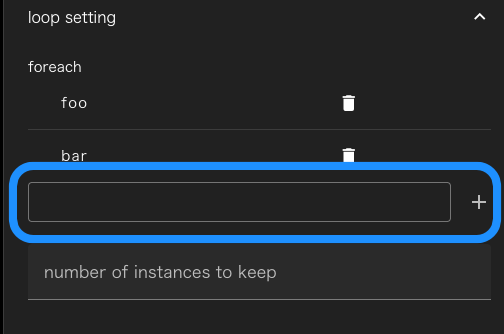

Foreachコンポーネントは、シェルスクリプトのforループのように、設定されたインデックスのリストをもとに下位コンポーネントを繰り返し実行します。

Foreachコンポーネントに設定できるプロパティは以下のとおりです。

### indexList

インデックス値のリストを設定します。  
入力欄に任意のインデックス値を入力し、＋ボタンをクリックで追加します。 

__インデックス値の参照方法について__  
ループ実行中に下位コンポーネントから現在のインデックス値を利用する場合は、__$WHEEL_CURRENT_INDEX__ 環境変数で参照可能です。  
{: .notice--info}

### number of instances to keep
各インデックスで処理を行なった時のディレクトリを最大何個まで残すかを指定します。
無指定の時は、全てのディレクトリが保存されます。

詳しくは後述の[Foreachコンポーネント実行時の挙動](#foreachコンポーネント実行時の挙動)で説明します。

### skip copy

各イテレーション間のコピー操作から除外するファイル、ディレクトリ、または glob パターンのリストを設定します。

指定したパターンにマッチするファイル・ディレクトリは、WHEEL が前のイテレーションのディレクトリから新しいイテレーションディレクトリを作成する際にコピーされません。
前のイテレーションで生成された大容量の出力ファイルや一時ファイルを除外するのに便利です。

入力欄に任意のパターンを入力し、＋ボタンをクリックで追加します。
glob パターン（例：`*.log`、`output_*`、`results/`）も使用できます。

### Foreachコンポーネント実行時の挙動
ForeachコンポーネントもForコンポーネントと同様の挙動をしますがインデックス値は計算によって求められるのではなく、indexListに設定された値がリストの先頭から順に使われます。
リストの終端まで実行されるとコンポーネント全体の実行を終了します。

### 中断時のリスタート挙動

プロジェクトが `stopped`、`failed`、または `unknown` 状態で中断された後にリスタートすると、Foreachコンポーネントは完了済みのイテレーション（`finished` 状態のインスタンスディレクトリ）をスキップし、中断された時点のインデックスから実行を再開します。

リスタート前に `save project` を行なった場合は、全コンポーネントの状態が `not-started` にリセットされ、indexListの先頭から実行し直します。

--------
[コンポーネントの詳細に戻る]({{ site.baseurl }}/reference/4_component/)

