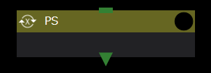

The ParameterStudy component (The following PS components) executes subcomponents for all combinations in the parameter space specified by parameterFile.

The PS component reads the [parameter configuration file](#parameterfile) at the start of execution and creates a directory corresponding to all combinations in the defined parameter space by copying its own directory.

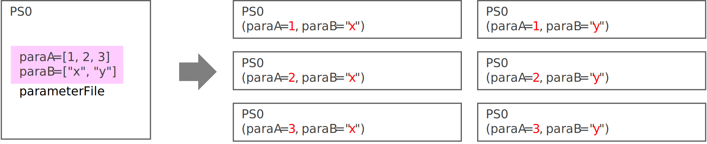

In this case, the file set to [targetFiles](#targetfiles) in the parameter configuration file is not a simple copy, but the placeholders in the file are rewritten and copied to the parameter settings.

Also, files set to [scatter](#scatter) are renamed and copied to only the necessary directories, depending on the settings.
You can also use the value of the parameter as the file name.

Components in the copied directory are executed in parallel, while Task components are executed in parallel within the limit of the number of concurrent executions.

When the component has finished running for all parameters, only the files set to [gather](#gather) are collected in the original directory.
Again, you can rename the file using the value of the parameter.
If files with the same name, such as application execution result files, have been created, use this function to rename and collect them.

### parameterFile
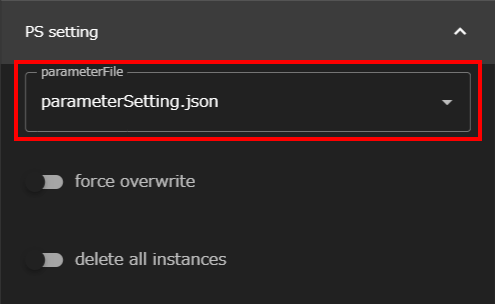

A file (Json file) that defines conditions for a parameter study, such as parameter space.
parameterSetting.json is specified by default.

[Edit the contents of parameterFile](#editing-the-contents-of-parameterfile) in the PS-config mode of the [Text Editor Screen]({{site.baseurl}}/reference/3_workflow_screen/3_editor.html#ps-config-mode).
Select parameterFile from the Files area and open it in a text editor screen.

### force overwrite
Sets whether to overwrite existing directories, if any, when creating directories with parameters.

### delete all instances
Specifies whether to remove the directory for individual copied parameters at the end of execution.

### Editing the contents of parameterFile
To change the conditions of a parameter study, edit parameterFile in PS-config mode in the [Text Editor Screen]({{site.baseurl}}/reference/3_workflow_screen/3_editor.html#ps-config-mode).

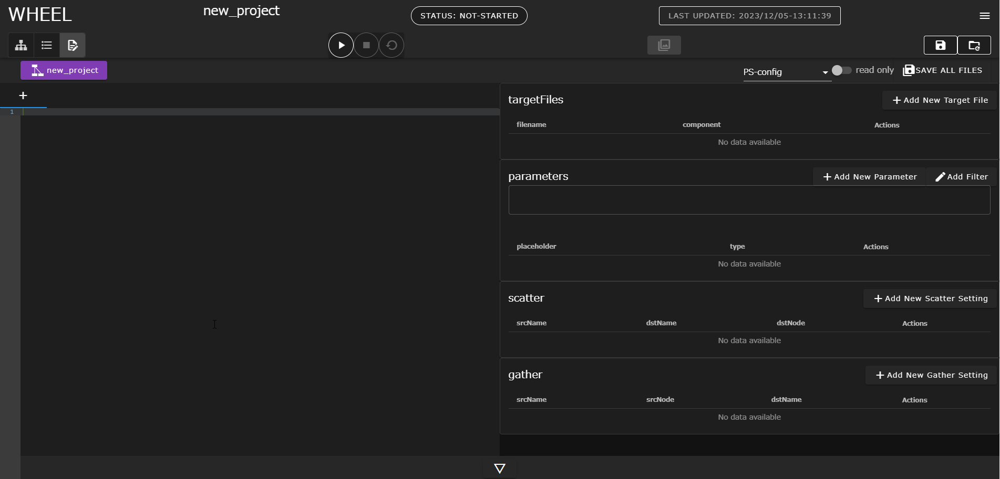

__Edit parameterFile__
parameterFile is a Json file, but you can use PS-config to create a Json file with only form input.
We recommend that you use the PS-config mode when editing parameterFile to prevent input errors.
{: .notice--info}

#### targetFiles
In the PS component, the file that contains the parameters you want to change in the parameter study is called the target file.
The PS component modifies the parameters in the target file as appropriate during the parameter study.

The following procedure describes how to specify a target file.
1. When you click the __+ add new target file__ button, a dialog box opens and the lower components under the PS component are displayed in a tree.  
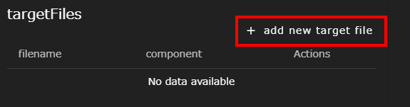
2. Select the component whose file you want to target and type a file name in the text box.
In the following example, the file run.sh in the task0 component is specified as the target file.  
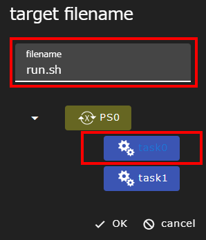
3. Click the __OK__ button to display the selected file in the list and open the specified file in the tab editor.  
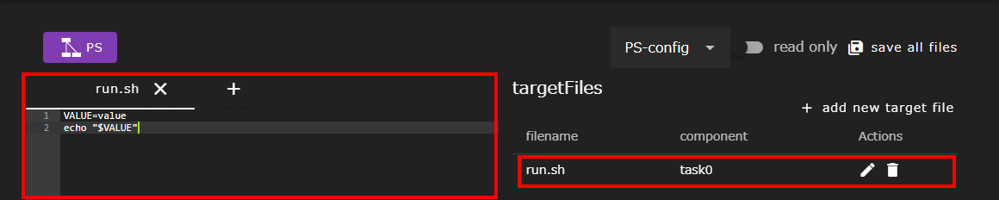

#### parameters
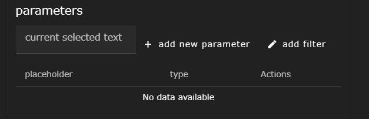

Define where the parameter is by placing a placeholder in the target file.
You can also set the parameter space for each placeholder.
The placeholder you set here is replaced by the value of the parameter when you run the parameter study.

The setup procedure is as follows.
1. From the target file, drag to select a placeholder for the variable you want to use in the parameter study.
The __current selected text__ text box displays the selection.  
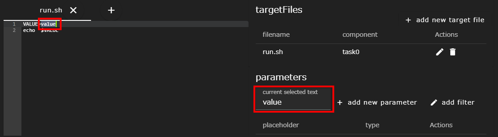
2. Click the __+ add new parameter__ button to set the parameter value to assign to the selected placeholder.
Select a method to select a parameter value from the drop-down list to define the parameter value.
In the figure below, foo, bar, and baz are defined as the parameter values to be assigned to placeholders when running the parameter study.  
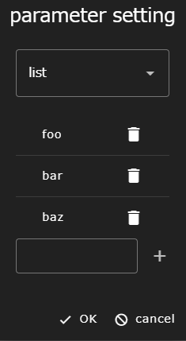
3. Click the __OK__ button to display the placeholders in the list and place them in the Tab Editor in double curly braces ("\{\{" and "\}\}").  
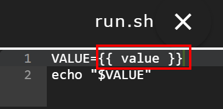
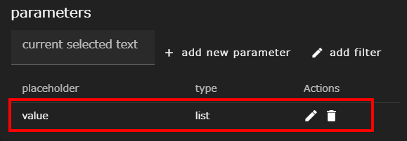

In the example above, a three-pattern calculation is performed when the workflow is run, with the placeholder parts replaced by foo, bar, and baz.

There are three ways to select parameter values (min-max-step, list, files).
Each pattern is described below.

##### min-max-step
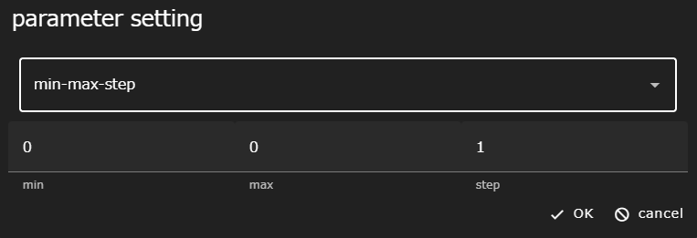

A pattern that can be used when the parameter value is an evenly spaced sequence of numbers defined by three values: min (minimum), max (maximum), and step (step width).
Any of min, max, or step can be written as an integer, a fixed-point number, or a floating-point number (ex. 1.0e-2). Negative values (starting with -) are also allowed.

##### list
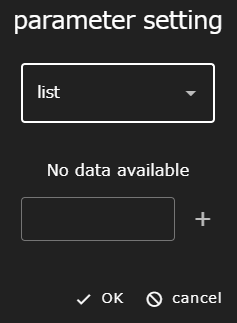

A pattern that defines parameter values as a list.

##### files
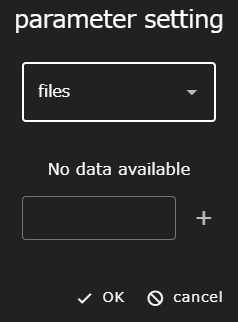

A pattern that defines parameter values as a list, similar to list.
However, globs (wildcards) can be specified for values in the list, and only files that exist at run time are actually used as parameters.
Also, files specified as parameters for this pattern are only copied to the actual directory.

#### scatter/gather
Setting scatter/gather allows you to transfer files and folders to the assigned execution folder before and after the parameter study.

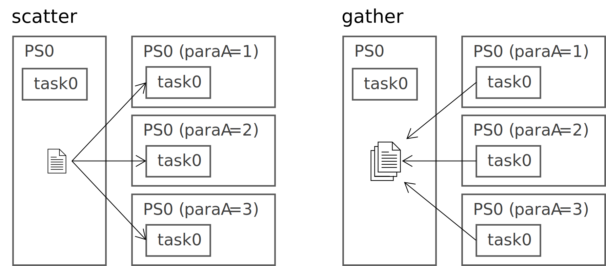

##### scatter
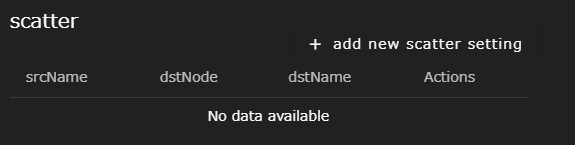

scatter allows you to set up the files to be distributed to each subcomponent separately before running the parameter study.
Set each item in the dialog box that opens when you click the __+add new scatter setting__ button.

| Component | Description |
|----------|---------------------------------|
|srcName| Specifies the file name to copy from |
|destination node| Select the destination component from the tree |
|dstName| Specifies the destination file name |

##### gather
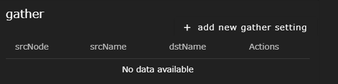

After completing the parameter study, gather sets the file to be collected from each subordinate component.
The WHEEL GUI can only refer to result files collected by gather. For this reason, files that are required for subsequent components or that need to be checked must be set in gather.

Set each item in the dialog box that opens when you click the __+add new gather setting__ button.

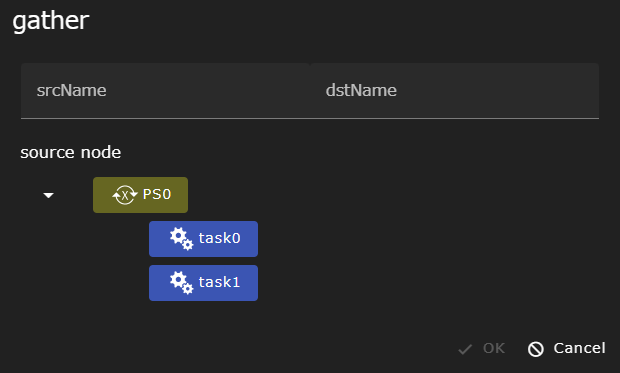

| Component | Description |
|----------|---------------------------------|
|srcName| Specifies the file name to copy from |
|source node| Select the source component from the tree |
|dstName| Specifies the destination file name |

__about files not specified by the gather feature__
Files not specified by the gather function are not erased unless `delete all instances` is specified.
However, it is placed in a directory that is not accessible from the WHEEL GUI, and cannot be accessed after execution is finished.
{: .notice--info}

##### Common notes
Common caveats for scatter/gather are:

###### srcName
srcName can be a placeholder set with glob (wildcard) and parameters in the same format as the target file (For example, \{\{ Placeholder Name \}\}).
You can also specify a directory name instead of a file name. If a directory name is specified, all directories and files under the specified directory will be copied recursively.

###### dstName
dstName, like srcName, also accepts placeholders set by parameters (For example, \{\{ Placeholder Name \}\}).
However, glob (wildcard) is not allowed in dstName. A trailing '/' or '\\' is treated as a directory, and the file specified by srcName is copied under the dstName directory.
If the destination directory does not exist, the file is copied after the new directory is created.

Note that if you set a fixed file name for dstName, the system attempts to copy multiple parameter study result files to the same file.
Therefore, depending on the environment where WHEEL is running (OS, file system, etc.) and the timing of the copy operation, the copied file may be corrupted.
Therefore, when copying files with the same name, it is recommended that you specify a name using the dstName parameter.

###### destination node/source node
By selecting a subordinate component as the destination node or source node, the path interpretation of srcName/dstName can begin with the directory of the subordinate component rather than the PS component.
Although srcName and dstName can be written directly including the directory name of the subordinate component, this will not work if the name of the subordinate component changes.
Therefore, it is recommended that you use destination node/source node to select lower components whenever possible.

--------
[Return to Component Details]({{site.baseurl}}/reference/4_component/)
