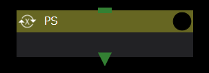
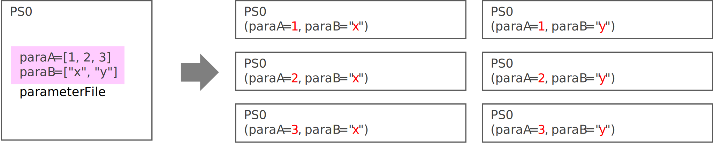
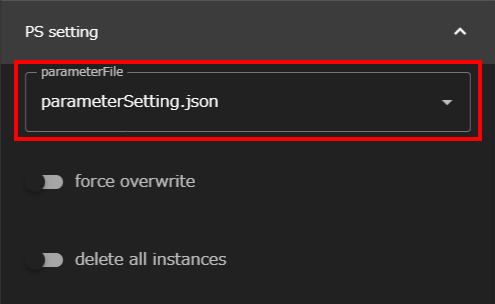
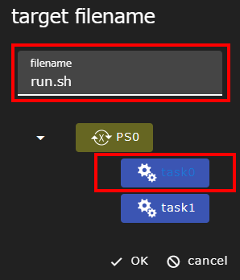
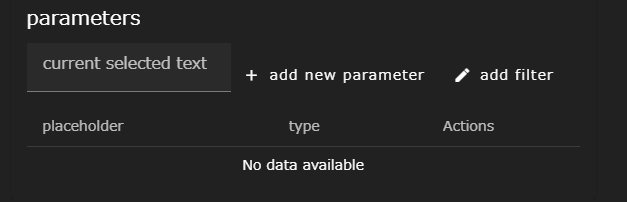
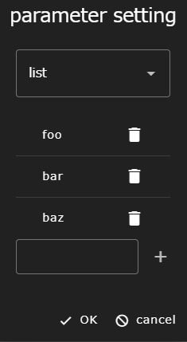
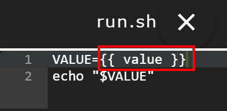
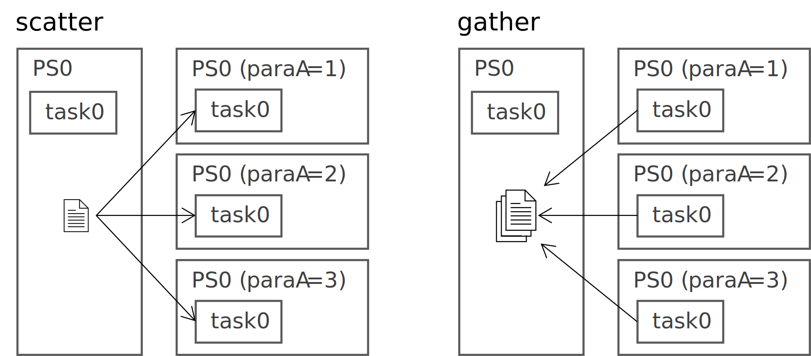
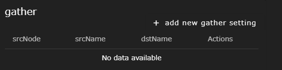

ParameterStudyコンポーネント（以下、PSコンポーネント）は、parameterFileに指定されたパラメータ空間内で全ての組み合わせについて下位コンポーネントを実行します。

PSコンポーネントは実行開始時に[パラメータ設定ファイル](#parameterfile)を読み込み、定義されたパラメータ空間内の全組み合わせに相当するディレクトリを、自身のディレクトリをコピーすることで作成します。

このとき、パラメータ設定ファイル中で[targetFiles](#targetfiles)に設定されたファイルは単純なコピーではなく、ファイル内のプレースホルダがパラメータの設定値に書き換えられコピーされます。

また[scatter](#scatter)に設定されたファイルは、設定された内容に応じて必要なディレクトリのみに、名前を変更してコピーされます。
パラメータの値をファイル名として用いることもできます。

コピーされたディレクトリ内のコンポーネントは、並列に実行されますがTaskコンポーネントについては同時実行本数の制限の中での並列実行となります。

全てのパラメータについてコンポーネントの実行が終了すると[gather](#gather)に設定されたファイルのみが、元のディレクトリ配下に集められます。
このときもパラメータの値を用いてファイル名を変更することができます。
アプリケーションの実行結果ファイルなど、同じ名前のファイルが作成されている場合はこの機能を用いてリネームし、集めてください。

### parameterFile

パラメータ空間等、パラメータスタディの条件を定義するファイル（Jsonファイル）です。
デフォルトでparameterSetting.jsonが指定されています。  

[parameterFileの内容の編集](#parameterfileの内容の編集)は、[テキストエディタ画面]({{ site.baseurl }}/reference/3_workflow_screen/3_editor.html#ps-configモード)のPS-configモードで行います。
FilesエリアからparameterFileを選択しテキストエディタ画面で開いてください。

### force overwrite
パラメータを設定したディレクトリを作成する際に、既存のディレクトリが存在しても上書きするかどうかを設定します。

### delete all instances
実行終了時にコピーされた個々のパラメータ用のディレクトリを削除するかどうかを指定します。

### parameterFileの内容の編集
パラメータスタディの条件を変更する際は、[テキストエディタ画面]({{ site.baseurl }}/reference/3_workflow_screen/3_editor.html#ps-configモード)のPS-configモードでparameterFileを編集します。

__parameterFileの編集__  
parameterFileはJsonファイルですが、PS-configを使用することで、フォーム入力だけでJsonファイルを作成できます。  
入力ミス等の防止のため、parameterFileの編集を行う際はPS-configモードの利用を推奨します。
{: .notice--info}

#### targetFiles
PSコンポーネントでは、パラメータスタディ内で変更したいパラメータが格納されているファイルをターゲットファイルと呼びます。
PSコンポーネントは、パラメータスタディ実行時にターゲットファイル内のパラメータを適宜変更します。

以下にターゲットファイルの指定手順を示します。
1. __+ add new target file__ ボタンをクリックすると、
ダイアログが開き PSコンポーネント配下の下位コンポーネントがツリー表示されます。  

2. ターゲットファイルとするファイルを持つコンポーネントを選択し、
テキストボックスにファイル名を入力します。  
下図では例として、task0コンポーネント内のrun.shというファイルをターゲットファイルとして指定しています。  
  
3. __OK__ ボタンをクリックすると選択したファイルが一覧に表示され、指定したファイルがタブエディタで開かれます。  

#### parameters

ターゲットファイル内にプレースホルダを置くことで、どこをパラメータにするかを定義します。
また、併せてプレースホルダごとにパラメータ空間を設定できます。
ここで設定したプレースホルダは、パラメータスタディ実行時にパラメータの値で置換されます。

設定手順は以下の通りです。
1. ターゲットファイルから、パラメータスタディで用いる変数のプレースホルダとなる箇所をドラッグして選択してください。
__current selected text__ テキストボックスに選択した内容が表示されます。  

2. __+ add new parameter__ ボタンをクリックし、選択したプレースホルダに代入するパラメータ値を設定します。  
ドロップダウンリストからパラメータ値を選択する方法を選択し、パラメータ値を定義します。  
下図では、パラメータスタディ実行時にプレースホルダに代入するパラメータ値としてfoo, bar, bazを定義しています。  

3. __OK__ ボタンをクリックするとプレースホルダが一覧に表示され、タブエディタ上で該当箇所が二重の中括弧( "\{\{" と "\}\}" )で囲ったプレースホルダ表記となります。  

上記の例では、ワークフローを実行時にプレースホルダ部分がfoo、bar、bazに置換された3パターンの計算が実行されます。

__プレースホルダの置換について__  
プレースホルダの置換は、外部モジュールのテンプレートエンジン(nunjucks)を用いて行ないます。
中括弧内には変数以外にも、フィルターを追加したり、Javascriptの式や関数を記述することもできますが本ドキュメントには、詳細は記載しませんので、nunjucksのドキュメントをご参照ください。  
[https://mozilla.github.io/nunjucks/templating.html](https://mozilla.github.io/nunjucks/templating.html)
{: .notice--info}

なお、パラメータ値を選択する方法は3パターン(min-max-step, list, files)存在します。
各パターンについては以下のとおりです。

##### min-max-step

パラメータ値が、min(最小値)、max(最大値)、step(ステップ幅)の3つの値で定義できる等間隔な数列の場合に使えるパターンです。
min, max, stepのいずれも、整数、固定小数点数、浮動小数点数(ex. 1.0e-2)で記述できます。負の値(-で始まる値)も使用可能です。

##### list

パラメータ値を、リストとして定義するパターンです。

##### files

listと同様にパラメータ値をリストとして定義するパターンです。  
ただし、リスト内の値にglob（ワイルドカード）を指定することもでき、実行時に存在するファイルのみが実際にパラメータとして使われます。
また、このパターンのパラメータとして指定されたファイルは、実際に使われるディレクトリにしかコピーされません。

#### scatter / gather
scatter / gatherを設定すると、
パラメータスタディの前後で、パラメータ割り当て済みの実行フォルダにファイルやフォルダを転送できます。

##### scatter

scatterでは、パラメータスタディ実行前に各下位コンポーネントに個別に配布されるファイルの設定を行ないます。
__+ add new scatter setting__ ボタンをクリックすると開かれるダイアログで、各項目を設定してください。

|構成要素|説明|
|----------|---------------------------------|
|srcName|コピー元のファイル名を指定します|
|destination node|ツリーの中からコピー先のコンポーネントを選択します|
|dstName|コピー先のファイル名を指定します|

##### gather

gatherではパラメータスタディ完了後に、各下位コンポーネントから回収するファイルの設定を行ないます。  
WHEELのGUIからはgatherで回収された結果ファイルしか参照することができません。
そのため、個々のパラメータスタディ実行結果のうち、後続のコンポーネントで必要なファイルや、結果を確認する必要があるファイルはgatherにて設定しておく必要があります。

__+ add new gather setting__ ボタンをクリックすると開かれるダイアログで、各項目を設定してください。

|構成要素|説明|
|----------|---------------------------------|
|srcName|コピー元のファイル名を指定します|
|source node|ツリーからコピー元のコンポーネントを選択します|
|dstName|コピー先のファイル名を指定します|

__gather機能で指定されなかったファイルについて__  
gather機能で指定されなかったファイルは、`delete all instances`を指定しない限り消されることはありません。  
ただし、WHEELのGUIからはアクセスできないディレクトリに置かれるため、実行終了後にアクセスすることはできなくなります。
{: .notice--info}

##### 共通の注意事項
scatter / gather共通の注意事項は以下の通りです。

###### srcName
srcNameには、glob（ワイルドカード）およびparametersで設定したプレースホルダをターゲットファイルと同様の書式で指定することができます（例えば、\{\{ プレースホルダ名 \}\}）。  
また、ファイル名ではなくディレクトリ名を指定することもできます。ディレクトリ名が指定された場合は、指定されたディレクトリ以下の全てのディレクトリとファイルが再帰的にコピーされます。

###### dstName
dstNameにもsrcNameと同様parametersで設定したプレースホルダを用いることができます（例えば、\{\{ プレースホルダ名 \}\}）。
ただし、dstNameではglob（ワイルドカード）は使えません。 
また、末尾に'/'または'\\'が指定された場合はディレクトリとして扱われ、srcNameで指定されたファイルはdstNameディレクトリの下へコピーされます。
もしコピー先のディレクトリが存在しなかった場合は、ディレクトリが新規作成された後にファイルコピーが行われます。

なお、dstNameに固定のファイル名を設定した場合は、複数のパラメータスタディ結果のファイルを同じファイルに対してコピーしようとします。
このため、WHEELを実行している環境(OS, ファイルシステムなど)とコピー処理が行なわれるタイミングによっては、コピー後のファイルが壊れる可能性もあります。
したがって、同じ名前のファイルをコピーする際は、dstNameにパラメータを使った名前を指定することを推奨します。

###### destination node / source node
destination nodeまたはsource nodeとして下位コンポーネントを選択することで、srcName/dstNameのパス解釈の起点をPSコンポーネントではなく、下位コンポーネントのディレクトリとすることができます。
srcNameやdstNameに直接、下位コンポーネントのディレクトリ名を含めて記述することもできますが、その場合下位コンポーネントの名前が変わると動作しなくなります。
そのため、なるべくdestination node / source nodeを使って下位コンポーネントを選択することを推奨します。

--------
[コンポーネントの詳細に戻る]({{ site.baseurl }}/reference/4_component/)
