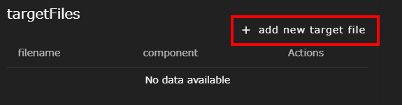
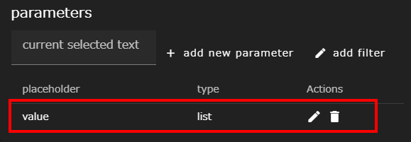
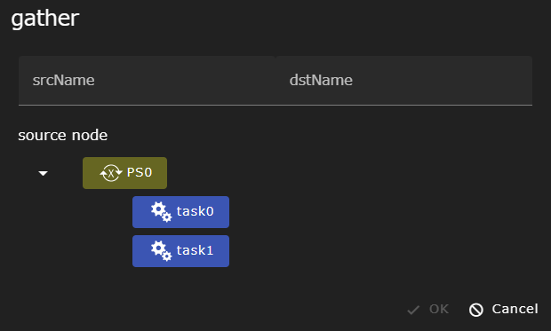

ParameterStudyコンポーネント（以下、PSコンポーネント）は、
parameterFileに指定されたパラメータ空間内で
全ての組み合わせについて下位コンポーネントを可能な限り並列実行します。


PSコンポーネントに設定できるプロパティは以下のとおりです。

### parameterFile


<!--パラメータ空間を定義したパラメータ設定ファイル（Jsonファイル）を指定します。  
デフォルトでparameterSetting.jsonが指定されているので、Filesエリアから選択しテキストエディタ画面で編集してください。  
parameterFileの作成には[テキストエディタ画面]({{ site.baseurl }}/reference/3_workflow_screen/3_editor.html#ps-configモード)のPS-configモードを用いてください。-->
パラメータ空間を定義したパラメータ設定ファイル（Jsonファイル）を指定します。  
parameterFileには、デフォルトでparameterSetting.jsonが指定されています。
parameterSetting.jsonは、Filesエリアから選択しテキストエディタ画面で編集してください。  
parameterFileの編集には[テキストエディタ画面]({{ site.baseurl }}/reference/3_workflow_screen/3_editor.html#ps-configモード)のPS-configモードを用いてください。

<!---->

### force overwrite
パラメータを設定したディレクトリを作成する際に、
既存のディレクトリが存在しても上書きするかどうかを設定します。

### delete all instances
実行終了時にコピーされた個々のパラメータ用のディレクトリを削除するかどうかを指定します。

### パラメータ設定ファイル
パラメータ設定ファイルには、パラメータスタディ対象のパラメータ空間と、パラメータを置換するファイル(ターゲットファイル) を記述します。


<!---->

<!--||構成要素|説明|
|----------|----------|---------------------------------|
|1|targetFiles入力エリア|パラメータスタディ実行時に、パラメータ値で内容を上書きする元になるファイルを設定します|
|2|parameters入力エリア|パラメータスタディ実行時に使われるパラメータ空間の定義を行ないます|
|3|scatter設定入力エリア|パラメータスタディ実行前に、各サブコンポーネントに個別に配布されるファイルの設定を行ないます|
|4|gather設定入力エリア|パラメータスタディ完了後に、各サブコンポーネントから回収するファイルの設定を行ないます|-->

#### targetFiles


パラメータスタディ実行時に、パラメータ値で内容を上書きする元となるターゲットファイルを設定します。
ターゲットファイルには、PSコンポーネント内の下位コンポーネントが持つファイルを指定することができます。

__+ add new target file__ ボタンをクリックすると、ダイアログが開かれます。  
PSコンポーネント配下の下位コンポーネントがツリー表示されるので、
ターゲットファイルとするファイルを持つ任意のコンポーネントを選択し、テキストボックスにファイル名を入力します。  
例えば下図では、task0コンポーネントのrun.shというファイルを、ターゲットファイルとして指定しています。


__OK__ ボタンをクリックすると、選択したファイルが一覧に表示され、指定したファイルがタブエディタで開かれます。


#### parameters


パラメータスタディ実行時に使われるパラメータ空間の定義を行ないます。  
ターゲットファイルに、パラメータスタディで用いる変数のプレースホルダと、パラメータ値を定義します。
プレースホルダは実際に実行されるディレクトリにターゲットファイルがコピーされる際に、パラメータの値で置換されます。

ターゲットファイルから、パラメータスタディで用いる変数のプレースホルダとなる箇所をドラッグして選択します。
すると、__current selected text__ テキストボックスに選択した内容が表示されます。


つづいて __+ add new parameter__ ボタンをクリックし、選択したプレースホルダに代入するパラメータ値を設定します。  
ドロップダウンリストからパラメータ値を選択する方法を選択し、パラメータ値を定義します。  
例えば下図では、パラメータスタディ実行時にプレースホルダに代入するパラメータ値として、foo, bar, bazを定義しています。


__OK__ ボタンをクリックすると、プレースホルダが一覧に表示され、タブエディタ上で該当箇所が二重の中括弧( "\{\{" と "\}\}" )で囲ったプレースホルダ表記となります。




例えば上記定義を用いて、パラメータスタディを実行すると、プレースホルダ部分にvalueの値が展開されて、次のような内容のコピーが作成されます。

```
VALUE=foo
```
```
VALUE=bar
```
```
VALUE=baz
```

なお、パラメータ値を選択する方法は3パターン(min-max-step, list, files)存在します。
各パターンについては以下のとおりです。

##### min-max-step


パラメータ値が、min(最小値)、max(最大値)、step(ステップ幅)の3つの値で定義できる等間隔な数列の場合に使えるパターンです。
min, max, stepのいずれも、整数、固定小数点数、浮動小数点数(ex. 1.0e-2)で記述できます。負の値(-で始まる値)も使用可能です。

##### list


パラメータ値を、リストとして定義するパターンです。

##### files


listと同様にパラメータ値をリストとして定義するパターンです。  
ただし、リスト内の値にglob（ワイルドカード）を指定することもでき、実行時に存在するファイルのみが実際にパラメータとして使われます。
また、このパターンのパラメータとして指定されたファイルは、実際に使われるディレクトリにしかコピーされません。

#### scatter


パラメータスタディ実行前に、各下位コンポーネントに個別に配布されるファイルの設定を行ないます。

配布されるファイルの設定は __+ add new scatter setting__ ボタンをクリックすると開かれるダイアログで定義します。 


|構成要素|説明|
|----------|---------------------------------|
|srcName|コピー元のファイル名を指定します|
|dstNode|コピー先のコンポーネントを選択します|
|dstName|コピー先のファイル名を指定します|

#### gather


パラメータスタディ完了後に、各サブコンポーネントから回収するファイルの設定を行ないます。  
WHEELのGUIからはgatherで回収された結果ファイルしか参照することができません。そのため、個々のパラメータスタディ実行結果のうち、
後続のコンポーネントで必要なファイルや、結果を確認する必要があるファイルはgatherにて設定しておく必要があります。

回収されるファイルの設定は __+ add new gather setting__ ボタンをクリックすると開かれるダイアログで定義します。 



|構成要素|説明|
|----------|---------------------------------|
|srcName|コピー元のファイル名を指定します|
|srcNode|コピー元のコンポーネントを選択します|
|dstName|コピー先のファイル名を指定します|

#### scatter / gather 共通の注意事項
scatter / gather共通の注意事項は以下の通りです。

##### srcName
srcNameには、glob（ワイルドカード）およびparametersで設定したプレースホルダをターゲットファイルと同様の書式で指定することができます（例えば、\{\{ プレースホルダ名 \}\}）。  
また、ファイル名ではなくディレクトリ名を指定することもできます。ディレクトリ名が指定された場合は、指定されたディレクトリ以下の全てのディレクトリとファイルが再帰的にコピーされます。

##### dstName
dstNameにもsrcNameと同様parametersで設定したプレースホルダを用いることができます（例えば、\{\{ プレースホルダ名 \}\}）。
ただし、dstNameではglob（ワイルドカード）は使えません。 また、末尾に'/'または'\\'が指定された場合はディレクトリとして扱われ、
srcNameで指定されたファイルはdstNameディレクトリの下へコピーされます。
もしコピー先のディレクトリが存在しなかった場合は、ディレクトリが新規作成された後にファイルコピーが行われます。

なお、dstNameに固定のファイル名を設定した場合は、複数のパラスタ結果のファイルを同じファイルに対してコピーしようとします。
このため、WHEELを実行している環境(OS, ファイルシステムなど)とコピー処理が行なわれるタイミングによっては、コピー後のファイルが壊れる可能性もあります。
したがって、同じ名前のファイルをコピーする際は、dstNameにパラメータを使った名前を指定することを推奨します。

##### dstNode / srcNode
srcNodeまたはdstNodeとして、下位コンポーネントを選択することで、srcName/dstNameのパス解釈の起点をPSコンポーネントではなく、下位コンポーネントのディレクトリとすることができます。
srcNameやdstNameに直接、下位コンポーネントのディレクトリ名を含めて記述することもできますが、 その場合下位コンポーネントの名前が変わると動作しなくなります。
そのため、なるべくsrcNode/dstNodeを使って下位コンポーネントを選択することを推奨します。

### PSコンポーネント実行時の挙動
PSコンポーネントは実行開始時にパラメータ設定ファイルを読み込み、
定義されたパラメータ空間内の全組み合わせに相当するディレクトリを、
自身のディレクトリをコピーすることで作成します。

このとき、パラメータ設定ファイル中の`targetFiles`に設定されたファイルは単純なコピーではなく、
ファイル内のプレースホルダがパラメータの設定値に書き換えられコピーされます。

また`scatter`に設定されたファイルは、設定された内容に応じて
必要なディレクトリのみに、名前を変更してコピーされます。
名前としてパラメータの値を用いることもできます。

コピーされたディレクトリ内のコンポーネントは、並列に実行されますが
Taskコンポーネントについては同時実行本数の制限の中での並列実行となります。

全てのパラメータについてコンポーネントの実行が終了すると
`gather`に設定されたファイルのみが、元のディレクトリ配下に集められます。
このときもパラメータの値を用いてファイル名を変更することができます。
アプリケーションの実行結果ファイルなど、同じ名前のファイルが作成されている場合はこの機能を用いてリネームし、集めてください。

__gather機能で指定されなかったファイルについて__  
gather機能で指定されなかったファイルは、`delete all instances`を指定しない限り消されることはありません。  
ただし、WHEELのGUIからはアクセスできないディレクトリに置かれるため、実行終了後にアクセスすることはできなくなります。
{: .notice--info}


--------
[コンポーネントの詳細に戻る]({{ site.baseurl }}/reference/4_component/)
