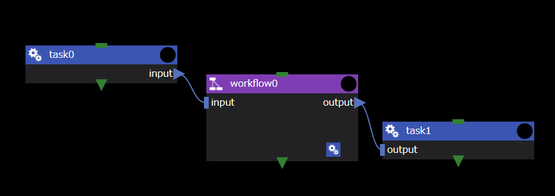
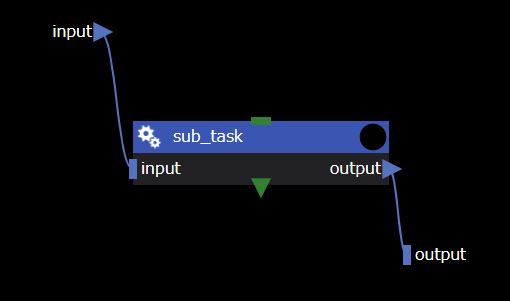

Workflow components are used to combine multiple component processes into a single component.
Using the Workflow component, you can consolidate each process on the workflow editing screen to improve the overall workflow perspective.

The Workflow component has no unique properties.

### input files, output files
You can use the input files/output files of the Workflow component to transfer files between components inside and outside the Workflow component.

Here is a simple example of the input and output of a Workflow component:
- Passing the `input` file created by the __task0__ component as input for the __workflow0__ component.
- Passing the `output` file output from the __workflow0__ component to the __task1__ component.

Inside the __workflow0__ component:
- The input/output files of the __workflow0__ component are displayed in the upper left and lower right of the screen.
- Optionally, you can connect to internal components to exchange files in and out of __workflow0__ components.

--------
[Return to Component Details]({{site.baseurl}}/reference/4_component/)
