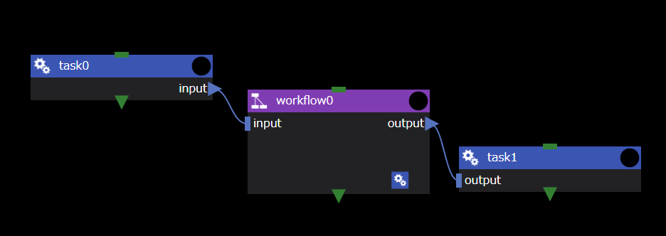

Workflowコンポーネントは、複数のコンポーネントからなる処理を一つのコンポーネントにまとめるために用います。
Workflowコンポーネントを使用することで、ワークフロー編集画面上を処理毎に集約することができ、ワークフロー全体の見通しを良くすることができます。

Workflowコンポーネントには固有のプロパティはありません。

### input files、output files
Workflowコンポーネントのinput files/output filesを使用することで、Workflowコンポーネント内外のコンポーネント間でファイルを転送できます。

Workflowコンポーネントの入出力の簡単な例を以下に示します。
- __task0__ コンポーネントで作成された `input` ファイルを __workflow0__ コンポーネントの入力として渡しています。
- __workflow0__ コンポーネントから出力された`output`ファイルを __task1__ コンポーネントに渡しています。

__workflow0__ コンポーネントの内部は以下の通りです。
- 画面左上・右下に __workflow0__ コンポーネントのinput/output filesが表示されます。
- 適宜、内部コンポーネントに接続することで、 __workflow0__ コンポーネントの内外でファイルをやり取りできます。

--------
[コンポーネントの詳細に戻る]({{ site.baseurl }}/reference/4_component/)
