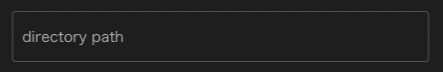

Storage component is outside the scope of the project directory
A component for saving files to a directory.

The files in the workflow are managed by WHEEL
Files generated or modified during execution
Click the cleanup project button to return to the previous state.

Repeating the same project with different settings
The files you want to keep after initializing the project are:
By forwarding to the Storage component using the input files/output files mechanism
You can save files to a location outside the control of WHEEL.

You can set the following properties for the Storage component:

### host
You can set host to the host where the file is actually saved.

If `localhost` is specified, a copy of the file is saved on the machine running WHEEL.
If anything other than `localhost` is specified, a copy of the file is saved on the remote host.

### directory path

Copy the files transferred to the storage component under the directory specified in directory path.

If directory path is set within the project directory, it will be erased during project initialization.
WHEEL does not determine whether the specified directory path is in the project directory.
If necessary, set the path outside the project directory.

--------
[Return to Component Details]({{site.baseurl}}/reference/4_component/)
