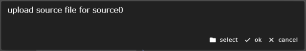

The Source component is related to project execution.
This component handles files that correspond to input files.

The following properties can be set for the Source component:
Note that you cannot specify the input files property for the Source component.

### upload on demand
Specifies whether the actual files to be used are uploaded from the browser to WHEEL when the project is run.

### Source Component Behavior
The file specified in the outputFile of the Source component during project execution
If it is in a directory, the Source component does nothing.
Terminates normally.

If the file does not exist and upload on demand is enabled,
The file upload dialog appears in the browser
The file uploaded by the user is treated as outputFile.

--------
[Return to Component Details]({{site.baseurl}}/reference/4_component/)