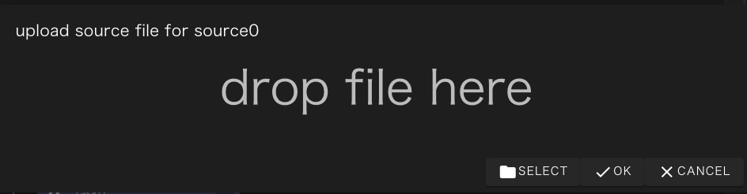

The Source component is used to handle the file equivalent of the input file for the project run.

The following properties can be set for the Source component:
Note that you cannot specify the input files property for the Source component.

### upload on demand
Specifies whether the actual files to be used are uploaded from the browser to WHEEL when the project is run.

### Source Component Behavior
If the file specified in the outputFile of the Source component exists in the directory at project execution time, the Source component does nothing and terminates normally.

If the file does not exist and upload on demand is enabled, a file upload dialog appears in the browser and the file uploaded by the user is treated as output files.

--------
[Return to Component Details]({{site.baseurl}}/reference/4_component/)